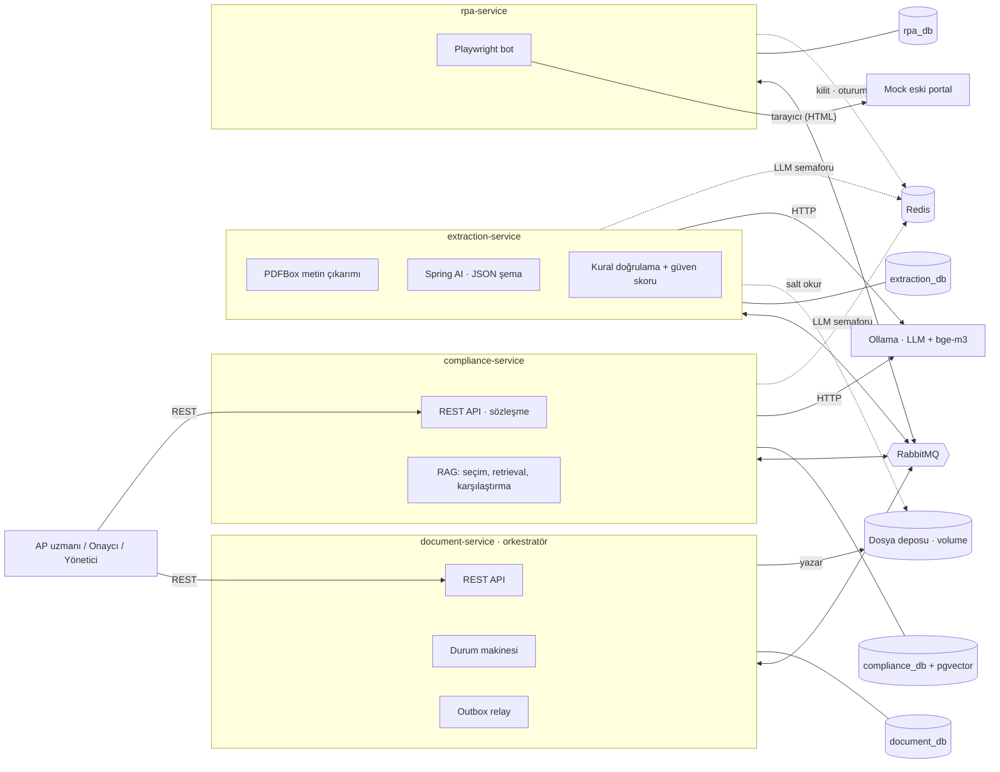
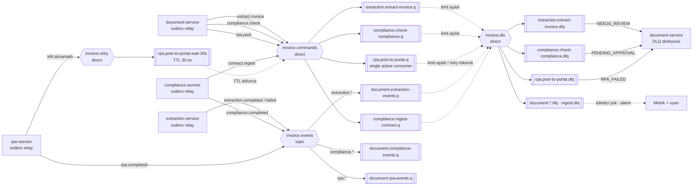
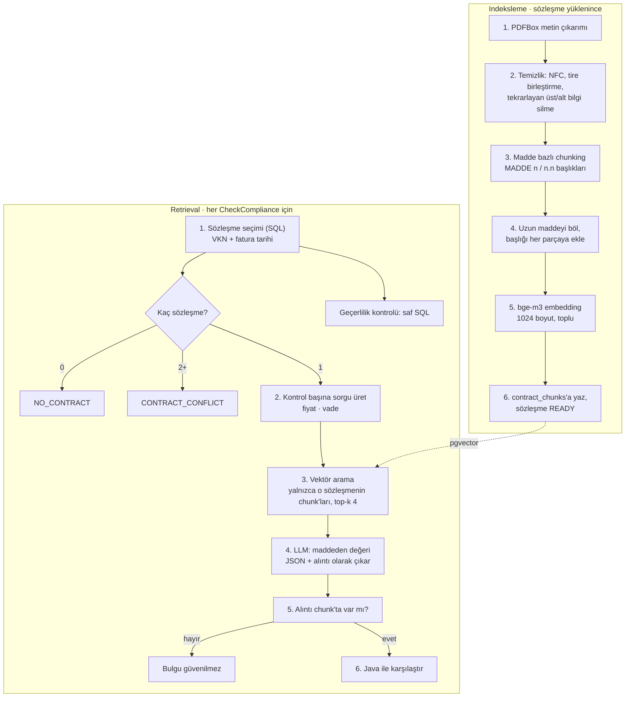
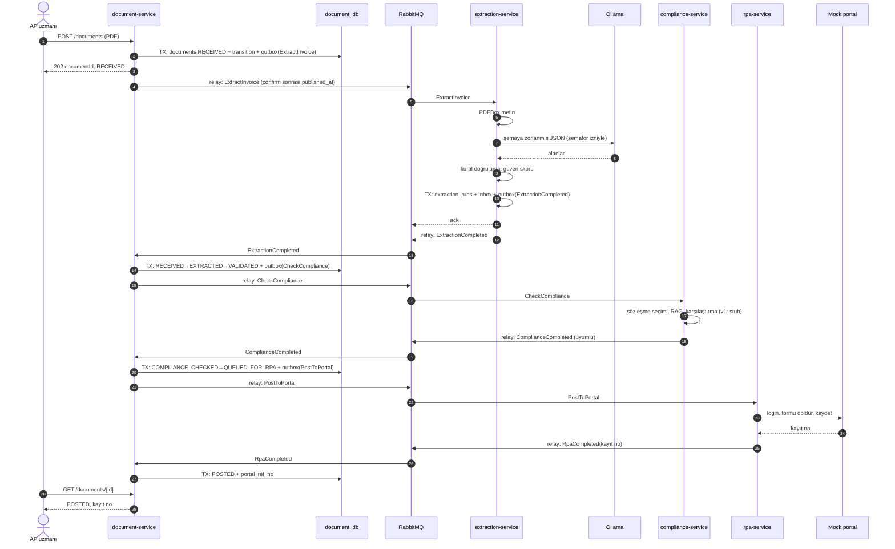
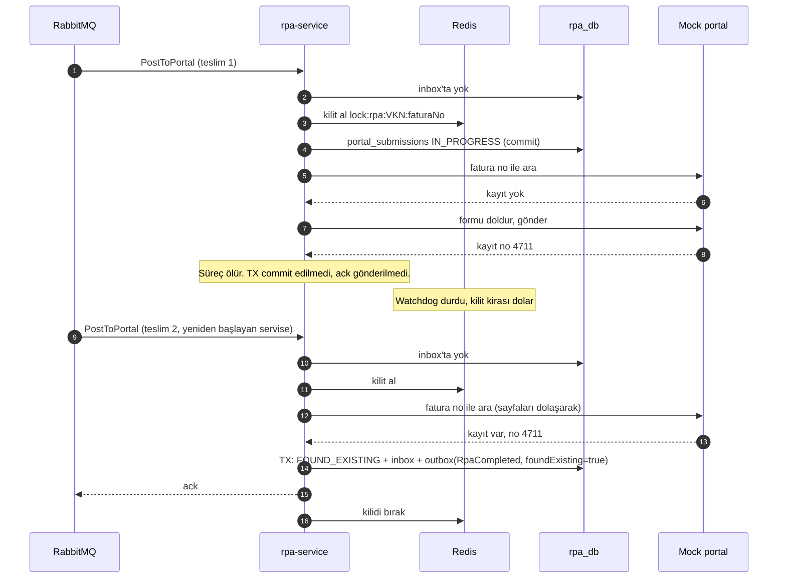
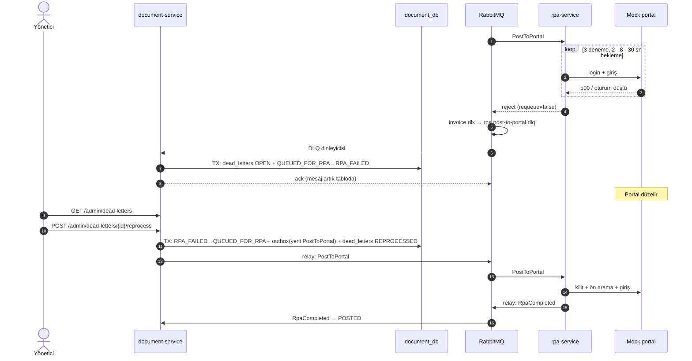

# Akıllı Fatura İşleme ve Sözleşme Uyum Sistemi — Sistem Tasarımı

## Özet ve tasarım ilkeleri

Sistem, document-service'in orkestratör olduğu, servisler arasında yalnızca RabbitMQ ile konuşan dört Spring Boot servisinden oluşur. REST yalnızca insanların sisteme girdiği iki kapıdadır (fatura ve sözleşme yükleme, durum, onay, yönetim); servisten servise senkron çağrı yoktur. "Portala en fazla bir kez" garantisi tek bir mekanizmaya değil, üst üste binen dört korumaya dayanır.

Tasarımı taşıyan altı ilke:

1. **Tek durum sahibi.** Faturanın durumu yalnızca document-service'in veritabanında yaşar. Diğer servisler komut alır, iş yapar, olay yayınlar; durum geçişine karar vermezler (FR-D9).
2. **Komut ve olay ayrımı.** Komutlar (`ExtractInvoice`, `CheckCompliance`, `PostToPortal`) tek bir alıcıya gider; olaylar (`*Completed`, `ExtractionFailed`) olanı bildirir. Akış koreografi değil orkestrasyondur: sonraki adımı her zaman document-service başlatır.
3. **Transactional outbox, istisnasız.** Her servis giden mesajı iş verisiyle aynı transaction'da kendi `outbox` tablosuna yazar; ayrı bir relay yayınlar (NFR-02). Broker kapalıyken bile yükleme API'si çalışır.
4. **En az bir kez teslim + idempotent tüketici.** Her tüketici işlediği `messageId`'yi aynı transaction'da `inbox` tablosuna yazar. Tekrar gelen mesaj sonucu değiştirmez (NFR-01 katman 1).
5. **Durum makinesi koşullu güncellemedir.** Geçiş `UPDATE … WHERE id = ? AND status = ?` ile yapılır; geç ya da sırasız gelen olay etkisiz kalır.
6. **Dış dünyaya yan etki için ek koruma.** Portal idempotent değildir; RPA kilit (v2) ve portalda ön arama (v2) ile korunur. v1'de tek aktif consumer bu boşluğu kısmen kapatır.

Belge v1 ile v2'yi ayırır; ayrım için son bölümdeki tabloya bakın.

## Servis sınırları ve sorumluluklar

Sınırlar, değişme nedenine göre çizildi: iş akışı kuralları, LLM ile çıkarım, sözleşme bilgisi ve portal otomasyonu birbirinden bağımsız değişir. Her servis tek bir "zor şey"in sahibidir.



| Servis             | Tek sorumluluğu                                                                                                                             | Sahip olduğu veri                                                                                  | Tükettiği                                                                                         | Yayınladığı                                         | Dış bağımlılık                           |
| ------------------ | ------------------------------------------------------------------------------------------------------------------------------------------- | -------------------------------------------------------------------------------------------------- | ------------------------------------------------------------------------------------------------- | --------------------------------------------------- | ---------------------------------------- |
| document-service   | Faturanın yaşam döngüsü: yükleme, hash ile tekrar kontrolü, durum makinesi, mükerrer ve eşik kararları, onay/ret, DLQ'ların kayda yansıması | Fatura kaydı, kabul edilmiş alanlar, durum geçmişi, DLQ park tablosu, eşik ayarları, PDF dosyaları | `ExtractionCompleted`, `ExtractionFailed`, `ComplianceCompleted`, `RpaCompleted`, üç komut DLQ'su | `ExtractInvoice`, `CheckCompliance`, `PostToPortal` | Yok                                      |
| extraction-service | PDF'ten yapılandırılmış fatura verisi üretmek ve ne kadar güvenilir olduğunu söylemek                                                       | Çıkarım denemeleri: ham LLM çıktısı, model ve prompt sürümü                                        | `ExtractInvoice`                                                                                  | `ExtractionCompleted`, `ExtractionFailed`           | Ollama (LLM), dosya deposu (salt okunur) |
| compliance-service | Sözleşme bilgisini tutmak ve bir faturayı fatura tarihinde geçerli sözleşmeyle karşılaştırmak                                               | Sözleşmeler, madde chunk'ları ve embedding'leri, uyum kontrol sonuçları                            | `CheckCompliance`, kendi iç `IngestContract` komutu                                               | `ComplianceCompleted`                               | Ollama (LLM + embedding)                 |
| rpa-service        | Onaylı faturayı portala bir kez girmek ve kayıt numarasını almak                                                                            | Portal giriş kayıtları, denemeler, ekran görüntüleri                                               | `PostToPortal`                                                                                    | `RpaCompleted`                                      | Mock portal (tarayıcı), Redis            |
| mock-portal        | API'si olmayan eski sistemi taklit etmek                                                                                                    | Kendi fatura tablosu (sistemin parçası sayılmaz)                                                   | —                                                                                                 | —                                                   | —                                        |

İki sınır kararı açıklama gerektiriyor:

- **Güven eşiği karşılaştırması neden document-service'te?** extraction-service yalnızca ölçer (skor), karar vermez. Eşik iş kuralıdır, FR-A2 ile değişir ve mükerrer kontrolüyle birlikte öncelik kuralına girer. Kararın tek yerde olması durum makinesini test edilebilir tutar.
- **Sözleşme yükleme neden compliance-service'te?** Sözleşme verisinin tek sahibi odur; document-service üzerinden geçirmek, compliance'ın verisini başka bir servisin API'sine bağlardı. Bunun bedeli istemcinin iki taban URL bilmesidir; ölçek büyürse önüne bir API gateway konur (kapsam dışı).

Dosya paylaşımı: PDF'ler `/data/documents/{sha256}.pdf` yolunda içerik adresli ve değişmez saklanır. extraction-service bu volume'u salt okunur bağlar ve mesajdaki `storageUri` ile okur. Dosya hiç değişmediği için bu paylaşım bir veri sahipliği ihlali değildir; ileride MinIO'ya geçişte yalnızca URI şeması değişir, mesaj sözleşmesi aynı kalır.

## Veri sahipliği (database-per-service)

Tek bir PostgreSQL konteyneri içinde dört ayrı veritabanı ve her biri için ayrı kullanıcı vardır. Bir servisin kullanıcısı başka bir servisin veritabanına bağlanamaz; bu, 18 GB sınırında dört Postgres konteyneri çalıştırmadan aynı izolasyonu verir. Servisler arası veri yalnızca mesajlarla taşınır: örneğin compliance-service faturayı okumaz, `CheckCompliance` mesajı VKN, tarih, kalemler ve tutarları taşır.

### document_db

| Tablo                | İçerik                                                                                                                                                                               | Not                                                                                                                                                 |
| -------------------- | ------------------------------------------------------------------------------------------------------------------------------------------------------------------------------------ | --------------------------------------------------------------------------------------------------------------------------------------------------- |
| `documents`          | id, `file_sha256`, `storage_uri`, `status`, `supplier_vkn`, `invoice_no`, `invoice_date`, `grand_total`, `currency`, `confidence_score`, `portal_ref_no`, `version`, zaman damgaları | `file_sha256` UNIQUE (US-02); `(supplier_vkn, invoice_no)` üzerinde unique olmayan indeks (US-03, mükerrer şüpheli kayıtlar bir arada var olabilir) |
| `invoice_data`       | document_id, kabul edilmiş alanlar (JSONB), kural sonuçları, kaynak (LLM / uzman düzeltmesi)                                                                                         | Faturanın "resmi" verisi burada; extraction_db'deki ham çıktı değil                                                                                 |
| `compliance_results` | document_id, sonuç, bulgular ve madde referansları (JSONB)                                                                                                                           | Onaycının gördüğü ekranın kaynağı (US-06)                                                                                                           |
| `status_transitions` | document_id, from, to, tetikleyen olay, `message_id`, aktör, gerekçe, zaman                                                                                                          | Append-only; v2'de uygulama kullanıcısından UPDATE/DELETE yetkisi geri alınır (NFR-05)                                                              |
| `dead_letters`       | Kaynak kuyruk, mesaj tipi, `message_id`, document_id, gövde, `x-death` başlığı, durum (OPEN, REPROCESSED, IGNORED)                                                                   | DLQ "park" tablosu; yönetici listesi buradan okunur (FR-A1)                                                                                         |
| `settings`           | Güven eşiği, onay tutar eşiği                                                                                                                                                        | FR-A2; servis belleğinde kısa süreli önbelleklenir                                                                                                  |
| `outbox`, `inbox`    | Ortak desen (aşağıda)                                                                                                                                                                | Her serviste aynı yapı                                                                                                                              |

### extraction_db

| Tablo             | İçerik                                                                            | Not                                                                 |
| ----------------- | --------------------------------------------------------------------------------- | ------------------------------------------------------------------- |
| `extraction_runs` | document_id, deneme no, model, prompt sürümü, ham LLM çıktısı, parse hatası, süre | FR-E6; LLM'in neyi neden yanlış çıkardığını sonradan açıklamak için |
| `outbox`, `inbox` | Ortak desen                                                                       |                                                                     |

### compliance_db (pgvector eklentili)

| Tablo               | İçerik                                                                                                          | Not                                                                                                |
| ------------------- | --------------------------------------------------------------------------------------------------------------- | -------------------------------------------------------------------------------------------------- |
| `contracts`         | id, `supplier_vkn`, `valid_from`, `valid_to`, `storage_uri`, `file_sha256`, `status` (INGESTING, READY, FAILED) | `(supplier_vkn, valid_from, valid_to)` indeksli; sözleşme seçimi bu tablodan SQL ile yapılır       |
| `contract_chunks`   | contract_id, madde no, başlık, metin, sayfa, `embedding vector(1024)`, embedding model adı                      | bge-m3 1024 boyut üretir; model değişirse yeniden indeksleme gerekir (model adı bu yüzden satırda) |
| `compliance_checks` | document_id, contract_id, sonuç, bulgular, getirilen chunk id'leri, model                                       | Hangi maddelere bakılarak karar verildiğinin kaydı                                                 |
| `outbox`, `inbox`   | Ortak desen                                                                                                     |                                                                                                    |

### rpa_db

| Tablo                | İçerik                                                                                                    | Not                                                                                                                      |
| -------------------- | --------------------------------------------------------------------------------------------------------- | ------------------------------------------------------------------------------------------------------------------------ |
| `portal_submissions` | document_id, `invoice_no`, durum (IN_PROGRESS, SUBMITTED, FOUND_EXISTING), `portal_ref_no`, deneme sayısı | Botun "girmeye başladım" bilgisini forma yazmadan önce kaydeder; çökmeden sonra ön aramanın gerekip gerekmediğini söyler |
| `rpa_attempts`       | document_id, deneme no, başarısız adım, hata, ekran görüntüsü yolu                                        | FR-R6                                                                                                                    |
| `outbox`, `inbox`    | Ortak desen                                                                                               |                                                                                                                          |

### Her serviste aynı olan iki tablo

```sql
CREATE TABLE outbox (
    id            UUID PRIMARY KEY,          -- = yayınlanacak messageId
    aggregate_id  UUID NOT NULL,             -- = documentId (correlationId)
    message_type  TEXT NOT NULL,             -- ExtractInvoice, RpaCompleted ...
    exchange      TEXT NOT NULL,
    routing_key   TEXT NOT NULL,
    payload       JSONB NOT NULL,
    created_at    TIMESTAMPTZ NOT NULL DEFAULT now(),
    published_at  TIMESTAMPTZ,
    attempts      INT NOT NULL DEFAULT 0
);
CREATE INDEX outbox_unpublished ON outbox (created_at) WHERE published_at IS NULL;

CREATE TABLE inbox (
    message_id    UUID NOT NULL,
    consumer      TEXT NOT NULL,             -- kuyruk adı; aynı mesajı iki farklı listener işleyebilir
    processed_at  TIMESTAMPTZ NOT NULL DEFAULT now(),
    PRIMARY KEY (message_id, consumer)
);
CREATE INDEX inbox_processed_at ON inbox (processed_at);
```

`inbox` kayıtları sınırsız büyümesin diye 30 günden eski satırlar zamanlanmış bir işle silinir; RabbitMQ'nun bu kadar geç bir tekrar teslimi pratikte yoktur. Dosyalar da veridir: `documents` volume'u document-service'in, sözleşme PDF'leri compliance-service'in, ekran görüntüleri rpa-service'in volume'undadır.

## Senkron iletişim (REST)

Senkron iletişim yalnızca bir insanın yanıt beklediği yerdedir: yükleme, sorgulama, onay ve yönetim. Uzun süren hiçbir iş (LLM, RAG, RPA) HTTP isteğinin içinde yapılmaz; yükleme 202 döner ve işleme kuyrukta sürer (NFR-07, 500 ms hedefi). Servisten servise REST çağrısı bilinçli olarak yoktur: compliance-service çöktüğünde document-service'in API'si çalışmaya devam etmelidir.

### document-service

| Metot ve yol                                               | Ne yapar                                                                                                  | Yanıt                                                                                              | Sürüm |
| ---------------------------------------------------------- | --------------------------------------------------------------------------------------------------------- | -------------------------------------------------------------------------------------------------- | ----- |
| `POST /api/v1/documents` (multipart)                       | PDF'i alır, SHA-256 hesaplar, yeni ise kaydı ve `ExtractInvoice` outbox satırını tek transaction'da yazar | 202 `{documentId, status: RECEIVED}`; hash biliniyorsa 200 `{documentId, status, duplicate: true}` | v1    |
| `GET /api/v1/documents/{id}`                               | Durum, alanlar, portal kayıt no                                                                           | 200                                                                                                | v1    |
| `GET /api/v1/documents?status=&vkn=&from=&to=&page=&size=` | Filtreli, sayfalı liste                                                                                   | 200                                                                                                | v1    |
| `GET /api/v1/documents/{id}/history`                       | Durum geçmişi (US-12)                                                                                     | 200                                                                                                | v2    |
| `PUT /api/v1/documents/{id}/fields`                        | `NEEDS_REVIEW` kaydında alan düzeltme; `If-Match: version` zorunlu                                        | 200, eşzamanlı düzeltmede 412                                                                      | v2    |
| `POST /api/v1/documents/{id}/approve` · `/reject`          | Onay veya gerekçeli ret; onaycı kendi yüklediğini onaylayamaz                                             | 200, geçersiz durumda 409                                                                          | v2    |
| `POST /api/v1/documents/{id}/duplicate-decision`           | Mükerrer şüphesini kapatır                                                                                | 200, 409                                                                                           | v2    |
| `GET /api/v1/admin/dead-letters` · `POST …/{id}/reprocess` | DLQ park tablosu ve yeniden işletme (FR-A1)                                                               | 200, 409                                                                                           | v2    |
| `PUT /api/v1/admin/settings`                               | Eşikler (FR-A2)                                                                                           | 200                                                                                                | v2    |

### compliance-service

| Metot ve yol                                                 | Ne yapar                                                                         | Yanıt                      | Sürüm |
| ------------------------------------------------------------ | -------------------------------------------------------------------------------- | -------------------------- | ----- |
| `POST /api/v1/contracts` (multipart + VKN, başlangıç, bitiş) | Dosyayı saklar, `INGESTING` kaydı ve iç `IngestContract` komutunu outbox'a yazar | 202 `{contractId, status}` | v2    |
| `GET /api/v1/contracts?vkn=` · `/{id}`                       | Sözleşmeler ve indeksleme durumu                                                 | 200                        | v2    |

### Yükleme isteğinin içi

1. Dosya geçici konuma akış halinde yazılırken `DigestInputStream` ile SHA-256 hesaplanır; bellek dosya boyutundan bağımsız kalır.
2. `INSERT INTO documents … ON CONFLICT (file_sha256) DO NOTHING RETURNING id` çalışır. Satır dönmezse mevcut kayıt okunur ve 200 `duplicate: true` döner. Aynı dosyanın eşzamanlı iki yüklemesini unique kısıt çözer; burada Redis kilidine gerek yoktur.
3. Yeni kayıtta aynı transaction içinde `status_transitions` ve `outbox` (`ExtractInvoice`) satırları yazılır, dosya `/data/documents/{sha256}.pdf` yoluna taşınır.
4. Transaction commit olursa 202 döner. Commit olmadan çökerse geride yalnızca sahipsiz bir dosya kalır; aynı dosya tekrar yüklendiğinde aynı yola yazılır, gece çalışan bir temizlik işi kaydı olmayan dosyaları siler.

Servisin dışarıya açılan diğer iki HTTP bağı istemci tarafıdır: extraction ve compliance servislerinden Ollama'ya (zaman aşımlı, Spring AI üzerinden) ve rpa-service'ten portala (API değil, Playwright ile HTML).

## Asenkron iletişim: RabbitMQ topolojisi

Üç ana exchange vardır: komutlar için `direct`, olaylar için `topic`, ölü mektuplar için bir DLX. Her iş kuyruğu quorum tipindedir, teslim limiti 3'tür ve kendi DLQ'suna sahiptir; böylece bozuk bir mesaj ilk teslim ve üç yeniden teslimden (toplam dört deneme) sonra kenara çekilir ve arkasındaki faturaları bekletmez (NFR-03).



### Exchange ve kuyruk tablosu

| Kuyruk                          | Bağlandığı exchange · routing key       | Tüketen            | Prefetch · eşzamanlılık                   | DLQ'su ve sonucu                                                                  |
| ------------------------------- | --------------------------------------- | ------------------ | ----------------------------------------- | --------------------------------------------------------------------------------- |
| `extraction.extract-invoice.q`  | `invoice.commands` · `extract.invoice`  | extraction-service | 1 · 1 (LLM sınırı, NFR-08)                | `extraction.extract-invoice.dlq` → document-service, kayıt `NEEDS_REVIEW`         |
| `compliance.check-compliance.q` | `invoice.commands` · `compliance.check` | compliance-service | 1 · 1                                     | `compliance.check-compliance.dlq` → document-service, kayıt `PENDING_APPROVAL`    |
| `compliance.ingest-contract.q`  | `invoice.commands` · `contract.ingest`  | compliance-service | 1 · 1                                     | `compliance.ingest-contract.dlq` → sözleşme `FAILED`, alarm                       |
| `rpa.post-to-portal.q`          | `invoice.commands` · `rpa.post`         | rpa-service        | 1 · 1, `x-single-active-consumer` (FR-R8) | `rpa.post-to-portal.dlq` → document-service, kayıt `RPA_FAILED`                   |
| `document.extraction-events.q`  | `invoice.events` · `extraction.*`       | document-service   | 10 · 2                                    | `document.extraction-events.dlq` → tüketici yok, alarm (FR-D10)                   |
| `document.compliance-events.q`  | `invoice.events` · `compliance.*`       | document-service   | 10 · 2                                    | aynı şekilde alarm                                                                |
| `document.rpa-events.q`         | `invoice.events` · `rpa.*`              | document-service   | 10 · 2                                    | aynı şekilde alarm                                                                |
| `rpa.post-to-portal.wait-30s`   | `invoice.retry` · `rpa.post.wait`       | — (bekleme odası)  | —                                         | TTL dolunca DLX'i `invoice.commands`, routing key `rpa.post` → asıl kuyruğa döner |

`x-single-active-consumer`, FR-R8'deki "tek consumer" kuralını konfigürasyondan topolojiye taşır: ikinci bir rpa-service örneği açılsa bile yedekte bekler, aynı anda iki bot çalışmaz.

### Kuyruk argümanları

```text
x-queue-type              = quorum
x-delivery-limit          = 3
x-dead-letter-exchange    = invoice.dlx
x-dead-letter-routing-key = <kuyruk adı>        # her kuyruk kendi .dlq'suna
x-dead-letter-strategy    = at-least-once       # DLQ'ya taşırken de mesaj kaybolmaz
x-overflow                = reject-publish      # at-least-once için zorunlu
```

RabbitMQ 4.x'te quorum kuyrukların varsayılan teslim limiti 20'dir; 3 açıkça verilir. DLQ'lar da quorum ve kalıcıdır, kendi DLX'leri yoktur.

### Yayıncı ve tüketici ayarları

- **Outbox relay:** 500 ms'de bir `SELECT … WHERE published_at IS NULL ORDER BY created_at LIMIT 100 FOR UPDATE SKIP LOCKED` çalıştırır. Mesajı `persistent`, `mandatory` ve publisher confirm ile gönderir; `published_at` yalnızca broker onayı (ack) geldikten sonra yazılır. Onay gelmeden çökerse mesaj tekrar yayınlanır, tekrarları inbox karşılar. Her tur tek transaction'dır; return edilen (yönlendirilemeyen), nack alan veya zaman aşımına uğrayan satır yayınlanmış sayılmaz, `attempts` artar ve sonraki turda yeniden denenir. Servisler outbox'a `OutboxWriter` ile, yalnızca iş transaction'ı içinde yazar.
- **Mesaj özellikleri:** `message_id` = outbox satır id'si, `correlation_id` = `documentId`, `type` = mesaj adı, `x-schema-version` başlığı. `correlationId` MDC'ye konur ve her log satırına girer (NFR-06); konteynerde loglar ECS formatında JSON'dur, `service.name` alanı servisi ayırır.
- **Ack:** Container `AcknowledgeMode.MANUAL` ile çalışır; ack ve reject kararını `common-messaging`'deki `InvoiceMessageListener` açıkça verir. Handler başarıyla dönünce `basicAck`, istisnada `basicReject(requeue=true)` gönderilir. Spring AMQP'nin varsayılan hata yolu kullanılmaz: istisnada `basicNack` gönderir ve RabbitMQ 4.3'te `nack` quorum kuyruğun teslim sayacını artırmaz, hatalı mesaj DLQ'ya hiç düşmez. İş transaction'ı commit olmadan ack gönderilmez; commit ile ack arasında çökme, tekrar teslim ve inbox'ta yakalanma demektir.
- **Zehirli mesaj:** Çözümlenemeyen mesaj (bilinmeyen `type`, eksik zarf alanı, desteklenmeyen `x-schema-version`, bozuk JSON), kuyrukta handler'ı olmayan tip ve handler'ın fırlattığı `AmqpRejectAndDontRequeueException` `basicReject(requeue=false)` ile tekrar denenmeden doğrudan DLQ'ya gider; teslim limitini boşuna tüketmez.

### İki ayrı yeniden deneme sayacı

Yeniden denemenin iki farklı nedeni vardır ve bunlar ayrı sayılır:

1. **Geçici iş hatası** (portal 500, oturum düşmesi, eleman bulunamadı, LLM parse hatası): servis içinde, aynı teslimat sırasında, artan beklemeyle denenir (örneğin RPA için 3 deneme, 2 · 8 · 30 sn). Tükenirse RPA mesajı reddederek DLQ'ya gönderir; extraction ise iş sonucu olarak `ExtractionFailed` yayınlar ve mesajı ack eder.
2. **Çökme veya zehirli mesaj:** süreç ölür ya da beklenmeyen bir istisna atılır; broker teslim sayacını artırır. Limit 3 olduğu için dördüncü başarısız teslimden sonra mesaj DLQ'ya gider.

Kilit alınamaması (FR-R7) bir hata değildir: mesaj aynı `messageId` ile bekleme odasına yayınlanır ve orijinali ack edilir. Böylece bu durum teslim limitini tüketmez.

## Redis: tam olarak nerede ve neden

Redis bu sistemde hiçbir verinin doğruluk kaynağı değildir; yalnızca birden fazla süreç arasında kısa ömürlü koordinasyon için kullanılır. Redis tamamen silinse hiçbir fatura kaybolmaz ya da yanlış duruma geçmez; en kötü ihtimalle iş yavaşlar. Üç kullanım vardır, ikisi v2'dedir.

| Anahtar                                                 | Kullanan                               | Ne için                                                                                                                                                       | TTL                                                    | Redis yoksa                                                       | Sürüm |
| ------------------------------------------------------- | -------------------------------------- | ------------------------------------------------------------------------------------------------------------------------------------------------------------- | ------------------------------------------------------ | ----------------------------------------------------------------- | ----- |
| `sem:llm` (Redisson semaforu, 2 izin)                   | extraction-service, compliance-service | Ollama'ya giden eşzamanlı istek sayısını iki servis toplamında 1-2 ile sınırlamak (NFR-08). Servis başına sınır yetmez, çünkü iki servis aynı GPU'yu paylaşır | İzin başına kira süresi, LLM zaman aşımının biraz üstü | Servis içi yerel semafora düşer (fail-open, yerel sınırla)        | v1    |
| `lock:rpa:{supplierVkn}:{invoiceNo}` (Redisson `RLock`) | rpa-service                            | İki worker'ın aynı faturayı aynı anda portala girmesini önlemek (FR-R7, NFR-01 katman 2)                                                                      | 60 sn kira, watchdog iş sürerken 20 sn'de bir yeniler  | Kilit alınamaz sayılır, mesaj bekleme odasına gider (fail-closed) | v2    |
| `rpa:portal:session`                                    | rpa-service                            | Playwright oturum durumunu (cookie) worker'lar ve yeniden başlatmalar arasında paylaşmak; her faturada login olmamak                                          | Portalın oturum süresinden kısa                        | Bot yeniden login olur                                            | v2    |

### Kilit anahtarı neden documentId değil?

Portal faturayı fatura numarasıyla tanır. Kilidin koruduğu şey portaldaki iş anahtarıdır, bu yüzden anahtar `supplierVkn + invoiceNo` olur. `documentId` ile kilitlemek, mükerrer kontrolden kaçmış iki farklı kaydın aynı faturayı paralel girmesine izin verirdi.

### Kilit tek başına neden yetmez?

Tek bir Redis örneğindeki kira tabanlı kilit, worker uzun bir GC duraklamasına ya da ağ kopmasına girerse süresi dolup başka worker'a geçebilir. Bu yüzden kilit bir verimlilik koruması olarak görülür, doğruluk garantisi olarak değil: son garanti, kilit alındıktan sonra portalda yapılan fatura no aramasıdır (FR-R3). Kilit iki botun aynı anda forma yazmasını engeller; ön arama "daha önce girildi mi" sorusunu portalın kendisine sorar.

### Redis'in bilinçli olarak kullanılmadığı yerler

- **Inbox / işlenmiş mesaj kaydı:** Redis'te tutulsaydı iş verisiyle aynı transaction'a giremezdi. "DB commit oldu, Redis'e yazılamadı" ya da tersi, ya mesajın iki kez işlenmesine ya da hiç işlenmemesine yol açardı. Bu yüzden inbox Postgres'tedir.
- **Yükleme tekrar kontrolü:** `file_sha256` üzerindeki unique kısıt eşzamanlı yüklemeleri zaten tek kayda indirir.
- **Durum sorgusu önbelleği:** Birincil anahtarla tek satır okumak bu ölçekte milisaniyenin altındadır; önbellek yalnızca bayat veri riski ekler.
- **Eşik ayarları:** Tek servis okur; birkaç saniyelik bellek içi önbellek yeterlidir.

## RAG pipeline

RAG burada "hangi madde ilgili?" sorusunu yanıtlar; "uyumlu mu?" kararını vermez. Hangi sözleşmenin geçerli olduğu SQL ile, sayıların karşılaştırılması Java koduyla yapılır. LLM yalnızca madde metninden sayısal değeri (birim fiyat, vade günü) yapılandırılmış biçimde çıkarır ve dayandığı cümleyi alıntılar. Bu ayrım, hatalı olabileceği varsayılan bir LLM'i (aktör tablosu) karar zincirinin en zayıf halkası olmaktan çıkarır.



### Indeksleme (FR-C1)

Sözleşme yükleme isteği yalnızca dosyayı ve `INGESTING` kaydını yazar; asıl iş `compliance.ingest-contract.q` kuyruğunda yapılır. Böylece indeksleme sırasında servis çökerse iş kaybolmaz.

1. **Metin çıkarımı:** PDFBox, sayfa numarası korunarak. Metin çıkmazsa sözleşme `FAILED` olur (OCR kapsam dışı).
2. **Normalizasyon:** Unicode NFC (Türkçe İ/ı sorunları için), satır sonu tirelerinin birleştirilmesi, her sayfada tekrar eden üst/alt bilgi ve sayfa numaralarının silinmesi.
3. **Chunking, madde sınırında:** `^(MADDE|Madde)\s+\d+` ve `^\d+(\.\d+)*[.)]\s` kalıplarıyla madde başlıkları bulunur, her madde bir chunk olur. Sabit boyutlu bölme yerine madde sınırının seçilmesinin nedeni, onaycıya "Madde 7.2" diye kaynak gösterilebilmesidir (US-06).
4. **Uzun maddeler:** \~500 token'ı aşan madde paragraf sınırından bölünür ve her parçanın başına madde başlığı eklenir ("Madde 7 – Ödeme Koşulları: …"). Başlıksız parça, embedding uzayında bağlamını kaybeder. Hiç madde kalıbı bulunamazsa \~400 token, 50 token örtüşmeli yinelemeli bölmeye düşülür.
5. **Embedding:** bge-m3 (çok dilli, NFR-14) ile Ollama üzerinden, toplu istekle. Vektörler normalize edilir, kosinüs benzerliği kullanılır. Model adı her satıra yazılır; model değişirse yeniden indeksleme bu kolondan tespit edilir.
6. **Yazım:** Tüm chunk'lar tek transaction'da yazılır, ardından sözleşme `READY` olur. Yarım indekslenmiş sözleşme hiçbir zaman seçilmez.

Aynı VKN için tarih aralığı çakışan bir sözleşme yüklenirse kabul edilir ama yanıtta uyarı döner; çakışma kontrol anında `CONTRACT_CONFLICT` olarak sonuçlanır (US-07).

### Retrieval ve karşılaştırma (FR-C2, FR-C3)

1. **Sözleşme seçimi deterministiktir:** `WHERE supplier_vkn = ? AND ? BETWEEN valid_from AND valid_to AND status = 'READY'`. Vektör arama yanlış sözleşmeye ait benzer bir maddeyi getirebileceği için seçim asla embedding ile yapılmaz.
2. **Sorgular kontrol başınadır:** fiyat için her kalem ayrı ("{kalem açıklaması} birim fiyat"), vade için tek sorgu ("ödeme vadesi gün"). Fatura metni sorgu olarak kullanılmaz; gürültülüdür.
3. **Vektör arama, filtreden sonra tam taramayla:** `WHERE contract_id = ? ORDER BY embedding <=> :q LIMIT 4`. Bir sözleşme onlarca chunk içerdiğinden filtrelenmiş küme küçüktür ve tam tarama hem kesin hem hızlıdır. HNSW indeksi bu ölçekte gereksizdir; üstelik HNSW ile sonradan filtreleme, eşleşen satırları kaçırabilir.
4. **Değer çıkarımı:** LLM'e getirilen maddeler ve tek bir soru verilir; yanıt şemaya zorlanmış JSON'dur: `{bulunduMu, deger, birim, maddeNo, alinti}`.
5. **Grounding kontrolü:** `alinti` metni getirilen chunk'ların içinde birebir (boşluk normalize edilerek) aranır. Bulunamazsa bulgu "güvenilmez" işaretlenir ve fatura insan onayına gider.
6. **Karşılaştırma kodla yapılır:** fatura birim fiyatı > sözleşme fiyatı, fatura vadesi ≠ sözleşme vadesi gibi kurallar Java'dadır ve birim testle sınanır. Sözleşme süresi kontrolü (1. adımın sonucu) hiç LLM'e gitmez.

Sonuç `ComplianceCompleted` olarak yayınlanır: genel sonuç (`COMPLIANT`, `NON_COMPLIANT`, `NO_CONTRACT`, `CONTRACT_CONFLICT`) ve her bulgu için madde no, alıntı ve iki değer. `PENDING_APPROVAL` kararını document-service verir (FR-C4).

İleride retrieval kalitesi yetmezse ilk adım hibrit aramadır: Postgres'in `turkish` tam metin araması ile vektör sonuçlarını Reciprocal Rank Fusion ile birleştirmek. Kalem adları gibi tam eşleşme gerektiren terimlerde bu belirgin fark yaratır.

## Sequence diyagramları

### Mutlu yol (US-01)

Her servis aynı ritmi izler: mesajı al, inbox'a bak, işi yap, sonucu ve inbox satırını tek transaction'da yaz, ack et. Yayını outbox relay yapar.



`EXTRACTED` ve `VALIDATED` aynı transaction'da arka arkaya uygulanır; ikisi de `status_transitions`'a ayrı satır olarak düşer, böylece denetimde öncelik kuralının nasıl işlediği görünür.

### RPA giriş sırasında çöker (US-08, v2)

Bot formu gönderdikten sonra, sonucu veritabanına yazamadan ölür. Portalda kayıt vardır, sistem bunu bilmez. Kurtarmayı portalda yapılan ön arama sağlar.



Form yeniden doldurulmaz; document-service `RpaCompleted`'ı normal şekilde işler ve kayıt `POSTED` olur. v1'de ön arama olmadığı için bu senaryo çift kayıtla sonuçlanabilir; kapsam raporundaki bilinen kısıt budur.

### Portal sürekli hata verir, yönetici yeniden işletir (US-09, US-10)



Yeniden işletme mesajı DLQ'dan kuyruğa taşımaz; document-service durumu geçerli bir geçişle geri alır ve yeni bir komut yayınlar. Böylece kayıt `RPA_FAILED` iken gelen bir `RpaCompleted` asla "yetim" kalmaz.

## Hata senaryoları ve idempotency

Sistem "tam olarak bir kez teslim" vaat etmez; RabbitMQ bunu sağlamaz. Bunun yerine her mesaj en az bir kez teslim edilir ve her tüketici aynı mesajı ikinci kez gördüğünde hiçbir şey değiştirmez. Sonuç, iş açısından "tam olarak bir kez etki"dir.

### Dört idempotency katmanı

| Katman                  | Nerede                                                    | Neyi önler                                                                                    | Sürüm                         |
| ----------------------- | --------------------------------------------------------- | --------------------------------------------------------------------------------------------- | ----------------------------- |
| 1. Inbox                | Her tüketicide, iş verisiyle aynı transaction             | Aynı `messageId`'nin iki kez işlenmesi (relay'in tekrar yayını, ack öncesi çökme)             | v1                            |
| 2. Koşullu durum geçişi | document-service, `UPDATE … WHERE status = ?` + `version` | Farklı `messageId` ile gelen ama artık geçersiz olan olay (geç, sırasız, eski komutun sonucu) | v1                            |
| 3. Dağıtık kilit        | rpa-service, Redis, VKN + fatura no                       | İki worker'ın aynı faturayı aynı anda girmesi                                                 | v2 (v1'de tek aktif consumer) |
| 4. Portalda ön arama    | rpa-service, kilit alındıktan sonra                       | Önceki denemede girilmiş ama sisteme yansımamış kaydın tekrar girilmesi                       | v2                            |

İlk iki katman "sistem içi" tekrarları, son ikisi "dış dünyaya" tekrarı önler. Portal idempotent olmadığı için yalnızca RPA'nın dört katmanın hepsine ihtiyacı vardır.

### Tüketici iskeleti

```java
// var listener = listeners.forQueue("document.extraction-events.q")
//         .on(ExtractionCompleted.class, this::on).build();
// InvoiceListenerContainers.create(cf, listener, 10, 2);
//
// Dinleyici transaction'ı açar ve inbox.tryInsert(messageId, kuyruk) yapar; mesaj daha önce
// işlendiyse handler çağrılmaz, ack edilir. Handler aynı transaction'da çalışır.
void on(MessageEnvelope envelope, ExtractionCompleted evt) {
    Trigger trigger = Trigger.message("extraction-service", envelope, evt, "document.extraction-events.q");
    // Koşullu UPDATE; kayıt artık RECEIVED değilse STALE döner ve olay dead_letters'a LATE_EVENT olarak yazılır.
    if (transitions.apply(evt.documentId(), RECEIVED, EXTRACTED, trigger) == STALE) {
        return;
    }
    Decision d = decide(evt, settings);                // NEEDS_REVIEW > DUPLICATE_SUSPECTED > VALIDATED
    transitions.apply(evt.documentId(), EXTRACTED, d.target(), trigger);
    d.nextCommand().ifPresent(cmd -> outbox.add(evt.documentId(), cmd));   // ör. CheckCompliance
    // normal dönüş -> commit + basicAck; istisna -> rollback + basicReject(requeue=true), teslim sayacı artar;
    // AmqpRejectAndDontRequeueException -> rollback + basicReject(requeue=false), doğrudan DLQ
}
```

Inbox satırı iş transaction'ının içinde olduğu için transaction geri alınırsa inbox satırı da kaybolur ve tekrar teslimde iş yeniden yapılır; doğru davranış budur. Uzun süren işlerde (LLM, RPA) önce ucuz bir `inbox.exists` kontrolü yapılır, iş transaction dışında yürütülür, sonuç kısa bir transaction'da `tryInsert` ile yazılır. İki kopya eşzamanlı işlenirse ikinci `tryInsert` birincinin commit'ini bekler, çakışma alır ve sonucunu atar. Bu desen dinleyicide kodludur: handler `onLongRunning` ile kaydedilir ve sonucu `completion.complete(() -> …)` ile yazar.

### Hata matrisi

| Senaryo                                                    | Ne olur                                                                      | Neden mesaj kaybolmaz, iş iki kez yapılmaz                                                                                                                                               | Sürüm |
| ---------------------------------------------------------- | ---------------------------------------------------------------------------- | ---------------------------------------------------------------------------------------------------------------------------------------------------------------------------------------- | ----- |
| document-service DB commit'ten sonra, yayından önce çöker  | Outbox satırı `published_at` boş kalır                                       | Servis açılınca relay satırı bulur ve yayınlar (NFR-02 kabul kriteri)                                                                                                                    | v1    |
| Relay yayınlar, `published_at` yazmadan çöker              | Mesaj ikinci kez yayınlanır                                                  | Aynı `messageId` alıcının inbox'ında yakalanır                                                                                                                                           | v1    |
| RabbitMQ çöker                                             | Yükleme yine 202 döner, outbox birikir; tüketiciler yeniden bağlanmayı dener | Quorum kuyruklar ve kalıcı mesajlar diskte; relay broker gelince devam eder                                                                                                              | v1    |
| Yükleme sırasında commit öncesi çökme                      | Kayıt yok, diskte sahipsiz dosya kalabilir                                   | Kullanıcı 202 almadığı için tekrar yükler; dosya aynı yola yazılır, temizlik işi artıkları siler                                                                                         | v1    |
| extraction-service LLM çağrısında ölür                     | Mesaj ack edilmemiştir, tekrar teslim edilir                                 | Teslim sayacı artar; dördüncü başarısız teslimden sonra DLQ → `NEEDS_REVIEW`                                                                                                             | v1    |
| LLM bozuk JSON verir veya zaman aşımına uğrar (US-05)      | Servis içinde, hata mesajı prompt'a eklenerek sınırlı yeniden deneme         | Tükenirse `ExtractionFailed` yayınlanır ve mesaj ack edilir; bu bir iş sonucudur, DLQ değil                                                                                              | v1    |
| Parse edilemeyen (zehirli) mesaj                           | Dönüştürme istisnası                                                         | Tekrar denenmeden doğrudan DLQ; kuyruğun başını tıkamaz                                                                                                                                  | v1    |
| compliance-service saatlerce kapalı                        | `CheckCompliance` mesajları kuyrukta bekler, kayıtlar `VALIDATED`'da kalır   | Mesajlar kalıcıdır; servis açılınca sırayla işlenir. Takılı kayıt dedektörü alarm üretir                                                                                                 | v1    |
| Aynı `ExtractionCompleted` iki kez gelir                   | İkinci kopya                                                                 | Inbox (katman 1)                                                                                                                                                                         | v1    |
| Geç veya sırasız olay (kayıt artık beklenen durumda değil) | Koşullu `UPDATE` 0 satır döner                                               | Katman 2; olay `dead_letters` tablosuna "geç olay" olarak yazılır, alarm üretilir                                                                                                        | v1    |
| RPA formu gönderdikten sonra çöker (US-08)                 | Portalda kayıt var, sistemde yok                                             | v2: kilit + ön arama mevcut kaydı bulur. v1: çift kayıt riski (bilinen kısıt)                                                                                                            | v2    |
| Portal geçici hata verir (US-09)                           | Servis içi artan beklemeli retry, oturum düşerse yeniden login               | Tükenirse DLQ → `RPA_FAILED`; yeniden işletme ön arama sayesinde güvenli                                                                                                                 | v2    |
| İki rpa-service örneği açılır                              | İkincisi yedekte bekler                                                      | `x-single-active-consumer`; v2'de ayrıca kilit                                                                                                                                           | v1    |
| Redis çöker                                                | LLM semaforu yerel sınıra düşer; RPA kilit alamaz                            | RPA fail-closed: mesaj bekleme odasına gider, portala dokunulmaz                                                                                                                         | v2    |
| Postgres çöker                                             | Tüketiciler istisna atar                                                     | Risk: sağlam mesajlar teslim limitini tüketip DLQ'ya düşer. Önlem: listener içinde DB hatalarında kısa artan beklemeli retry, health check DOWN iken listener container'larını durdurmak | v1    |
| Kayıt `RPA_FAILED` iken `RpaCompleted` gelir               | Geçersiz geçiş, reddedilir                                                   | Nadir yarış (commit sonrası çökme ile teslim limitinin çakışması). "Geç olay" olarak kaydedilir; yönetici yeniden işletince ön arama kaydı bulur ve `POSTED` olur                        | v2    |
| document-service kendi olay kuyruğunda hata (bug)          | Olay DLQ'ya düşer, kayıt güncellenemez (FR-D10)                              | DLQ derinliği alarmı; hata düzeltilince mesajlar yeniden yayınlanır, inbox ve koşullu geçiş tekrarı zararsız kılar                                                                       | v1    |

### Takılı kayıt dedektörü

Hiçbir mesaj kaybolmasa bile bir kayıt beklenenden uzun bir ara durumda kalabilir (ilgili servis kapalı, kuyruk birikmiş). document-service dakikada bir `RECEIVED`, `VALIDATED`, `QUEUED_FOR_RPA` durumlarında eşik süresinden (örneğin 10 dk) uzun kalmış kayıtları sayar ve metrik olarak yayınlar. v1'de yalnızca alarm üretir; komutu otomatik yeniden yayınlamaz, çünkü bekleyen bir kopya zaten kuyrukta olabilir. Bu, "hiçbir fatura ara durumda takılı kalmaz" kabul kriterini gözlemlenebilir kılar.

## v1 / v2 ayrımı ve açık kararlar

v1'in topolojisi v2 ile aynıdır: bütün kuyruklar, DLQ'lar, outbox ve inbox ilk günden kurulur. v2 yeni mesaj veya kuyruk eklemez (bekleme odası hariç), mevcut iskeletin içine mantık ekler. Bu, FR-C5'teki "mesaj sözleşmesi ve akış değişmez" ilkesinin tüm sisteme genişletilmiş halidir.

| Bileşen                                 | v1                                     | v2                                                     |
| --------------------------------------- | -------------------------------------- | ------------------------------------------------------ |
| Outbox + inbox, her serviste            | Var                                    | Aynı                                                   |
| Quorum kuyruk, teslim limiti 3, DLX/DLQ | Var                                    | Aynı                                                   |
| DLQ → durum güncelleme (FR-D10)         | Var, `dead_letters` tablosuna park     | + yönetici API'si ile yeniden işletme                  |
| RPA eşzamanlılık koruması               | `x-single-active-consumer`, prefetch 1 | + Redis kilidi, portalda ön arama, bekleme odası       |
| Retry                                   | Yalnızca teslim limiti                 | + servis içi artan beklemeli retry                     |
| compliance-service                      | Stub, hep uyumlu                       | RAG + kod ile karşılaştırma                            |
| Redis                                   | LLM semaforu                           | + RPA kilidi, portal oturumu                           |
| Audit                                   | `status_transitions` yazılır           | Değişmezlik yetkiyle zorlanır, geçmiş API'si           |
| Gözlemlenebilirlik                      | JSON log + `correlationId`             | + Micrometer metrikleri, DLQ ve takılı kayıt alarmları |

### Açık kararlar

- [x] **Ollama'ya hiç ulaşılamaması** (bağlantı reddi) deneme sayılmaz (B-19, DECISIONS.md A1). Bekleme odası yerine extraction dinleyicisi durdurulur, Ollama yoklanır, dönünce dinleyici yeniden başlar; yeni kuyruk gerekmedi. Yalnızca bozuk çıktı ve zaman aşımı deneme bütçesini tüketir.
- [x] **Dosya paylaşımı:** salt okunur ortak volume seçildi (B-10, DECISIONS.md A2 ve ADR-11). İç uç nokta, extraction-service'i document-service'in ayakta olmasına bağlayacağı için seçilmedi.
- [ ] **Takılı kayıt dedektörü** v2'de komutu aynı `messageId` ile otomatik yeniden yayınlasın mı? Inbox sayesinde güvenlidir; yine de önce alarm verisiyle ne sıklıkla gerektiği görülmeli.
- [ ] **Geç olay politikası:** `RPA_FAILED` iken gelen `RpaCompleted` şimdilik yalnızca kaydediliyor. Kayıt numarası taşıdığı için doğrudan `POSTED`'a geçiş kapsam raporundaki kuralı değiştirmeyi gerektirir; bilinçli olarak dışarıda bırakıldı.
- [ ] **Güven skoru formülü:** hangi kural ihlalinin ne kadar puan düşürdüğü ve eşiğin başlangıç değeri, 10 sentetik faturayla ölçüldükten sonra sabitlenmeli.
