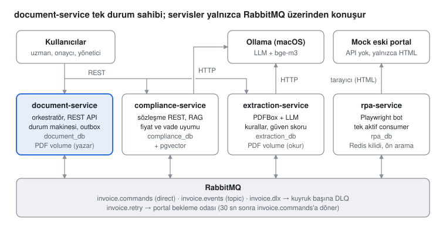

# Smart Invoice Processing and Contract Compliance System — Master Decision Document

> **English translation.** The original is [`docs/DECISIONS.md`](../DECISIONS.md) (Turkish), which is authoritative;
> if the two differ, the Turkish version wins. Translated on 2026-10-03. Identifiers, configuration keys, log and
> error messages that the system actually produces in Turkish are quoted as they are, with a translation where it
> helps.

## 1. Project summary

The system reads supplier invoices from PDF, checks them against rules and against the supplier contract valid on the invoice date, and enters approved invoices into a legacy accounting portal that has no API, using RPA. The goal is a backend system with a narrow scope but deep failure scenarios. There are two core guarantees: an invoice is entered into the portal at most once, and no message is ever silently lost.

This document is the single source for the decisions in the "Requirements and Scope" (30 September 2026) and "System Design" (1 October 2026) documents. It is the reference when coding; IDs (US-xx, FR-xx, NFR-xx) are the same as in the source documents.

**Constraints:** a single developer working at side-project pace; no paid LLM, everything runs locally (M3 Pro, 18 GB); no live deployment, delivery is GitHub + README.

### Actors

| Actor                         | Type               | Role in the system                                                                                                        |
| ----------------------------- | ------------------ | ------------------------------------------------------------------------------------------------------------------------- |
| Accounting expert (AP expert) | Human              | Uploads invoices and contracts, tracks status, corrects low-confidence records                                            |
| Approver                      | Human              | Approves non-compliant or above-threshold invoices or rejects them with a reason; cannot approve their own upload (can reject it; B-43) |
| System administrator          | Human              | Inspects and reprocesses messages in the DLQs; manages thresholds                                                         |
| Legacy accounting portal (mock) | External system  | No API; login, session timeout, pagination and a form that occasionally fails                                             |
| Local LLM (Ollama)            | External component | Maps text to a JSON schema, extracts values from contract clauses; assumed to be fallible                                 |

### Technology stack

| Layer            | Choice                                                                    | Where it is used                                     |
| ---------------- | ------------------------------------------------------------------------- | ---------------------------------------------------- |
| Language and build | Java 25 (LTS), Maven (wrapper, multi-module)                            | All modules                                          |
| Service framework | Spring Boot 4.1.1, Spring AMQP, Spring AI 2.0.x                          | The four services                                    |
| Messaging        | RabbitMQ 4.x, quorum queues                                               | All communication between services                   |
| Database         | PostgreSQL + pgvector (one container, four databases)                     | Each service's own database; contract embeddings     |
| Coordination     | Redis + Redisson                                                          | LLM semaphore (v1), RPA lock and portal session (v2) |
| PDF              | Apache PDFBox                                                             | Invoice and contract text extraction                 |
| LLM / embedding  | Ollama (on macOS), a 7–8B class 4-bit model, bge-m3 (1024 dimensions)     | Field extraction, clause value extraction, embedding |
| RPA              | Playwright (Java)                                                         | Entry into the mock portal                           |
| Testing          | Testcontainers, stub LLM client                                           | Integration tests                                    |
| Observability    | JSON logs, `correlationId`, Actuator + Micrometer                         | All services                                         |

Spring AI 2.0.x is compatible only with Spring Boot 4.0–4.1 (`>=4.0.0 <4.2.0-M1`); moving to Boot 4.2 requires Spring AI 2.1.

### Six principles behind the design

1. **Single owner of state.** An invoice's state lives only in document-service; the other services receive commands, do work and publish events (FR-D9).
2. **Commands vs. events, orchestration.** Commands go to a single recipient, events report what happened; the next step is always started by document-service.
3. **Transactional outbox, without exception.** Every outgoing message is written to the `outbox` table in the same transaction as the business data, and a relay publishes it (NFR-02).
4. **At-least-once delivery + idempotent consumer.** The processed `messageId` is written to the `inbox` table in the same transaction (NFR-01 layer 1).
5. **A state transition is a conditional update.** `UPDATE … WHERE id = ? AND status = ?`; a late or out-of-order event has no effect.
6. **Extra protection for side effects in the outside world.** The portal is not idempotent; RPA is protected by a single active consumer (v1), a Redis lock and a pre-search in the portal (v2).

There are no synchronous calls between services; REST exists only at the doors through which humans enter the system.

## 2. MVP scope (v1) and v2

v1 is the end-to-end happy path and the first version to go on the CV (about 3–4 weeks at side-project pace). The v1 topology is the same as v2's: all queues, DLQs, the outbox and inbox are set up from day one; v2 adds no new messages, it adds logic inside the existing skeleton (the only exception is the RPA waiting room).

### Scenarios

| ID    | Scenario                                         | Expected behaviour                                                                                    | Version |
| ----- | ------------------------------------------------ | ----------------------------------------------------------------------------------------------------- | ------- |
| US-01 | Happy path                                       | PDF is uploaded, `documentId` + `RECEIVED` returned; after extraction, compliance and RPA, `POSTED` + portal record number | v1 |
| US-02 | Same PDF a second time                           | No new record; HTTP 200, the existing `documentId`, `duplicate: true`                                  | v1      |
| US-04 | LLM extracts a wrong field                       | Confidence score below threshold → `NEEDS_REVIEW` (no correction screen in v1)                         | v1      |
| US-05 | LLM does not follow the schema / does not answer | Bounded retries; when exhausted, `NEEDS_REVIEW`                                                        | v1      |
| US-03 | Different file, same invoice (tax number + invoice no) | `DUPLICATE_SUSPECTED`, not entered into the portal                                               | v2      |
| US-06 | Mismatch with the contract                       | `PENDING_APPROVAL`; the approver sees the clause and the difference                                    | v2      |
| US-07 | No valid contract / more than one                | The compliance check is skipped, the invoice goes to human approval                                    | v2      |
| US-08 | RPA crashes during entry                         | The pre-search finds the record, it is not entered again; no duplicate record                          | v2      |
| US-09 | Portal returns a temporary error                 | Retry with increasing wait, re-login; when exhausted, DLQ → `RPA_FAILED`                               | v2      |
| US-10 | Administrator handles the DLQ                    | Safe reprocessing via FR-A1                                                                            | v2      |
| US-11 | Contract upload                                  | The contract is indexed with its validity dates                                                        | v2      |
| US-12 | Invoice history                                  | Who, when, from which state to which                                                                   | v2      |
| US-13 | Approval list and rejection reason               | Lists pending records, rejection with a reason                                                         | v2      |

### Distribution of requirements

|                    | v1                                                                                                                                         | v2                                                                                   |
| ------------------ | ------------------------------------------------------------------------------------------------------------------------------------------ | ------------------------------------------------------------------------------------ |
| document-service   | FR-D1–D5, FR-D9–D10                                                                                                                        | FR-D6–D8, FR-D11                                                                     |
| extraction-service | FR-E1–E5                                                                                                                                   | FR-E6                                                                                |
| compliance-service | FR-C5 (stub)                                                                                                                               | FR-C1–C4                                                                             |
| rpa-service        | FR-R1–R2, FR-R8                                                                                                                            | FR-R3–R7                                                                             |
| Mock portal        | FR-P1–P2                                                                                                                                   | FR-P3                                                                                |
| Administration     | —                                                                                                                                          | FR-A1–A2                                                                             |
| NFR                | NFR-01 (1) + single RPA consumer, NFR-02, NFR-03 (DLX + delivery limit), NFR-06 (logs + correlationId), NFR-07–09, NFR-10 (secrets), NFR-11–14 | NFR-01 (2)(3), NFR-03 retry, NFR-04, NFR-05, NFR-06 metrics, NFR-10 role-based access |

### Non-functional requirements (summary)

| ID     | Topic              | Target                                                                  |
| ------ | ------------------ | ----------------------------------------------------------------------- |
| NFR-01 | Idempotency        | An invoice enters the portal at most once; four layers (section 5)      |
| NFR-02 | Reliability        | Durable queues, manual ack, outbox for every publish                    |
| NFR-03 | Fault tolerance    | DLX on every queue, delivery limit 3; a broken message cannot block a queue |
| NFR-04 | Recoverability     | A restarted service continues where it left off                         |
| NFR-05 | Auditability       | Audit records are never updated or deleted                              |
| NFR-06 | Observability      | JSON logs, `correlationId` = `documentId`, queue/DLQ metrics            |
| NFR-07 | Performance        | Upload API < 500 ms; single-page invoice upload → `POSTED` < 2 min      |
| NFR-08 | Resources          | The whole stack fits in 18 GB; 1–2 concurrent requests to the LLM       |
| NFR-09 | Changeability      | Model and portal selectors in configuration                             |
| NFR-10 | Security           | Portal credentials from secrets, never logged; role-based access (v2)   |
| NFR-11 | Privacy            | Data never leaves the machine, the LLM is local                         |
| NFR-12 | Testability        | Testcontainers; the LLM can be replaced by a stub                       |
| NFR-13 | Installation       | One command: `docker compose up`                                        |
| NFR-14 | Language           | Turkish invoices (characters, TL, decimal comma); multilingual embeddings |

### Out of scope

OCR for scanned PDFs; e-Invoice/UBL and GİB (Turkish tax authority) integration; reporting, dashboards and a front end (API + Swagger and a simple status page are enough); multi-tenancy, SSO/LDAP; cloud and Kubernetes; currency conversion. These are listed in the README as "next steps".

### Assumptions

- Invoices are text-based PDFs, one invoice = one file, mostly Turkish and in TL.
- A supplier is identified by its tax number (VKN); it may have more than one contract, and the one valid on the invoice date applies.
- The portal can be searched by invoice number; duplicate prevention relies on this search.
- Test data consists of synthetic invoice and contract PDFs.

**Known limitation (v1):** Since the pre-search arrives in v2, if RPA crashes during entry and the message is processed again, a duplicate record can be created. The single RPA consumer prevents concurrent double entry; the "at most once" guarantee is completed in v2.

### v1 acceptance criteria

- [ ] At least 8 of the 10 synthetic invoices become `POSTED` without human intervention. **Not met (B-29):** 7/10 with the real model (`qwen2.5:7b-instruct`, prompt v3); 8/10 with the fake LLM (`EndToEndSystemTest`; since B-39, 7 `POSTED` + 1 `PENDING_APPROVAL`: invoice 3, at 1,534,908 TL, is above the amount threshold, so landing in approval is the correct result and counts as without a human). A wrongly extracted invoice is caught by the rules and no wrong data reaches the portal; the remaining error type is a known limitation (B-29, B-32).
- [x] A second upload of the same PDF creates no new record and no portal entry. (B-28, `EndToEndSystemTest`)
- [x] An invoice whose totals do not add up falls into `NEEDS_REVIEW` and is not entered into the portal. (B-28, `EndToEndSystemTest`)
- [x] The system comes up on a clean machine with `docker compose up` + Ollama. (B-32: tried with a clean copy + empty volumes; the first build time on a truly clean machine was not measured.)
- [x] The README has an architecture diagram, demo steps and a v2 roadmap. (B-32)
- [x] An invoice that keeps failing in the portal falls into the DLQ after the delivery limit and does not block the ones behind it. (B-28, `MessagingFaultsSystemTest`)
- [x] When a service killed while publishing a message restarts, no invoice is left stuck in an intermediate state. (B-28, `CrashRecoverySystemTest`)

## 3. Architecture



*(The diagram's labels are in Turkish.)*

The services never call each other: each depends only on RabbitMQ and its own database; the four databases are in one Postgres container. Redis is for coordination only: the LLM semaphore for extraction and compliance (v1), the lock and session for rpa (v2).

### Happy path (US-01)

Every service follows the same rhythm: receive the message, check the inbox, do the work, write the result and the inbox row in one transaction, ack; the outbox relay does the publishing.

1. The expert uploads the PDF; document-service writes `RECEIVED` + the transition + `outbox(ExtractInvoice)` in one transaction and returns 202.
2. extraction-service extracts the text, has the LLM produce JSON with a semaphore permit, computes the rules and the confidence score, and publishes `ExtractionCompleted`.
3. document-service applies `RECEIVED → EXTRACTED → VALIDATED` and publishes `CheckCompliance`.
4. compliance-service (v1 stub) publishes `ComplianceCompleted` with a compliant result.
5. document-service applies `COMPLIANCE_CHECKED → QUEUED_FOR_RPA` and publishes `PostToPortal`.
6. rpa-service logs into the portal, enters the form, gets the record number and publishes `RpaCompleted`.
7. document-service sets the record to `POSTED` and stores the portal record number.

### RPA crashes during entry (US-08, v2)

1. rpa-service takes the lock, writes `portal_submissions` = `IN_PROGRESS`, runs the pre-search (no record) and submits the form.
2. It dies before writing the result: the transaction is not committed, no ack is sent, the lock's lease expires.
3. The message is redelivered; the bot takes the lock and finds the record in the pre-search.
4. `FOUND_EXISTING` + `RpaCompleted(foundExisting = true)` are written; the form is not filled again and the record becomes `POSTED`.

### Portal keeps failing, administrator reprocesses (US-09, US-10)

1. On a temporary error rpa-service defers the message to the waiting room (30 s, same identity); when `invoice.rpa.max-attempts` (4) is reached it rejects it, and the message falls into `rpa.post-to-portal.dlq` (B-37).
2. The document-service DLQ listener parks the message in `dead_letters` and sets the record to `RPA_FAILED`.
3. Once the portal recovers, the administrator calls `POST /api/v1/admin/dead-letters/{id}/reprocess`; the `RPA_FAILED → QUEUED_FOR_RPA` transition and a new `PostToPortal` are written, and this command becomes the pending command (B-38). In rpa-service a new command starts a new round, with its own attempts.
4. rpa-service takes the lock, runs the pre-search and enters the invoice; the record becomes `POSTED`.

## 4. Services

The boundaries were drawn by reason for change: workflow rules, LLM extraction, contract knowledge and portal automation change independently of each other; each service owns a single "hard thing". Every service has the same `outbox` and `inbox` tables (section 5). The DDL blocks are drafts derived from the columns in the design; types are finalized in the first migration.

### 4.1 document-service (orchestrator)

**Responsibility:** the invoice life cycle. Upload, duplicate check by hash, the state machine, duplicate and threshold decisions, approval/rejection, reflecting the DLQs onto records. The confidence-threshold comparison is here: extraction-service only measures the score, document-service makes the decision. It has no external dependencies.

#### REST API

| Method and path | What it does | Response | Version |
| --- | --- | --- | --- |
| `POST /api/v1/documents` (multipart, `file` part, ≤ 20 MB) | Receives the PDF and computes SHA-256; if new, the record + the `ExtractInvoice` outbox row in one transaction | 202 `{documentId, status: RECEIVED, duplicate: false}` + `Location`; if the hash is known, 200 `{documentId, status, duplicate: true}`; not a PDF 415, size exceeded 413, missing part 400 (`ProblemDetail`) | v1 |
| `GET /api/v1/documents/{id}` | Status, `documents` columns, `fields` + `ruleResults` (`invoice_data`), `compliance` (`compliance_results`), portal record number; parts that do not exist yet are `null`. The version is in the `ETag` (`"3"`, B-40) | 200; 404 if not found, 400 if the ID is not a UUID | v1 |
| `GET /api/v1/documents?status=&vkn=&from=&to=&page=&size=` | Filtered, paged summary list; `from`/`to` apply to the invoice date, inclusive; `vkn` exact match; `page` from 0, `size` 20 (≤ 100); `created_at DESC` | 200 `{content, page, size, totalElements, totalPages}`; invalid parameter 400 | v1 |
| `GET /api/v1/documents/{id}/history` | Status history (US-12, B-42): `status_transitions` rows from oldest to newest (`id` order), each `{from, to, event, actor, reason, messageId, at}`; on the upload row `from` is null, `messageId` is set only for transitions triggered by a message. History is append-only (NFR-05) | 200; empty list for a record without transitions; 404 if there is no record | v2 (B-42) |
| `PUT /api/v1/documents/{id}/fields` | Field correction for a `NEEDS_REVIEW` record (B-40): the full `InvoiceFields` replaces the old one; `If-Match: "<version>"` is mandatory. Error order 404 → 409 (state) → 412 (version) → 422 (rules, violations in `violations` in `ruleResults` format). The response is the current record + the new `ETag` | 200; 428 without `If-Match`, 400 if malformed, 412 on version mismatch, 409 on state mismatch, 422 if the rules fail | v2 (B-40) |
| `POST /api/v1/documents/{id}/approve` · `/reject` | Approval (`PENDING_APPROVAL`) or rejection with a reason (`NEEDS_REVIEW` or `PENDING_APPROVAL`; body `{reason}`, empty reason 400). No `If-Match`: fields cannot change in `PENDING_APPROVAL`. The response is the current record + `ETag`. Role: approve needs `APPROVER`; reject needs `EXPERT` (`NEEDS_REVIEW`) or `APPROVER` (`PENDING_APPROVAL`) depending on the record's state, otherwise 403; an approver cannot approve their own upload (403, B-43) | 200; 409 in an invalid state, 404 if not found | v2 (B-40) |
| `POST /api/v1/documents/{id}/duplicate-decision` | Closes a duplicate suspicion (B-41, US-03): body `{duplicate, reason}`; `true` → `REJECTED` (reason mandatory), `false` → `VALIDATED` + `CheckCompliance` (reason optional). Matching records are in `duplicateOf` in the `GET /documents/{id}` response (filled only for a `DUPLICATE_SUSPECTED` record). The response is the current record + `ETag` | 200; 400 if `duplicate` is missing or the reason is empty for a duplicate decision, 409 on state mismatch, 404 if not found | v2 (B-41) |
| `GET /api/v1/admin/dead-letters[?status=&page=&size=]` · `GET …/{id}` · `POST …/{id}/reprocess` · `POST …/{id}/ignore` | DLQ parking table and reprocessing (FR-A1, B-38): the list goes from newest to oldest, the detail has the body and the `x-death` JSON. `reprocess` only for an `OPEN`, `DLQ`, `PostToPortal` record while the document is `RPA_FAILED`: in one transaction `RPA_FAILED → QUEUED_FOR_RPA`, a new `PostToPortal` (becomes the pending command), the record becomes `REPROCESSED`. `ignore`: `OPEN → IGNORED`. `ADMIN` only (B-43); the actor is the administrator's name | 200 `{deadLetterId, documentId, commandMessageId}` · 204; 409 on state mismatch, 404 if not found | v2 (B-38) |
| `GET /api/v1/admin/settings` · `PUT /api/v1/admin/settings` | Confidence and amount thresholds (FR-A2, B-39): `{confidenceThreshold, approvalAmountThreshold}`, as strings. `PUT` takes both or one; what is not given does not change. Confidence 0–1 (≤ 4 decimals), amount ≥ 0 (≤ 2 decimals). In one transaction, `settings` + a `settings_changes` row for each real change (the same value leaves no trace); after commit this instance's cache is cleared, other instances follow within the TTL (5 s) at most. `ADMIN` only (B-43); the actor is the administrator's name | 200 current values; invalid body 400, nothing is written | v2 (B-39) |

**Authorization (B-43, NFR-10, ADR-22):** HTTP Basic, stateless, CSRF disabled; an unauthenticated request gets 401, an insufficient role 403. Per-endpoint rules are in `SecurityConfiguration`: `/actuator/health` and `/error` are open; `/api/v1/admin/**` needs `ADMIN`; upload, field correction and duplicate decision need `EXPERT`; approval `APPROVER`; rejection `EXPERT` or `APPROVER`; `GET /api/v1/documents…` any logged-in user; anything undefined is denied. State-dependent rules are in the service (error order 404 → 409 → 403): rejection needs an expert in `NEEDS_REVIEW` and an approver in `PENDING_APPROVAL`; an approver cannot approve a record whose `uploaded_by` is themselves, but can reject it. The actor of transitions and of the settings trail, and `uploaded_by`, is the user name. Users are in `invoice.document.security.users` (`application.yml`): `expert` (EXPERT), `approver` (APPROVER), `admin` (ADMIN), `expert-approver` (EXPERT + APPROVER; the prohibition can only be seen with a user who has both roles). Passwords come from `.env` (`API_*_PASSWORD`) and are BCrypt-hashed at startup; if one is empty the service does not start, and `toString` masks them.

#### Inside the upload request

1. If the first bytes are not `%PDF-`, 415 is returned and the file is not written (the content type is not trusted). The file is streamed into `.staging/` under the storage directory (same file system, for an atomic move) while SHA-256 is computed with a `DigestInputStream`; memory use does not depend on the file size.
2. `INSERT INTO documents … ON CONFLICT (file_sha256) DO NOTHING RETURNING id` runs. If no row is returned, the existing record is read and 200 `duplicate: true` is returned. Two concurrent uploads are resolved by the unique constraint; no Redis lock is needed.
3. For a new record, `status_transitions` and `outbox` (`ExtractInvoice`) are written in the same transaction, and the file is moved to `/data/documents/{sha256}.pdf`.
4. If the commit succeeds, 202 is returned. A crash before the commit leaves only an orphan file; a nightly cleanup job deletes files without a record.

In the API JSON, `BigDecimal` is always written as a string (`grandTotal`, `confidenceScore`, the values in `fields`; B-13). Errors are in `ProblemDetail` (RFC 9457) format.

Details (B-10): the move happens before the commit, because in the reverse order a crash would point `ExtractInvoice` at a file that does not exist. The first transition is `— → RECEIVED`, `trigger_event = UPLOAD`; since B-43 the actor and `uploaded_by` are the uploading user's name (before that `actor = api`, `uploaded_by` empty). Tomcat reads and discards an oversized body so the client gets 413 (`server.tomcat.max-swallow-size: 100MB`; with the 2 MB default the connection was cut without a response). Data access uses `JdbcClient` (ADR-21).

#### State machine

The main flow is `RECEIVED → EXTRACTED → VALIDATED → COMPLIANCE_CHECKED → QUEUED_FOR_RPA → POSTED`; the side branches are `NEEDS_REVIEW`, `PENDING_APPROVAL`, `REJECTED`, `DUPLICATE_SUSPECTED`, `RPA_FAILED`. `POSTED` and `REJECTED` are final states. Any transition not in the table is rejected (FR-D4).

**Priority rule:** when `ExtractionCompleted` is received, `NEEDS_REVIEW` > `DUPLICATE_SUSPECTED` > `VALIDATED` are evaluated in that order. If the confidence is low, the tax number and invoice number cannot be trusted either, so no duplicate check is done. `EXTRACTED` and `VALIDATED` are applied one after the other in the same transaction; two separate rows land in `status_transitions`. **Duplicate check (B-41, FR-D8, `DuplicateCheck`):** a match = the same trimmed tax number and the same trimmed, upper-cased invoice number on any other record that is not `REJECTED` (`POSTED`, in progress, `NEEDS_REVIEW`, another `DUPLICATE_SUSPECTED`); a rejected document can be uploaded again. If the tax number or invoice number is missing, no check is done. Two concurrent documents for the same invoice could not see each other in their own transactions; before the check `pg_advisory_xact_lock(hashtextextended(key, 0))` is taken, so the second document waits for the first one's commit and sees it (only the same key waits). The reason is `mükerrer şüphesi: <id> (<status>), …` ("duplicate suspicion: …"). It also applies after an expert correction (the tax number or invoice number may have changed). If the expert says "not a duplicate" and the portal already has the record, the pre-search finds it (`FOUND_EXISTING`), and there is no second portal entry.

| Source                | Target                            | Trigger                                                                                                        | Produced by      | Version   |
| --------------------- | --------------------------------- | -------------------------------------------------------------------------------------------------------------- | ---------------- | --------- |
| —                     | `RECEIVED`                        | PDF uploaded, new hash                                                                                         | Expert (API)     | v1        |
| `RECEIVED`            | `EXTRACTED`                       | `ExtractionCompleted`                                                                                          | extraction       | v1        |
| `RECEIVED`            | `NEEDS_REVIEW`                    | `ExtractionFailed` or `ExtractInvoice` in the DLQ                                                              | extraction / DLQ | v1        |
| `EXTRACTED`           | `NEEDS_REVIEW`                    | Confidence score < threshold (priority 1)                                                                      | document         | v1        |
| `EXTRACTED`           | `DUPLICATE_SUSPECTED`             | Tax number + invoice no match another record (priority 2; also after an expert correction)                     | document         | v2 (B-41) |
| `EXTRACTED`           | `VALIDATED`                       | Score ≥ threshold, no duplicate                                                                                | document         | v1        |
| `NEEDS_REVIEW`        | `EXTRACTED`                       | Expert corrected the fields (`If-Match`), followed by `EXTRACTED → VALIDATED` + `CheckCompliance`             | Expert (API)     | v2 (B-40) |
| `NEEDS_REVIEW`        | `REJECTED`                        | Expert rejected (reason mandatory)                                                                             | Expert (API)     | v2 (B-40) |
| `DUPLICATE_SUSPECTED` | `VALIDATED` / `REJECTED`          | Expert said not a duplicate (+ `CheckCompliance`) / said duplicate (reason mandatory)                          | Expert (API)     | v2 (B-41) |
| `VALIDATED`           | `COMPLIANCE_CHECKED`              | `ComplianceCompleted`: compliant and amount ≤ threshold (the v1 stub is always compliant)                      | compliance       | v1        |
| `VALIDATED`           | `PENDING_APPROVAL`                | `ComplianceCompleted`: compliant but amount > threshold or currency not TRY                                     | document         | v2 (B-39) |
| `VALIDATED`           | `PENDING_APPROVAL`                | `ComplianceCompleted`: `NON_COMPLIANT`, `NO_CONTRACT` or `CONTRACT_CONFLICT` (reason: result + findings summary) | compliance     | v2 (B-46) |
| `VALIDATED`           | `PENDING_APPROVAL`                | `CheckCompliance` in the DLQ                                                                                   | DLQ              | v1        |
| `PENDING_APPROVAL`    | `COMPLIANCE_CHECKED` / `REJECTED` | Approver approved (followed by `QUEUED_FOR_RPA` + `PostToPortal`) / rejected                                   | Approver (API)   | v2 (B-40) |
| `COMPLIANCE_CHECKED`  | `QUEUED_FOR_RPA`                  | State + `PostToPortal` to the outbox in the same transaction                                                   | document         | v1        |
| `QUEUED_FOR_RPA`      | `POSTED`                          | `RpaCompleted` (including one found by the pre-search)                                                         | rpa              | v1        |
| `QUEUED_FOR_RPA`      | `RPA_FAILED`                      | `PostToPortal` in the DLQ                                                                                      | DLQ              | v1        |
| `RPA_FAILED`          | `QUEUED_FOR_RPA`                  | Administrator reprocessed, new `PostToPortal`                                                                  | Administrator (API) | v2     |

Moving a message from the DLQ straight back to the queue is not a valid transition; reprocessing happens only through FR-A1, with a new command.

**Implementation (B-11):** the table lives in code, in `TransitionTable` (all v1 and v2 rows; the code that triggers the v2 rows arrives in v2). The only way to change state is `StatusTransitions.apply(documentId, from, to, trigger)`, and it is only called inside a transaction:

1. If the pair is not in the table, `IllegalTransitionException` (a programming error; the message is put back, DLQ after the limit).
2. `UPDATE documents SET status = :to, version = version + 1, updated_at = now() WHERE id = :id AND status = :from`.
3. 1 row → written to `status_transitions`, `APPLIED`. 0 rows → `STALE`; if the trigger is a message, the event is written to `dead_letters` as `LATE_EVENT` / `OPEN` and a warning is logged (an unknown `documentId` is recorded the same way); for an API trigger (v2) nothing is recorded and the caller returns 409.

**Event handling (B-12):** the three event queues are consumed with `on(...)` (short work); the inbox and the single transaction are in the listener, the late-event record is in the state machine. Prefetch and concurrency are `invoice.document.listener.{prefetch, concurrency}` (default 10 · 2).

- `ExtractionCompleted`: `RECEIVED → EXTRACTED` (actor `extraction-service`; stops if `STALE`). The fields are written to `documents` (tax number, invoice no, date, grand total, currency, score) and to `invoice_data` (`fields`, `rule_results`, `source = LLM`); also for a low-confidence record. Then, in the same transaction, by the priority rule: `score < threshold` → `NEEDS_REVIEW`; otherwise, if there is a duplicate, `DUPLICATE_SUSPECTED` (no command); otherwise `VALIDATED` + `CheckCompliance` (actor `document-service`, reason e.g. `güven 0.62 < eşik 0.80` — "confidence 0.62 < threshold 0.80"). If the score or the fields are missing, `NEEDS_REVIEW`. The duplicate check arrived in B-41.
- `ExtractionFailed`: `RECEIVED → NEEDS_REVIEW`, reason `reason: detail`.
- `ComplianceCompleted`: if `COMPLIANT`, first the approval decision (FR-D11, B-39): if the currency is not `TRY` (no currency conversion) or `grandTotal > approval_amount_threshold` (the threshold itself is not included), `VALIDATED → PENDING_APPROVAL`, `compliance_results` is written, no command is written; the approver decides (B-40). Otherwise `VALIDATED → COMPLIANCE_CHECKED`, `compliance_results`, then `COMPLIANCE_CHECKED → QUEUED_FOR_RPA` + `PostToPortal`. Both paths in one transaction. document-service makes the decision (FR-C4): the transition's actor is `document-service`, the reason `tutar X > eşik Y` / `tutar X ≤ eşik Y` / `para birimi USD ≠ TRY` ("amount X > threshold Y" / "amount X ≤ threshold Y" / "currency USD ≠ TRY"); if the amount or currency is missing, to approval. `NON_COMPLIANT`, `NO_CONTRACT`, `CONTRACT_CONFLICT` (B-46, US-06, US-07): `VALIDATED → PENDING_APPROVAL`, actor `compliance-service`, reason e.g. `NON_COMPLIANT: UNIT_PRICE (Madde 4.1), PAYMENT_TERM güvenilmez` ("… (Clause 4.1), PAYMENT_TERM unreliable"); the findings go to `compliance_results`, no command is written; the approver sees the findings in `GET /documents/{id}` → `compliance`. The amount threshold applies only to compliant invoices.
- Human steps (B-40, `DocumentReview`), each in one transaction. **Correction:** `NEEDS_REVIEW → EXTRACTED` (actor `expert`, with the `If-Match` version in the condition), `invoice_data` (`source = EXPERT_CORRECTION`, with the rule results) and the search copies in `documents`; the confidence score stays the LLM's. Then the decision is made again: if there is a duplicate, `EXTRACTED → DUPLICATE_SUSPECTED` (B-41), otherwise `EXTRACTED → VALIDATED` + `CheckCompliance` (actor `document-service`, reason `uzman düzeltmesi, kurallar geçti` — "expert correction, rules passed"); the confidence threshold is not applied, this is human input. If the correction fails the structural check, nothing changes (422). **Approval:** `PENDING_APPROVAL → COMPLIANCE_CHECKED` (actor `approver`) `→ QUEUED_FOR_RPA` + `PostToPortal` (`RpaDispatch`, pending command). **Rejection:** `NEEDS_REVIEW` (actor `expert`) or `PENDING_APPROVAL` (actor `approver`) `→ REJECTED`, the reason is the transition's `reason`. The actor is the name of the user making the request (B-43; previously the fixed `expert` / `approver`). **Duplicate decision (B-41):** `DUPLICATE_SUSPECTED → VALIDATED` + `CheckCompliance` (trigger `NOT_DUPLICATE`) or `→ REJECTED` (`DUPLICATE_CONFIRMED`, reason mandatory), actor `expert`.
- `RpaCompleted`: `QUEUED_FOR_RPA → POSTED`, `portal_ref_no` is written.

**DLQs (B-14, FR-D10):**

- The command DLQs (`extraction.extract-invoice.dlq` → `RECEIVED → NEEDS_REVIEW`, `compliance.check-compliance.dlq` → `VALIDATED → PENDING_APPROVAL`, `rpa.post-to-portal.dlq` → `QUEUED_FOR_RPA → RPA_FAILED`) are consumed by `DeadLetterListener` in `common-messaging` (prefetch 1 · 1). In one transaction: inbox (`consumer` = DLQ name), a `dead_letters` row (`kind = DLQ`, `status = OPEN`, `source_queue` = `x-first-death-queue`, body, `x_death`), the state transition (trigger `DLQ:<Type>`, actor `dlq`), then ack. If the record is not in the expected state it is only parked; no separate `LATE_EVENT` is written. A poison message is parked too (if the body is not valid JSON, `{"raw": …}`; if it has no type, `UNKNOWN`), with no transition.
- The event DLQs (`document.*-events.dlq`) are not consumed; the messages stay in the queue so they can be republished once the bug is fixed. `EventDeadLetterMonitor` reads their depths every `invoice.document.event-dlq-check-interval` (default 1 min) with a passive `queue.declare` and logs a non-empty one at `ERROR` (in v1 an alarm = a log line; verified to work without the application user's `configure` permission). The metric arrived in B-48.

The `CheckCompliance` and `PostToPortal` bodies are built from `invoice_data.fields` (the official data; supplier name, due date and VAT exist only there). The threshold is read from `settings` and kept in memory for `invoice.document.settings-cache-ttl` (default 5 s). The `invoice_data` JSON is written with the same converter rules as the messages; amounts are strings there too.

For events, the only protection is the state condition: events carry no version, and a concurrent second update is already stopped by the row lock and the state condition. `version` increases on every transition; the optional `expectedVersion` is for `If-Match` in v2. Field updates (tax number, amount, portal number) are not done in the state machine but by the caller, in the same transaction, after the transition is applied (B-12).

#### Database: document_db

The final schema is in `document-service/src/main/resources/db/migration/V1__document_schema.sql` (B-09). Type decisions: code columns are `TEXT` + `CHECK`; copies of values coming from the LLM (`supplier_vkn`, `currency`, `grand_total`) are loosely typed, so bad output does not fall into the DLQ through an INSERT error but is recorded and goes to `NEEDS_REVIEW`, and an amount is never silently rounded (validation is in the FR-E3 rules); `updated_at` and `version` are updated in the application inside the conditional `UPDATE`, there are no triggers; `settings` comes with placeholder initial values (A5).

```sql
CREATE TABLE documents (
    id               UUID PRIMARY KEY,
    file_sha256      CHAR(64)    NOT NULL UNIQUE CHECK (file_sha256 ~ '^[0-9a-f]{64}$'),   -- US-02
    storage_uri      TEXT        NOT NULL,
    status           TEXT        NOT NULL CHECK (status IN (…eleven states…)),
    supplier_vkn     TEXT,                                -- LLM output; the 10-digit rule is in FR-E3
    invoice_no       TEXT,
    invoice_date     DATE,
    grand_total      NUMERIC,                             -- unscaled: no rounding
    currency         TEXT,
    confidence_score NUMERIC(5,4),
    portal_ref_no    TEXT,
    uploaded_by      TEXT,                                -- an approver cannot approve their own upload
    version          INT         NOT NULL DEFAULT 0,      -- If-Match, conditional transition
    created_at       TIMESTAMPTZ NOT NULL DEFAULT now(),
    updated_at       TIMESTAMPTZ NOT NULL DEFAULT now()
);
CREATE INDEX documents_vkn_invoice ON documents (supplier_vkn, invoice_no);  -- not unique (US-03)
CREATE INDEX documents_duplicate_key ON documents (btrim(supplier_vkn), upper(btrim(invoice_no)));  -- V4, B-41: duplicate match key
CREATE INDEX documents_status      ON documents (status, updated_at);        -- list + stuck record detector

CREATE TABLE invoice_data (            -- the invoice's "official" data
    document_id  UUID PRIMARY KEY REFERENCES documents(id),
    fields       JSONB NOT NULL,
    rule_results JSONB NOT NULL,
    source       TEXT  NOT NULL CHECK (source IN ('LLM', 'EXPERT_CORRECTION')),
    updated_at   TIMESTAMPTZ NOT NULL DEFAULT now()
);

CREATE TABLE compliance_results (      -- source of the approver screen (US-06)
    document_id UUID PRIMARY KEY REFERENCES documents(id),
    result      TEXT  NOT NULL CHECK (result IN ('COMPLIANT', 'NON_COMPLIANT', 'NO_CONTRACT', 'CONTRACT_CONFLICT')),
    findings    JSONB NOT NULL,
    created_at  TIMESTAMPTZ NOT NULL DEFAULT now()
);

CREATE TABLE status_transitions (      -- append-only; V5 (B-42): UPDATE/DELETE/TRUNCATE privileges revoked + rejecting triggers
    id            BIGSERIAL PRIMARY KEY,
    document_id   UUID NOT NULL REFERENCES documents(id),
    from_status   TEXT CHECK (from_status IN (…)),
    to_status     TEXT NOT NULL CHECK (to_status IN (…)),
    trigger_event TEXT NOT NULL,
    message_id    UUID,
    actor         TEXT NOT NULL,
    reason        TEXT,
    created_at    TIMESTAMPTZ NOT NULL DEFAULT now()
);
CREATE INDEX status_transitions_document ON status_transitions (document_id, created_at);  -- FK + history (US-12)

CREATE TABLE dead_letters (            -- DLQ parking table + late events
    id           UUID PRIMARY KEY,
    kind         TEXT NOT NULL CHECK (kind IN ('DLQ', 'LATE_EVENT')),
    source_queue TEXT NOT NULL,
    message_type TEXT NOT NULL,
    message_id   UUID NOT NULL,
    document_id  UUID,
    body         JSONB NOT NULL,
    x_death      JSONB,
    status       TEXT NOT NULL CHECK (status IN ('OPEN', 'REPROCESSED', 'IGNORED')),
    created_at   TIMESTAMPTZ NOT NULL DEFAULT now()
);
CREATE INDEX dead_letters_status ON dead_letters (status, created_at);  -- administrator list (FR-A1)

CREATE TABLE settings (                -- FR-A2; cached in memory for a few seconds
    key        TEXT PRIMARY KEY,
    value      TEXT NOT NULL,
    updated_at TIMESTAMPTZ NOT NULL DEFAULT now()
);
-- Placeholder values (A5): confidence_threshold = 0.80, approval_amount_threshold = 100000.00 (v2)

CREATE TABLE settings_changes (        -- B-39 (V3); append-only, the settings API's trail
    id         BIGINT GENERATED ALWAYS AS IDENTITY PRIMARY KEY,
    key        TEXT NOT NULL REFERENCES settings (key),
    old_value  TEXT NOT NULL,
    new_value  TEXT NOT NULL,
    actor      TEXT NOT NULL,          -- since B-43 the administrator's user name (before that the fixed 'admin')
    changed_at TIMESTAMPTZ NOT NULL DEFAULT now()
);
```

Files: the `documents` volume (`/data/documents/{sha256}.pdf`), content-addressed and immutable.

**Immutability of the history (B-42, NFR-05):** `V5__status_transitions_append_only` sets up two layers: (1) the UPDATE, DELETE and TRUNCATE privileges on `status_transitions` are revoked from the user that runs the migrations (`document_user`, which is also the application user and the table owner); (2) even if the privilege is granted back by mistake, UPDATE/DELETE (row) and TRUNCATE (statement) triggers raise the error `status_transitions yalnızca eklenir` ("status_transitions is append-only"; this also stops a superuser). The table owner can grant the privilege back to itself and drop the trigger: the protection is against application bugs and accidents, not against a malicious database owner. Alternative: a separate owner role for Flyway (`document_owner`) and an application user with only SELECT/INSERT. It would give a real separation of privileges, but would need a new secret, an init script, compose and Testcontainers changes, manual ownership migration in existing dev volumes, and would apply only to document-service. `settings_changes` is also an audit table but is not protected yet; the same method can be added if needed.

#### Messages

| Direction  | Message                                   | Queue / routing key                                                                                                                                |
| ---------- | ----------------------------------------- | -------------------------------------------------------------------------------------------------------------------------------------------------- |
| Publishes  | `ExtractInvoice`                          | `invoice.commands` · `extract.invoice`                                                                                                             |
| Publishes  | `CheckCompliance`                         | `invoice.commands` · `compliance.check`                                                                                                            |
| Publishes  | `PostToPortal`                            | `invoice.commands` · `rpa.post`                                                                                                                    |
| Listens    | `ExtractionCompleted`, `ExtractionFailed` | `document.extraction-events.q`                                                                                                                     |
| Listens    | `ComplianceCompleted`                     | `document.compliance-events.q`                                                                                                                     |
| Listens    | `RpaCompleted`                            | `document.rpa-events.q`                                                                                                                            |
| Listens    | Command DLQs                              | `extraction.extract-invoice.dlq` → `NEEDS_REVIEW`; `compliance.check-compliance.dlq` → `PENDING_APPROVAL`; `rpa.post-to-portal.dlq` → `RPA_FAILED` |

#### Background jobs

- **Outbox relay:** sends unpublished rows every 500 ms (section 5).
- **Stuck record detector:** every minute, counts records that have stayed in `RECEIVED`, `VALIDATED` or `QUEUED_FOR_RPA` longer than a threshold (by `updated_at`); in v1 it only raises an alarm, the metric arrived in B-48. Thresholds are per state (B-15): `RECEIVED` 30 min (LLM queue), `VALIDATED` 10 min, `QUEUED_FOR_RPA` 30 min (portal and retries); `invoice.document.stuck-detection.*`. The alarm is a single `ERROR` line per round: the count per state and at most the 10 oldest records. States that wait for a human are not counted as stuck.
- **Inbox cleanup:** deletes rows older than 30 days (`InboxCleaner` in `common-messaging`, hourly, in chunks of 10,000; `invoice.messaging.inbox.{retention, cleanup-interval, cleanup-batch-size}`, `cleanup.enabled`).
- **Outbox cleanup (A7):** deletes published rows older than 7 days (`OutboxCleaner`, hourly, in chunks of 10,000; `invoice.messaging.outbox.{retention, cleanup-interval, cleanup-batch-size}`, `cleanup.enabled`). It never touches an unpublished row, however old.
- **Orphan file cleanup:** nightly, deletes PDFs without a record. Cron `invoice.document.orphan-cleanup.cron` (default `0 0 3 * * *`, `@Scheduled`). It only touches files older than 1 hour (`grace-period`): since the file is moved into place before the commit (B-10), the file of a record about to be committed must not be deleted. It also deletes old temporary files under `.staging/`; it does not touch files whose names are not hashes.

### 4.2 extraction-service

**Responsibility:** producing structured invoice data from the PDF and saying how reliable it is. It makes no decisions; it only measures the score. External dependencies: Ollama, the file store (read-only), Redis (LLM semaphore).

**REST API:** none (Actuator only).

#### How it works

1. `ExtractInvoice` is received; a cheap `inbox.exists` check is done, and the work runs outside a transaction.
2. Text is extracted deterministically with PDFBox (FR-E1). If no text comes out, `ExtractionFailed` (reason: no text). Details (B-17, `PdfTextExtractor`): `storageUri` may only use the `file:` scheme and must be inside the storage root (`invoice.extraction.storage-dir`); the file's SHA-256 is compared with `fileSha256` in the message; if either check fails it is a permanent error (`DocumentIntegrityException`). A missing file counts as an infrastructure problem (`DocumentNotAvailableException`, the message is put back, DLQ → `NEEDS_REVIEW` if it persists). Text is extracted in positional order (left and right blocks at the same height end up on one line), multi-page text is separated with `--- Sayfa n ---` ("--- Page n ---"), and Unicode NFC and whitespace normalization are applied. Fewer than 20 non-whitespace characters (`min-text-chars`) and a PDF that cannot be opened (corrupt, encrypted) become `NO_TEXT`; the distinction is in the `detail` field, no new reason was added to the message contract.
3. A Redis `sem:llm` permit is taken; through Spring AI, the LLM is made to produce schema-constrained JSON (FR-E2, FR-E5). Details (B-18): model `qwen2.5:7b-instruct` (`invoice.extraction.llm.model` ← `OLLAMA_CHAT_MODEL`, pulled on the host beforehand, not downloaded at startup); a hand-written JSON schema (`InvoiceSchema`) as Ollama's `format`, temperature 0, prompt v1 (`PromptV1`; it states explicitly the seller/buyer distinction and that ETTN/IBAN/MERSİS numbers are not the tax number; since B-29 the default is v3, `num_ctx` 8192, `num_predict` 4096, a `maxLength` per field in the schema). The LLM returns every value as a string **as printed** on the invoice (`"1.234,56 TL"`, `"18/09/2026"`, `"%20"`); amounts and dates are converted by deterministic Turkish parsers (`TurkishNumbers`, `TurkishDates`), and a value that cannot be parsed stays `null` and is caught in rule validation (B-20). The VAT rate is the first number in the field (`parseRate`): the model sometimes writes the rest of the line into this field (`"1 %1 9.200,00 TL"`), and the general parser, which removes spaces, read this as 119200 (found in a smoke test with real Ollama). The semaphore is a Redisson `RPermitExpirableSemaphore`: 2 permits, the permit lease is twice the LLM timeout (if the service crashes while holding a permit, it comes back on its own); if Redis cannot be reached it falls back to a local semaphore with 1 permit; if no permit is obtained within `permit-wait` (10 min), the message is put back. `RedissonClient` is initialized lazily, so the service starts while Redis is down.
4. On a parse error or timeout, a bounded retry is done with the error added to the prompt. When retries are exhausted, `ExtractionFailed` is published and the message is acked: this is a business result, not a DLQ case (US-05). Details (B-19, `LlmExtraction`): at most 3 attempts (`llm.max-attempts`); on broken output, the previous raw answer and the error are added to the next prompt; the timeout is applied at the HTTP level with `spring.http.clients.read-timeout` = `llm.timeout` (120 s), so the request is really cut; the semaphore permit is per attempt. **Spring AI's own retry is disabled** (`spring.ai.retry.max-attempts: 0`): the value is the number of retries in addition to the first attempt; the default (10), and even 1, sent every attempt to Ollama twice and multiplied the timeout (measured with a fake Ollama server). Errors are classified by their cause chain (`LlmFailures`); Boot picks the Reactor Netty client here, so the read timeout is Netty's `ReadTimeoutException`.
5. The output is validated against the rules (FR-E3), and the confidence score is computed from the rule results (FR-E4).
6. `extraction_runs` + `inbox.tryInsert` + `outbox(ExtractionCompleted)` are written in a short transaction, then ack.

#### Extraction schema (FR-E2)

| Field                                 | Description                                       |
| ------------------------------------- | ------------------------------------------------- |
| `supplierName`, `supplierVkn`         | Supplier name, 10-digit tax number (VKN)          |
| `invoiceNo`, `invoiceDate`, `dueDate` | Invoice number, date, due date                    |
| `lines[]`                             | `description`, `quantity`, `unitPrice`, `vatRate` |
| `subtotal`, `vatTotal`, `grandTotal`  | Subtotal, VAT, grand total                        |
| `currency`                            | Currency (no conversion)                          |

#### Validation rules (FR-E3)

- Sum of lines = subtotal (within tolerance).
- Subtotal + VAT = grand total (within tolerance).
- Tax number has 10 digits.
- Invoice date ≤ due date.
- Mandatory fields are present.
- Turkish number format (decimal comma, TL) is parsed correctly (NFR-14).

How much each violation lowers the score and the initial value of the threshold are an open decision (open decision A5).

**Implementation (B-20, `InvoiceValidator`, `ConfidenceScore`):** each rule produces a `RuleResult(rule, passed, detail)`; the details are Turkish texts meant for the expert (e.g. `kalem toplamı 15.100,00 ≠ ara toplam 15.400,00 (fark 300,00, tolerans 0,02)` — "sum of lines 15,100.00 ≠ subtotal 15,400.00 (difference 300.00, tolerance 0.02)"), visible in `invoice_data.rule_results` and through `GET /documents/{id}`. The input is the LLM's raw output and the parsed fields.

| Code                              | Check                                                                                            | Weight |
| --------------------------------- | ------------------------------------------------------------------------------------------------ | ------ |
| `REQUIRED_FIELDS_PRESENT`         | supplier name, tax number, invoice no, date, due date, ≥1 line, subtotal, VAT, grand total, currency | 0.50 |
| `VKN_10_DIGITS`                   | exactly 10 digits                                                                                | 0.30   |
| `LINES_SUM_EQUALS_SUBTOTAL`       | Σ(quantity × unit price) ≈ subtotal; tolerance max(0.02; 0.01 × number of lines)                 | 0.40   |
| `SUBTOTAL_PLUS_VAT_EQUALS_TOTAL`  | subtotal + VAT ≈ grand total; tolerance 0.02                                                     | 0.40   |
| `AMOUNTS_PARSED`                  | every amount, date and rate the LLM returned non-empty went through the Turkish parser (NFR-14)  | 0.30   |
| `INVOICE_DATE_NOT_AFTER_DUE_DATE` | invoice date ≤ due date (light)                                                                  | 0.15   |
| `VAT_MATCHES_LINES`               | Σ(line net × rate) ≈ VAT total, with the line tolerance (in addition to FR-E3, light)            | 0.15   |

Confidence score = 1.00 − the weights of the failed rules, floor 0, two decimals. A critical rule on its own pushes the score below the default threshold (0.80); one light rule does not, two do. A rule that cannot be computed because of a missing value counts as failed. Tolerances and weights are set with `invoice.extraction.validation.*` (NFR-09); on the B-16 set with the stub LLM, invoices 1–8 score 1.00 and invoice 9 scores 0.45.

**Checking an expert correction (B-40, `CorrectionValidator`, document-service):** the rules above that do not depend on the LLM, with the same codes and default tolerances (except `AMOUNTS_PARSED`; the values arrive typed from JSON), plus `LINES_VALID` (each line has a description, quantity > 0, unit price ≥ 0, VAT rate 0–100). There is no score: either everything passes or the correction is rejected with 422. The cost: the arithmetic and tolerances exist in two services (`invoice.document.correction.*`, defaults the same as `invoice.extraction.validation.*`); a deliberate duplication because there are no synchronous calls between services (ADR-15). Alternatives: trusting the expert completely (an inconsistent correction could reach the portal), moving the rules to a shared module (a new module and an extraction-service refactoring).

#### Synthetic test set (B-16)

Under `extraction-service/src/test/resources/invoices/` there are 10 invoice PDFs, each with an `invoice-XX.expected.json` (the printed fields in `InvoiceFields` format, amounts as strings; the expected result; a note). Following the acceptance criterion, 8 clean + 2 deliberately broken: in invoice 9 the sum of lines does not match the printed subtotal (`NEEDS_REVIEW`), invoice 10 is image-only (`NO_TEXT`). The clean ones, in order: a single line; mixed VAT rates (1%/10%/20%, a VAT line per rate); large amounts with thousands separators; mixed `₺` and TL; text heavy in Turkish characters; e-Archive noise (ETTN, tax office, IBAN, MERSİS); 2 pages (lines overflow); `dd/mm/yyyy` dates. Companies and tax numbers are fictional; the buyer block has a different tax number (which must not be confused with the supplier's).

The PDFs are generated from a catalogue (`SyntheticInvoices`) with PDFBox and committed; the generation command is in the `SyntheticInvoiceGenerator` Javadoc. DejaVu Sans is embedded for Turkish characters (`src/test/resources/fonts`, with its licence). Table lines are drawn as graphics, as on real invoices; a line drawn with dash characters got mixed into the header in positional text extraction (found in B-17). `SyntheticInvoiceSetTest` verifies that the committed files match the catalogue (so that regenerating is not forgotten), that the totals are consistent, and the text layer. The PDFBox version is pinned in the root pom (`pdfbox.version`; Boot does not manage it).

#### Database: extraction_db

```sql
CREATE TABLE extraction_runs (         -- FR-E6: to explain what the LLM got wrong and why
    id             BIGSERIAL PRIMARY KEY,
    document_id    UUID        NOT NULL,
    attempt_no     INT         NOT NULL,
    model          TEXT        NOT NULL,
    prompt_version TEXT        NOT NULL,
    raw_output     TEXT,
    parse_error    TEXT,
    duration_ms    INT,
    created_at     TIMESTAMPTZ NOT NULL DEFAULT now(),
    UNIQUE (document_id, attempt_no)
);
-- + outbox, inbox (common pattern)
```

The final schema is in `extraction-service/src/main/resources/db/migration/V1__extraction_schema.sql` (B-21). Each LLM attempt is one row: model, prompt version, duration, raw answer (`raw_output`; empty on timeout) and error (`parse_error`: broken output or timeout; empty on success). The rows are written in the same transaction as the result (`ExtractionCompleted`/`ExtractionFailed`), together with the inbox record; on redelivery they are written once, but the attempts of a run that crashed mid-way are not recorded. `NO_TEXT` and Ollama being unreachable (A1) produce no rows. The raw output is written already in v1 (for the B-29 calibration; the recording part of B-47 was thus brought forward).

**Inspection and retention (B-47, FR-E6):** `GET /api/v1/extraction-runs?documentId=` (extraction-service, 8083 in compose) returns all attempts for the document in order: `attemptNo`, `model`, `promptVersion`, `rawOutput`, `parseError`, `durationMs`, `createdAt`, `rawOutputPurgedAt`. If there are no records, an empty list (the document is not known in this service; not 404); 400 if `documentId` is missing or not a UUID. Authorization per ADR-22: `ADMIN` and `EXPERT` can read (the expert sees what the model extracted while reviewing a low-confidence record), closed to the approver (the raw output contains the invoice text). Retention: `RawOutputRetention` runs nightly (`invoice.extraction.retention.cron`, default 03:30) and deletes only the `raw_output` of attempts older than `invoice.extraction.retention.raw-output` (90 days), writing `raw_output_purged_at` (`V2__raw_output_retention`); the model, prompt version, duration and error stay. A single conditional `UPDATE`, safe with several instances too. Alternatives: moving the API to document-service (the raw output would be added to the event, the message contract would change, the data would live in two places), deleting the whole row (calibration statistics would be lost).

In tests the LLM is `StubChatModel` (test sources, NFR-12): it implements Spring AI's `ChatModel`; its default is a good LLM that returns the printed values of the synthetic invoice; broken output, timeouts and connection errors can be queued in Reactor Netty's real exception forms. The HTTP level is tested by `FakeOllamaServer` (an imitation of the Ollama API). There is no stub in production.

#### Messages

| Direction | Message               | Queue / routing key                                        |
| --------- | --------------------- | ---------------------------------------------------------- |
| Listens   | `ExtractInvoice`      | `extraction.extract-invoice.q` (prefetch 1, concurrency 1) |
| Publishes | `ExtractionCompleted` | `invoice.events` · `extraction.completed`                  |
| Publishes | `ExtractionFailed`    | `invoice.events` · `extraction.failed`                     |

**Configuration (NFR-09):** model name, prompt version, LLM timeout, number of attempts, total tolerances.

### 4.3 compliance-service

**Responsibility:** holding contract knowledge and comparing the invoice with the contract valid on the invoice date. It does not make the `PENDING_APPROVAL` decision; it only reports the result and the findings (FR-C4). It does not read the invoice: the tax number, date, lines and amounts it needs are in the `CheckCompliance` message. External dependencies: Ollama (LLM + bge-m3), Redis (LLM semaphore).

**v1:** stub (FR-C5), `COMPLIANT` for every invoice. **v2 (B-46):** the real check; the message contract and the flow did not change, the listener moved to long-running work (embedding + LLM outside the transaction).

#### REST API (v2)

| Method and path | What it does | Response |
| --- | --- | --- |
| `POST /api/v1/contracts` (multipart: `file`, `supplierVkn`, `validFrom`, `validTo`; `EXPERT`) | Stores the file content-addressed; in one transaction an `INGESTING` record and an internal `IngestContract` command to the outbox. If the same supplier has a (non-`FAILED`) contract with an overlapping range, it accepts it but returns `warnings`. Same file: the existing record; if the existing one is `FAILED`, `FAILED → INGESTING` + a new command (supplier and dates from the first upload) | 202 `{contractId, status, duplicate, warnings}` (`Location`); same file 200; tax number not 10 digits, date missing/malformed or start > end 400; not a PDF 415 (B-45) |
| `GET /api/v1/contracts?vkn=` · `/{id}` (any logged-in user) | Contracts (by supplier, start date newest first); the detail has the indexing status, `failureReason` and chunk summaries (without embeddings) | 200; 404 if not found (B-45) |

#### Indexing (FR-C1, v2)

1. Text with PDFBox, keeping page numbers. If no text comes out, the contract is `FAILED`.
2. Normalization: Unicode NFC (İ/ı), joining end-of-line hyphens, removing repeated headers/footers.
3. Chunking at clause boundaries: `^(MADDE|Madde)\s+\d+` ("Clause n") and `^\d+(\.\d+)*[.)]\s`; each clause is one chunk.
4. A clause over \~500 tokens is split at paragraph boundaries, and the clause heading is added to each part. If no pattern is found, \~400-token splitting with a 50-token overlap.
5. Batch embedding with bge-m3 (1024 dimensions, normalized, cosine); the model name is written on every row.
6. All chunks are written in one transaction and the contract becomes `READY`; a half-indexed contract is never selected.

**Implementation (B-45, `ingest` package):** the listener is long-running work (1 · 1); text, chunking and embedding run outside the transaction, the result in one transaction (chunks of a previous half-finished attempt are deleted). Paragraph boundaries are read from PDFBox's line spacing (default threshold). Header/footer: the first or last non-empty line of a page, with digits counted as `#`, is removed if it is the same on at least two pages and at least half of the pages. Hyphen joining removes every hyphen between two letters at the end of a line (limitation: a genuinely hyphenated word that falls at the end of a line, e.g. "e-Arşiv", gets joined). Sub-clauses and parts of a long clause start with the clause heading ("MADDE 4 – FİYATLAR\n\n4.1. …", i.e. "CLAUSE 4 – PRICES"); a clause consisting only of a heading does not become a chunk; text before the first clause is an unnumbered chunk. Limits are in characters: ~4 characters = 1 token; `max-clause-chars` 2000, `window-chars` 1600, `overlap-chars` 200 (`invoice.compliance.ingest.*`); if a single paragraph does not fit it is split at sentence boundaries, and if that is not enough, at word boundaries. Embedding with Spring AI Ollama (`spring.ai.ollama.embedding.model` = `OLLAMA_EMBEDDING_MODEL`), batches of 16, L2-normalized; the vector is written with `CAST(:v AS vector)` (no pgvector library). It does not go through the LLM semaphore (short and infrequent work; to be reviewed in B-46).

| Situation                                                 | Outcome                                                                             |
| --------------------------------------------------------- | ----------------------------------------------------------------------------------- |
| No text, or shorter than 20 characters                    | `FAILED`, `NO_TEXT: …` (business result, ack)                                       |
| File missing, PDF unreadable, dimension ≠ 1024, zero vector | permanent: `basic.reject(requeue=false)` → DLQ                                    |
| Ollama unreachable                                        | temporary: put back, DLQ after the delivery limit (3)                               |
| `compliance.ingest-contract.dlq`                          | `INGESTING → FAILED`, `DLQ: <reason> (<queue>)`, `ERROR` log (alarm, metric in B-48) |
| Contract not `INGESTING` (repeated command)               | nothing is done                                                                     |

#### Retrieval and comparison (FR-C2, FR-C3, v2)

1. **Contract selection in SQL:** `WHERE supplier_vkn = ? AND ? BETWEEN valid_from AND valid_to AND status = 'READY'`. 0 results → `NO_CONTRACT`, 2+ → `CONTRACT_CONFLICT`. The contract validity check ends here; it does not go to the LLM.
2. **One query per check:** for price, each line separately ("{line description} birim fiyat" — "unit price"), one query for the payment term. The invoice text is not used as a query.
3. **Filtered full scan:** `WHERE contract_id = ? ORDER BY embedding <=> :q LIMIT 4`. No HNSW index (ADR-09).
4. **Value extraction:** the clauses + a single question to the LLM; the answer is `{bulunduMu, deger, birim, maddeNo, alinti}` (found, value, unit, clause no, quote).
5. **Grounding:** `alinti` (the quote) is searched for verbatim (whitespace-normalized) in the retrieved chunks; if it is not there, the finding is "unreliable" and the invoice goes to human approval.
6. **Comparison in Java:** invoice unit price > contract price, invoice payment term ≠ contract payment term; tested with unit tests.

Result values: `COMPLIANT`, `NON_COMPLIANT`, `NO_CONTRACT`, `CONTRACT_CONFLICT`. If retrieval quality is not enough, the first step is hybrid search: Postgres `turkish` full text + vector, with Reciprocal Rank Fusion.

**Implementation (B-46, `check` package):** `ComplianceEvaluator` applies the steps in order; if selection gives 0/2+ results, the LLM is not called at all (finding `CONTRACT_VALIDITY`; on a conflict the contracts and their ranges are in `contractValue`). The price query is made once per distinct line description (if the same description is on several lines, the highest price). LLM (`ClauseValueClient`): temperature 0, `num_ctx` 4096, `num_predict` 512, JSON schema `{found, value: number|null, unit, clauseNo, quote}`; the system message says that the item name may be written more generally in the contract ("Steril gazlı bez — parti 3" → "Steril gazlı bez", i.e. "Sterile gauze — batch 3" → "Sterile gauze"). The call goes through `sem:llm` (`llm-support`, ADR-07). Grounding (`Grounding`): the quote (at least 8 characters) must appear letter for letter, whitespace-normalized, in the retrieved chunks **and** the value must be written in the quote (price `1.840,00`/`1840,00`/`1840.00`, days as a separate number). A finding is written only for a violation and for an unreliable value: an unreliable finding (`reliable=false`: value not found, quote not in the chunk, value not in the quote, answer could not be parsed) makes the result `NON_COMPLIANT`; there is no separate result value (the message contract does not change). Finding fields: for price `invoiceValue` = `"Kalem: 86.50"` ("Line: 86.50"), `contractValue` = `"80.00 / adet"` ("80.00 / piece"); for the payment term `"14 gün"` / `"30 gün"` ("14 days" / "30 days"). The unit is not compared (the invoice has no unit) but is shown in the finding. Ollama being unreachable is temporary: the message is put back, DLQ → `PENDING_APPROVAL` after the delivery limit (as since v1). Every check is written to `compliance_checks`.

**Measurement with the real model (2026-10-02, `qwen2.5:7b-instruct` + `bge-m3`, `OllamaComplianceSmokeTest`, `-Dsmoke.ollama=true`):** the 8 contracts of B-44 were indexed in 3.6 s; the 10 invoices of B-16 gave **10/10 correct results**, the findings the same as expected (02: Clause 4.1, 86.50 > 80.00; 04: Clause 5, 14 ≠ 30 days). In the first attempt `value` was a string in the schema; the model added junk before the value (`"strconv(425.00)"`, `"os30"`), grounding counted all of them as unreliable, no wrong data passed, but 2 clean invoices fell into approval (8/10). `value` was changed to a number type and the note that the item name may be written more generally was added → 10/10. Duration: ~14 s for a single-line invoice; ~3.3 min for the 48-line invoice-07 (one call per line, ~4 s). **Known limitation:** the compliance check takes long on invoices with many lines; a candidate solution is to ask about the lines that fall into the same chunk in a single question (a deviation from §4.3 step 4, to be decided by measurement).

#### Database: compliance_db (pgvector)

In v1 there were only the common outbox and inbox (B-22). `contracts` and `contract_chunks` arrived in B-45 (`V1__compliance_schema.sql`, the final schema is there): additionally `failure_reason` (`FAILED` ⇔ set), `uploaded_by`, `updated_at`; checks for a 10-digit tax number and start ≤ end; `file_sha256` unique; in the chunk, `chunk_index` (order, `(contract_id, chunk_index)` unique, and its index also serves the filtered scan), `part` (part of a long clause) and `page` mandatory. `compliance_checks` arrived in B-46 (`V2__compliance_checks.sql`): `retrieved_chunk_ids` defaults to an empty array, `model` is `NULL` if the LLM was not called; if the same document is checked again, a new row.

```sql
CREATE EXTENSION IF NOT EXISTS vector;

CREATE TABLE contracts (
    id           UUID PRIMARY KEY,
    supplier_vkn CHAR(10)    NOT NULL,
    valid_from   DATE        NOT NULL,
    valid_to     DATE        NOT NULL,
    storage_uri  TEXT        NOT NULL,
    file_sha256  CHAR(64)    NOT NULL,
    status       TEXT        NOT NULL,   -- INGESTING | READY | FAILED
    created_at   TIMESTAMPTZ NOT NULL DEFAULT now()
);
CREATE INDEX contracts_selection ON contracts (supplier_vkn, valid_from, valid_to);

CREATE TABLE contract_chunks (
    id              BIGSERIAL PRIMARY KEY,
    contract_id     UUID NOT NULL REFERENCES contracts(id),
    clause_no       TEXT,
    title           TEXT,
    content         TEXT NOT NULL,
    page            INT,
    embedding       vector(1024) NOT NULL,   -- bge-m3
    embedding_model TEXT NOT NULL            -- detects the need to re-index if the model changes
);
CREATE INDEX contract_chunks_contract ON contract_chunks (contract_id);

CREATE TABLE compliance_checks (
    id                  BIGSERIAL PRIMARY KEY,
    document_id         UUID  NOT NULL,
    contract_id         UUID,
    result              TEXT  NOT NULL,
    findings            JSONB NOT NULL,
    retrieved_chunk_ids BIGINT[],
    model               TEXT,
    created_at          TIMESTAMPTZ NOT NULL DEFAULT now()
);
-- + outbox, inbox (common pattern)
```

Files: contract PDFs are in compliance-service's own volume.

#### Synthetic contract set (B-44)

8 contracts, written for the suppliers of the B-16 invoices (tax number, company name and line descriptions are read from the invoice catalogue); each one determines the compliance result of one invoice. The catalogue `SyntheticContracts` (compliance-service test sources), the PDFs and the `*.expected.json` files are committed in `src/test/resources/contracts`; the generation command is in the `SyntheticContractGenerator` Javadoc. The text follows the `MADDE n – BAŞLIK` ("CLAUSE n – TITLE") pattern and, in the sub-clause layout, `n.m.`; prices like `1.840,00 TL`, dates like `01.01.2026`, the payment term like "fatura tarihinden itibaren 30 (otuz) gün" ("30 (thirty) days from the invoice date").

| Contract | Invoice | Scenario                                                                                                                                   | Expected            |
| -------- | ------- | ------------------------------------------------------------------------------------------------------------------------------------------ | ------------------- |
| 01       | 01      | Same price and payment term, plain layout                                                                                                  | `COMPLIANT`         |
| 02       | 02      | Price overrun on one line (bearing 86.50 > 80.00); sub-clause layout (4.1…, 5.1…)                                                          | `NON_COMPLIANT`     |
| 03       | 04      | Payment term difference (invoice 14 days, contract 30 days)                                                                                | `NON_COMPLIANT`     |
| 04 + 05  | 06      | Two overlapping ranges for the same supplier                                                                                               | `CONTRACT_CONFLICT` |
| 06       | 08      | Expired (2025)                                                                                                                             | `NO_CONTRACT`       |
| 07       | 07      | 2 pages; header/footer on every page, end-of-line hyphens, an unnumbered penalty clause over ~500 tokens; 48 lines below the price ceiling | `COMPLIANT`         |
| 08       | 10      | Image only, no text layer                                                                                                                  | indexing `FAILED`   |

The penalty-clause paragraphs are deliberately unnumbered: numbers like `7.1.` would match the sub-clause pattern, the clause would already be split, and splitting at paragraph boundaries could not be tested. Hyphenation does not follow syllables; it makes no difference in testing because normalization joins the words. Invoices without a contract (03, 05, 09) get `NO_CONTRACT` → `PENDING_APPROVAL` after B-46; the system tests' expectations are handled then. `SyntheticContractSetTest`: the catalogue and the JSON are the same; the contract belongs to the invoice's supplier and every line matches a price; the expected result is the same as applying the §4.3 rules to the invoice by hand; the text layer (clauses, prices, dates, payment term; sub-clauses only in the sub-clause layout); header/footer, hyphens and the long clause on every page of contract-07; 04 and 05 overlap on the invoice date.

#### Messages

| Direction | Message                               | Queue / routing key                                                     |
| --------- | ------------------------------------- | ----------------------------------------------------------------------- |
| Listens   | `CheckCompliance`                     | `compliance.check-compliance.q` (1 · 1)                                 |
| Listens   | `IngestContract` (internal command, v2) | `compliance.ingest-contract.q` (1 · 1); DLQ → contract `FAILED`, alarm |
| Publishes | `ComplianceCompleted`                 | `invoice.events` · `compliance.completed`                               |
| Publishes | `IngestContract` (to itself)          | `invoice.commands` · `contract.ingest`                                  |

### 4.4 rpa-service

**Responsibility:** entering the approved invoice into the portal once and getting the record number. Because the portal is not idempotent, it is the only service that needs all four idempotency layers. External dependencies: the mock portal (HTML through Playwright), Redis (v2: lock, session).

**REST API:** none (Actuator only).

#### How it works

| Step              | v1                                                          | v2 |
| ----------------- | ----------------------------------------------------------- | -- |
| Concurrency       | `x-single-active-consumer`, prefetch 1 (FR-R8)              | + Redis lock `lock:rpa:{supplierVkn}:{invoiceNo}`, 60 s lease, the watchdog renews it every 20 s (FR-R7) |
| Lock not obtained | —                                                           | Publish to the `invoice.retry` · `rpa.post.wait` waiting room with the same `messageId`, ack the original; does not use up the delivery limit |
| Start record      | `portal_submissions` = `IN_PROGRESS` (commit)               | Same |
| Pre-search        | —                                                           | After the lock, search by invoice no and go through the pages (FR-R3); if found, `FOUND_EXISTING`, the form is not filled |
| Session           | Login for every invoice                                     | Login for every invoice (no sharing, B-37 decision); if a step lands on the login page, log in again once and restart the flow from the pre-search (FR-R4) |
| Entry             | Log in, fill the form, save, read the record no (FR-R1, FR-R2) | Same |
| Temporary error   | Delivery limit (3) → DLQ                                    | 30 s in the waiting room and retry; when `invoice.rpa.max-attempts` (4) is reached, `reject(requeue=false)` → DLQ (FR-R5, B-37); for every failed attempt, the step + a screenshot to `rpa_attempts` (FR-R6) |
| Result            | TX: `SUBMITTED` + inbox + `outbox(RpaCompleted)`, ack       | + release the lock |

If Redis is down, RPA fails closed: the lock counts as not obtained, the message goes to the waiting room and the portal is not touched.

**Pre-search (B-35, FR-R3):** done before every entry, after the lock is taken (the wording of FR-R3; it also catches a record entered by hand or coming from another document for the same invoice). The search page is searched by invoice no, and result pages are followed through `#next-page` until the end (at most 100 pages, within the time budget); the record number of the first row whose invoice no **and** tax number match exactly is taken (`data-ref-no`). If found, the form is not filled: `portal_submissions` = `FOUND_EXISTING`, `RpaCompleted(foundExisting = true)`; document-service sets this to `POSTED` too. `FOUND_EXISTING` counts as completed: if the same document comes again, the portal is not touched and the event keeps `foundExisting`. If the same invoice is uploaded a second time as a different PDF, since B-41 the second document stops in `DUPLICATE_SUSPECTED`; if the expert says "not a duplicate", the pre-search finds the first entry and the document becomes `POSTED` with the same number, without creating a new portal record. The selectors are in `invoice.rpa.portal.selectors.*` (§4.5).

**Time limits and the shutdown chain (B-27):** each page step is bounded by `invoice.rpa.portal.timeout` (15 s), the whole entry by `submit-timeout` (60 s); a step waits for whichever of the two has less time left, and opening the browser is also bounded by `timeout`. The upper bound of an entry is `maxProcessingTime` = timeout + submit-timeout + 15 s margin (90 s). The listener's `shutdownTimeout` is this value (Spring's default is 5 s; with a shorter wait the channel closes, the message moves to the standby instance and the same invoice could be entered by two instances). The chain: `maxProcessingTime` (90 s) < `spring.lifecycle.timeout-per-shutdown-phase` (2 min; otherwise the DB shuts down before the entry finishes) < compose `stop_grace_period` (150 s; otherwise Docker kills it). The first two links are tested in `RpaServiceApplicationTests`.

#### Database: rpa_db

```sql
CREATE TABLE portal_submissions (      -- "I have started entering it", recorded before writing to the form
    document_id   UUID PRIMARY KEY,
    supplier_vkn  CHAR(10)    NOT NULL,
    invoice_no    TEXT        NOT NULL,
    status        TEXT        NOT NULL,   -- IN_PROGRESS | SUBMITTED | FOUND_EXISTING
    portal_ref_no TEXT,
    attempt_count INT         NOT NULL DEFAULT 0,
    updated_at    TIMESTAMPTZ NOT NULL DEFAULT now()
);

CREATE TABLE rpa_attempts (            -- FR-R6
    id              BIGSERIAL PRIMARY KEY,
    document_id     UUID        NOT NULL,
    attempt_no      INT         NOT NULL,
    failed_step     TEXT,
    error           TEXT,
    screenshot_path TEXT,
    created_at      TIMESTAMPTZ NOT NULL DEFAULT now()
);
-- + outbox, inbox (common pattern)
```

Files: screenshots are in rpa-service's volume.

#### Messages

| Direction      | Message                   | Queue / routing key                                               |
| -------------- | ------------------------- | ----------------------------------------------------------------- |
| Listens        | `PostToPortal`            | `rpa.post-to-portal.q` (1 · 1, single active consumer)            |
| Publishes      | `RpaCompleted`            | `invoice.events` · `rpa.completed`                                |
| Publishes (v2) | `PostToPortal` (waiting)  | `invoice.retry` · `rpa.post.wait` → `rpa.post-to-portal.wait-30s` |

**Configuration:** portal URL, selectors (NFR-09), credentials from environment variables; never logged (NFR-10).

### 4.5 mock-portal

**Responsibility:** imitating the legacy system that has no API. It is not considered part of the system; it has its own invoice table and does not take part in messaging.

| Page                  | Behaviour                                                                                | Version   |
| --------------------- | ---------------------------------------------------------------------------------------- | --------- |
| Login                 | User name / password, session cookie                                                     | v1        |
| Invoice entry form    | Shows a record number on successful entry (FR-P2)                                        | v1        |
| Invoice list / search | Paged; search by invoice no                                                              | v1        |
| Fault injection       | Configurable session timeout, random 500s, late-loading elements (FR-P3)                 | v2 (B-36) |

Technology (A6, B-24): Spring Boot + Thymeleaf; records in memory (deleted on restart, record numbers start at 1000 and increase). The session is in the `HttpSession` cookie (`tracking-modes: cookie`; no `;jsessionid` in the URL), a new session on login; a request without a session gets a 302 to `/login`. Credentials are `PORTAL_USERNAME` / `PORTAL_PASSWORD`; if empty, the portal does not start. Validation is server-side: tax number 10 digits, ISO dates, amounts with a decimal point (`5100.00`), currency TRY/USD/EUR; an invalid form comes back with 200 and the same values. The portal is not idempotent: the same invoice produces two records. Failure flag: a submission whose invoice number matches `PORTAL_FAIL_INVOICE_NO_PATTERN` (regex, `find`) returns 500 without being saved; empty means off. This is how "one invoice keeps failing and the one behind it is still processed" is tested (B-28). Slow-response flag (B-35): a submission whose invoice number matches `PORTAL_SLOW_INVOICE_NO_PATTERN` **is saved**, and the response is delayed by `slow-response-delay` (20 s), so the bot can be killed meanwhile (US-08: the record exists in the portal but not in the system). Fault injection (FR-P3, B-36), all through environment variables and off by default: `PORTAL_SESSION_IDLE_TIMEOUT` (an idle session expires, the request is redirected to login; second-level precision in the portal itself, since Tomcat's is per minute), `PORTAL_ERROR_RATE` (0–1) + an optional `PORTAL_ERROR_SEED` (every page, including login, list, search and form, returns 500 + `#portal-error` with this probability; except Actuator, so the compose health check does not break; with a seed the sequence is repeatable), `PORTAL_ELEMENT_DELAY` (the invoice form and the results table arrive hidden with `data-delayed` and are shown by JavaScript after the delay). There is no endpoint to toggle these at runtime (A6).

The selectors are a contract with rpa-service; on the rpa side they are in the `invoice.rpa.portal.selectors.*` settings (NFR-09, B-25):

| Page                   | Selectors |
| ---------------------- | --------- |
| `/login`               | `#username`, `#password`, `#login-submit`; error `#login-error` |
| Every logged-in page   | `#nav-invoices` (top menu; rpa uses it to tell that login succeeded) |
| `/invoices/new`        | `#invoice-form`; fields `#supplierVkn`, `#supplierName`, `#invoiceNo`, `#invoiceDate`, `#dueDate`, `#grandTotal`, `#vatTotal`, `#currency` (select); `#invoice-submit`; errors `#form-errors`, `.field-error[data-field=…]` |
| `/invoices/{refNo}`    | `#ref-no`, `#success-message` (`?created` after submission) |
| `/invoices?q=&page=`   | `#search-invoice-no`, `#search-submit`, `#invoice-table tr.invoice-row[data-ref-no]` (cells `.invoice-no`, `.ref-no` …), `#next-page`, `#prev-page`, `#page-info` |
| Error                  | 500 + `#portal-error` |

## 5. Message contracts and RabbitMQ topology

There are eight messages: four commands go to a single recipient through `invoice.commands` (direct), four events go to document-service through `invoice.events` (topic). Message names are fixed; v2 adds no new messages.

### Message list

| Name                  | Kind             | Producer → Consumer     | Exchange · routing key                    | Version |
| --------------------- | ---------------- | ----------------------- | ----------------------------------------- | ------- |
| `ExtractInvoice`      | Command          | document → extraction   | `invoice.commands` · `extract.invoice`    | v1      |
| `ExtractionCompleted` | Event            | extraction → document   | `invoice.events` · `extraction.completed` | v1      |
| `ExtractionFailed`    | Event            | extraction → document   | `invoice.events` · `extraction.failed`    | v1      |
| `CheckCompliance`     | Command          | document → compliance   | `invoice.commands` · `compliance.check`   | v1      |
| `ComplianceCompleted` | Event            | compliance → document   | `invoice.events` · `compliance.completed` | v1      |
| `PostToPortal`        | Command          | document → rpa          | `invoice.commands` · `rpa.post`           | v1      |
| `RpaCompleted`        | Event            | rpa → document          | `invoice.events` · `rpa.completed`        | v1      |
| `IngestContract`      | Internal command | compliance → compliance | `invoice.commands` · `contract.ingest`    | v2      |

### Envelope (on every message)

| AMQP field                | Value                                                         |
| ------------------------- | ------------------------------------------------------------- |
| `message_id`              | The outbox row's id (UUID); the inbox key                     |
| `correlation_id`          | `documentId`; put into the MDC, appears on every log line (NFR-06) |
| `type`                    | The message name, e.g. `ExtractInvoice`                       |
| `x-schema-version` header | Schema version, starting at `1`                               |
| `delivery_mode`           | persistent; `content_type` = `application/json`               |

Schema evolution rule: fields may only be added; a consumer ignores unknown fields. Removing a field or changing its meaning increments `x-schema-version`.

Type information is carried by the message name in the `type` field, not by the Java class name (`__TypeId__`); the mapping is in the `MessageType` enum (name, body class, exchange, routing key, schema version). The converter `InvoiceMessageConverter` uses its own `JsonMapper`, so the service's web JSON settings do not affect the message contract. An unknown `type`, a missing or non-UUID `message_id` / `correlation_id`, a missing or unsupported `x-schema-version`, a non-JSON `content_type` and a body that cannot be decoded count as a poison message.

### Bodies (v1 schema draft)

```json
// ExtractInvoice
{ "documentId": "uuid", "storageUri": "file:///data/documents/{sha256}.pdf", "fileSha256": "hex" }

// ExtractionCompleted
{ "documentId": "uuid",
  "fields": { "supplierName": "", "supplierVkn": "1234567890", "invoiceNo": "", "invoiceDate": "2026-09-30",
              "dueDate": "2026-10-30", "lines": [{ "description": "", "quantity": "1", "unitPrice": "100.00", "vatRate": 20 }],
              "subtotal": "100.00", "vatTotal": "20.00", "grandTotal": "120.00", "currency": "TRY" },
  "confidenceScore": "0.92",
  "ruleResults": [{ "rule": "LINES_SUM_EQUALS_SUBTOTAL", "passed": true, "detail": null }],
  "model": "", "promptVersion": "" }

// ExtractionFailed
{ "documentId": "uuid", "reason": "NO_TEXT | LLM_RETRIES_EXHAUSTED", "detail": "", "attempts": 3 }

// CheckCompliance
{ "documentId": "uuid", "supplierVkn": "", "invoiceDate": "", "dueDate": "",
  "lines": [ ... ], "subtotal": "", "vatTotal": "", "grandTotal": "", "currency": "TRY" }

// ComplianceCompleted
{ "documentId": "uuid", "result": "COMPLIANT | NON_COMPLIANT | NO_CONTRACT | CONTRACT_CONFLICT",
  "contractId": "uuid|null",
  "findings": [{ "check": "UNIT_PRICE | PAYMENT_TERM | CONTRACT_VALIDITY", "clauseNo": "7.2",
                 "quote": "", "invoiceValue": "", "contractValue": "", "reliable": true }] }

// PostToPortal
{ "documentId": "uuid", "supplierVkn": "", "supplierName": "", "invoiceNo": "", "invoiceDate": "",
  "dueDate": "", "grandTotal": "", "vatTotal": "", "currency": "TRY" }

// RpaCompleted
{ "documentId": "uuid", "portalRefNo": "4711", "foundExisting": false }

// IngestContract (v2)
{ "contractId": "uuid", "storageUri": "file:///data/contracts/{sha256}.pdf" }
```

Amounts, `quantity` and `confidenceScore` are `BigDecimal` and carried as strings in JSON (no scientific notation, `1E+3` → `"1000"`), so that there are no floating-point rounding errors. Dates are ISO (`2026-09-30`), `vatRate` is an integer. `reason`, `result` and `check` are Java enums; `rule` is a string so that a new rule does not change the contract. The records are in `common-messaging`, in the `com.archosan.invoice.messaging.message` package (B-04).

### Queues

| Queue                                               | Bound to exchange · key                 | Consumer           | Prefetch · concurrency        | DLQ and its outcome                                                        |
| --------------------------------------------------- | --------------------------------------- | ------------------ | ----------------------------- | -------------------------------------------------------------------------- |
| `extraction.extract-invoice.q`                      | `invoice.commands` · `extract.invoice`  | extraction         | 1 · 1 (LLM limit)             | `.dlq` → document, `NEEDS_REVIEW`                                          |
| `compliance.check-compliance.q`                     | `invoice.commands` · `compliance.check` | compliance         | 1 · 1                         | `.dlq` → document, `PENDING_APPROVAL`                                      |
| `compliance.ingest-contract.q`                      | `invoice.commands` · `contract.ingest`  | compliance         | 1 · 1                         | `.dlq` → contract `FAILED`, alarm                                          |
| `rpa.post-to-portal.q`                              | `invoice.commands` · `rpa.post`         | rpa                | 1 · 1, single active consumer | `.dlq` → document, `RPA_FAILED`                                            |
| `document.extraction-events.q`                      | `invoice.events` · `extraction.*`       | document           | 10 · 2                        | `.dlq` → no consumer, alarm                                                |
| `document.compliance-events.q`                      | `invoice.events` · `compliance.*`       | document           | 10 · 2                        | `.dlq` → alarm                                                             |
| `document.rpa-events.q`                             | `invoice.events` · `rpa.*`              | document           | 10 · 2                        | `.dlq` → alarm                                                             |
| `rpa.post-to-portal.wait-30s` (v2, set up in B-34)  | `invoice.retry` · `rpa.post.wait`       | — (waiting room)   | —                             | When the TTL expires, DLX `invoice.commands` · `rpa.post` → back to the original queue |

Exchanges: `invoice.commands` (direct), `invoice.events` (topic), `invoice.dlx` (direct), `invoice.retry` (direct, v2).

### Queue arguments

```text
x-queue-type              = quorum
x-delivery-limit          = 3                  # the RabbitMQ 4.x default is 20, so it is set explicitly; allows 3 failed deliveries, DLQ on the 4th reject
x-dead-letter-exchange    = invoice.dlx
x-dead-letter-routing-key = <queue name>        # each queue to its own .dlq
x-dead-letter-strategy    = at-least-once
x-overflow                = reject-publish     # required for at-least-once
```

DLQs are quorum and durable too, and have no DLX of their own. DLQs get `x-delivery-limit = -1` (unlimited): with the default of 20, since there is no DLX, a message would be silently deleted after 20 failed deliveries.

### Publisher and consumer rules

- **Outbox relay:** every 500 ms, `SELECT … WHERE published_at IS NULL ORDER BY created_at LIMIT 100 FOR UPDATE SKIP LOCKED`; `persistent`, `mandatory`, publisher confirms. `published_at` is written only after the broker's ack. Each round is one transaction, and the lock is held until the confirms arrive (at most `confirm-timeout`, 5 s). A row that is returned (unroutable) does not count as published even if an ack arrives; a nack, a return and a timeout increment `attempts`, the row is retried in the next round, and the relay never gives up on a row. If the broker cannot be reached at all, the rest of the batch is not sent and `attempts` is not incremented (the fault is in the infrastructure). After a full and completely published batch, the next round starts without waiting. The relay is a `SmartLifecycle` running in its own thread; at startup, if `publisher-confirm-type=correlated` and `publisher-returns=true` are not set, the service does not start (B-05).
- **Writing to the outbox:** only through `OutboxWriter.add(aggregateId, message)` and inside an open business transaction (otherwise `IllegalTransactionStateException`). `aggregate_id` becomes `correlation_id` on publish; the schema version is taken from `MessageType` at publish time. Only the relay uses `RabbitTemplate`. For the waiting room (B-34), `OutboxWriter.republish(envelope, message, exchange, routingKey)`: writes a received message to another destination with **the same `messageId`** and `correlationId`; if the same message is deferred again, the row is upserted (it becomes unpublished again, `attempts` is reset).
- **Service integration:** `common-messaging` is set up through auto-configuration (ADR-20). JDBC, Flyway and the Postgres driver are `optional` in the library; a service that sets up its own DB adds `spring-boot-starter-jdbc`, `spring-boot-starter-flyway`, `flyway-database-postgresql` and `postgresql`, and sets `spring.rabbitmq.publisher-confirm-type: correlated` and `spring.rabbitmq.publisher-returns: true`. The relay can be disabled with `invoice.messaging.outbox.relay.enabled=false`; settings are `invoice.messaging.outbox.{poll-interval, batch-size, confirm-timeout}`.
- **Ack:** ack when the listener returns successfully, `basic.reject` on an exception. No ack before the business transaction commits. The container runs with `AcknowledgeMode.MANUAL`, and `InvoiceMessageListener` makes the decision (ADR-19).
- **The delivery limit counts only rejects:** in RabbitMQ 4.3, `x-delivery-count` is incremented by `basic.reject`, a dropped connection and a consumer timeout, but not by `basic.nack` (verified in B-03). Spring AMQP 4.1.1's default listener container sends a bulk `basicNack` on an exception; used as is, a failing message would never reach the DLQ and would block the queue forever. In B-04 manual ack + an explicit `basicReject` were chosen (ADR-19). Proven with a real queue in B-07 (`DeliveryLimitIntegrationTest`): a handler that always throws is called 4 times (first delivery + 3 redeliveries), and the message lands in the DLQ with `x-first-death-reason = delivery_limit`; a poison message and `AmqpRejectAndDontRequeueException` land there on the first delivery with reason `rejected`.
- **Poison message:** a message that cannot be decoded, a type that has no handler on the queue, and `AmqpRejectAndDontRequeueException` thrown by a handler (also searched for in the cause chain) go straight to the DLQ with `basic.reject(requeue=false)`. Handlers use this route to mark as permanent the errors where retrying with the same data would not change the result: in extraction, an address/hash error; in rpa, a value that cannot be converted to the portal format (missing field, more than two decimals; the portal is not touched) and the portal's form validation (B-25).
- **The DLQ consumer never drops a message (B-14):** DLQs have no DLX of their own, so the broker deletes a message rejected with `requeue=false`. That is why DLQs are consumed not with `InvoiceMessageListener` but with `DeadLetterListener`: the message is not strictly decoded (a poison message reaches the handler in raw form), it is acked on success, and on any error `basic.reject(requeue=true)`; since DLQs have no delivery limit, the message waits until the problem is fixed. The queue and reason that get recorded are those of **the last death** that put the message into the DLQ (`x-last-death-queue` / `-reason`, otherwise `x-first-death-*`): for a message that has been through the waiting room, the first death is the TTL there (`expired`, B-37).
- **Long-running work (LLM, RPA):** first `inbox.exists`, the work outside a transaction, the result in a short transaction with `tryInsert`. If the work cannot be done now (B-34: the invoice lock could not be taken), the handler calls `completion.defer(work)`: `work` runs in a short transaction, the message is **not** written to the inbox and is acked; `work` puts the message into the waiting room with `republish`, and when the message comes back with the same identity the inbox finds it unprocessed. The delivery limit is not used up. The handler calls exactly one of `complete` or `defer`, exactly once.
- **The inbox lives in the listener (B-06):** service code does not call the inbox directly; `consumer` is the queue name. Short work is registered with `on(Type, handler)`: the listener opens a transaction, does `tryInsert`, calls the handler in the same transaction and acks after commit; a repeated message is acked without calling the handler. Long work is registered with `onLongRunning(Type, handler)`: the listener first checks `exists`, the handler does the work outside a transaction and writes the result through `completion.complete(() -> …)`; the listener runs this in a short transaction after `tryInsert`, and if the message has been processed by another copy in the meantime the result is discarded. If the handler returns without calling `complete`, that counts as a programming error: nothing is written to the inbox, the message is put back with `basicReject(requeue=true)` and lands in the DLQ after the delivery limit (so the error is not silently lost; the cost is repeating the long work). Listeners are set up with the auto-configuration's shortcut `InvoiceMessageListenerFactory.forQueue(queue)`.
- **Two separate retry counters:** a temporary business error is retried inside the service with increasing waits; a crash or an unexpected exception increments the broker's delivery counter; since the limit is 3, DLQ after the 4th failed delivery.
- **Logs and correlationId (B-08, NFR-06):** MDC keys `correlationId` (= documentId), `messageId`, `messageType`. The listener puts them into the MDC from the raw AMQP fields for the duration of the processing (a poison message is also logged with the identities available), and the relay uses the row's values in its per-row logs; on close the MDC returns to its previous state. Service entry points (REST) use `try (var s = CorrelationScope.open(documentId))`. JSON logs use Spring Boot's built-in structured logging in ECS format (`service.name` = `spring.application.name`); they are enabled only in containers (compose `x-app-env`: `LOGGING_STRUCTURED_FORMAT_CONSOLE: ecs`), plain text locally and in tests. MDC propagation to thread pools that a service opens itself (`TaskDecorator`) will be added when needed.
- **Metrics and alerts (B-48, NFR-06):** every service exposes `/actuator/prometheus` (`micrometer-registry-prometheus`; common tag `application`). Authorization: `ADMIN` in document, compliance and extraction (ADR-22); rpa-service's port is not exposed to the host, its endpoint is on the internal network and unauthenticated. Queue/DLQ depth and consumers come from the broker's own plugin (`rabbitmq_prometheus`, pinned through `infra/rabbitmq/enabled_plugins`, `127.0.0.1:15692/metrics/per-object`); the application does not measure the same number again. Application metrics: `invoice_messages_processed_seconds{queue,type,outcome}` (timer; `outcome` = `ack`, `duplicate`, `deferred`, `requeue`, `dead_letter`; `requeue` is the retry metric; `type="unknown"` for a poison message), `invoice_dead_letters_received_total{queue,type}` (newly received by the DLQ listener), `invoice_outbox_relay_total{type,result}`, `invoice_outbox_pending`, `invoice_outbox_oldest_pending_age_seconds` (queried on read), `invoice_llm_permit_wait_seconds{mode}`, `invoice_llm_calls_seconds{mode}`, `invoice_llm_permit_unavailable_total{mode}` (`llm-support`; `mode` = `redis` | `local`), and in document-service `invoice_documents_stuck{status}` (the detector's last count) and `invoice_dead_letters_open{kind}`. Measuring does not change the listener's ack/reject decision; without a registry it is a no-op. Alerts are in `infra/prometheus/alerts.yml` (event DLQ not empty, new command DLQ message, parked record waiting for an hour, queue backlog, high retry rate, outbox stalled, stuck record, LLM permit not obtained, service cannot be scraped), `alerts.test.yml` holds promtool unit tests, `prometheus.yml` a scrape example (administrator password from a file). Prometheus does not run in compose (memory budget, B-31); the v1 `ERROR` log alarms remain. Alternatives: Prometheus + Grafana in compose (~400–600 MB, two services), only `/actuator/metrics` (no alert rules can be written).
- **Postgres crash:** inside the listener, a short retry with increasing waits on DB errors; while health is DOWN the listener containers are stopped, so that healthy messages do not use up the delivery limit for nothing.

### Common tables (in every service)

```sql
CREATE TABLE outbox (
    id            UUID PRIMARY KEY,          -- = messageId
    aggregate_id  UUID NOT NULL,             -- = documentId
    message_type  TEXT NOT NULL,
    exchange      TEXT NOT NULL,
    routing_key   TEXT NOT NULL,
    payload       JSONB NOT NULL,
    created_at    TIMESTAMPTZ NOT NULL DEFAULT now(),
    published_at  TIMESTAMPTZ,
    attempts      INT NOT NULL DEFAULT 0
);
CREATE INDEX outbox_unpublished ON outbox (created_at) WHERE published_at IS NULL;

CREATE TABLE inbox (
    message_id    UUID NOT NULL,
    consumer      TEXT NOT NULL,             -- queue name (B-06)
    processed_at  TIMESTAMPTZ NOT NULL DEFAULT now(),
    PRIMARY KEY (message_id, consumer)
);
CREATE INDEX inbox_processed_at ON inbox (processed_at);   -- for the 30-day cleanup
```

### The four idempotency layers

| Layer                         | Where                                               | What it prevents                                          | Version                        |
| ----------------------------- | --------------------------------------------------- | --------------------------------------------------------- | ------------------------------ |
| 1. Inbox                      | Every consumer, same transaction as the business data | The same `messageId` being processed twice              | v1                             |
| 2. Conditional state transition | document-service, `WHERE status = ?` + `version`  | An event that is late, out of order or the result of an old command | v1                   |
| 3. Distributed lock           | rpa-service, Redis, tax number + invoice no         | Two workers entering the same invoice at the same time    | v2 (v1: single active consumer) |
| 4. Pre-search in the portal   | rpa-service, after the lock                         | Repeating a record that was entered but not reflected in the system | v2                   |

### Failure matrix

| Scenario                                          | Outcome                                    | Protection                                               | Version |
| ------------------------------------------------- | ------------------------------------------ | -------------------------------------------------------- | ------- |
| Crash after commit, before publish                | The outbox row stays unpublished           | The relay publishes it on startup                        | v1      |
| The relay publishes, crashes before writing `published_at` | The message goes out twice        | The recipient's inbox                                    | v1      |
| RabbitMQ crashes                                  | Upload still returns 202, the outbox builds up | Quorum queue + durable messages                      | v1      |
| extraction dies during the LLM call               | Redelivery                                 | DLQ after the 4th failed delivery → `NEEDS_REVIEW`       | v1      |
| LLM broken JSON / timeout                         | In-service retry                           | When exhausted, `ExtractionFailed`, ack                  | v1      |
| Poison message                                    | Conversion exception                       | Straight to the DLQ                                      | v1      |
| compliance down for hours                         | Records wait in `VALIDATED`                | Durable messages; stuck record alarm                     | v1      |
| Late / out-of-order event                         | Conditional UPDATE affects 0 rows          | `dead_letters` (LATE_EVENT) + alarm                      | v1      |
| Two rpa-service instances                         | The second is on standby                   | Single active consumer; in v2 the lock                   | v1      |
| RPA crashes after submitting the form (US-08)     | The record is in the portal, not in the system | Lock + pre-search; in v1 risk of a duplicate record  | v2      |
| Temporary portal error (US-09)                    | In-service retry, re-login                 | When exhausted, DLQ → `RPA_FAILED`                       | v2      |
| Redis crashes                                     | The semaphore falls back to the local limit | RPA fails closed                                        | v2      |
| `RpaCompleted` while `RPA_FAILED`                 | Invalid transition                         | Recorded as a late event; on reprocessing the pre-search finds it | v2 |
| A bug in document-service on its own event queue  | The event falls into the DLQ               | DLQ depth alarm; republish after the fix                 | v1      |

## 6. Infrastructure (docker-compose)

`docker compose up` brings up five application containers (four services + the mock portal) and three infrastructure containers, eight containers in total; Ollama runs outside compose, directly on macOS. Since Docker Desktop containers cannot access the Mac GPU (Metal), Ollama in a container would fall back to the CPU; the services reach it through `host.docker.internal:11434`. Image versions and memory limits are suggestions and are pinned after the first full-stack measurement (NFR-08).

| Container            | Image (suggested)                                                   | Port        | Volume                 | Purpose |
| -------------------- | ------------------------------------------------------------------- | ----------- | ---------------------- | ------- |
| `postgres`           | `pgvector/pgvector:pg17`                                            | 5432        | `pgdata`               | Four databases + four users; set up by an init script |
| `rabbitmq`           | `rabbitmq:4-management`                                             | 5672, 15672 (localhost only) | `rabbitdata` | Exchange, queue and DLQ topology loaded from `definitions.json`; the UI with an optional administrator user |
| `redis`              | `redis:7-alpine`                                                    | 6379        | — (no persistence needed) | LLM semaphore; in v2 the lock and session |
| `document-service`   | Project image                                                       | 8081        | `documents` (rw)       | Orchestrator, public API |
| `extraction-service` | Project image                                                       | 8083        | `documents` (ro)       | Reaches Ollama through `host.docker.internal`; raw LLM output API (B-47) |
| `compliance-service` | Project image                                                       | 8082        | `contracts` (rw)       | Contract API (v2) |
| `rpa-service`        | Playwright Java base image (`mcr.microsoft.com/playwright/java`)    | —           | `screenshots` (rw)     | Includes headless Chromium |
| `mock-portal`        | Project image                                                       | 8090        | —                      | Legacy portal stand-in |

### Files needed in the repository

- `infra/postgres/init/01-databases.sql`: `document_db`, `extraction_db`, `compliance_db`, `rpa_db`; a separate user for each, `REVOKE CONNECT … FROM PUBLIC`; `CREATE EXTENSION vector` in `compliance_db`. Passwords are not written to the file; psql reads them from the postgres container's environment (`.env`) with `\getenv`.
- `infra/rabbitmq/definitions.json` + `rabbitmq.conf` (`load_definitions`): the `invoice` vhost, exchanges, queues, arguments and bindings. When definitions are loaded at startup, the default guest user is not created.
- `infra/rabbitmq/init-user.sh`: RabbitMQ's entrypoint; it builds the application user and its permissions from `RABBITMQ_USERNAME` / `RABBITMQ_PASSWORD` in `.env`, merges them with the topology, then starts the broker. The user has no `configure` permission (services do not declare topology), only `write` and `read`. If `RABBITMQ_ADMIN_PASSWORD` is set, a separate human user for the management UI (`RABBITMQ_ADMIN_USERNAME`, default `rabbit-admin`) is created too: `monitoring` tag, only `read` on the `invoice` vhost. It sees the queues, DLQs and messages; it cannot publish (`ACCESS_REFUSED`) or change the topology; in RabbitMQ `read` also covers getting messages and purging a queue. If the password is empty, the user is not created. The UI (15672) and the metrics endpoint (15692) are bound to `127.0.0.1` only.
- `.env.example`: DB passwords, the RabbitMQ user, portal credentials, model names. The real `.env` never goes into git (NFR-10). `.env` is compose's source of variables and is not handed to containers wholesale: the application containers have no `env_file`, each service gets only the variables it needs through `${…:?}` (B-26). Each service gets its own DB password and the RabbitMQ user; portal credentials only rpa-service and mock-portal; `OLLAMA_CHAT_MODEL` only extraction-service (mandatory). A new variable must also be written into compose, otherwise it never reaches the container. B-43: `API_EXPERT_PASSWORD`, `API_APPROVER_PASSWORD`, `API_ADMIN_PASSWORD`, `API_EXPERT_APPROVER_PASSWORD`; compose gives them only to document-service, which does not start if one is missing (`:?`). The scripts (`smoke-e2e.sh`, `measure-nfr07.sh`) read the expert password from `.env` and pass it to curl not as an argument but through a `-K <(…)` config (so it does not show up in the process list); the system tests generate all four passwords randomly. B-45: compose also gives `OLLAMA_EMBEDDING_MODEL` and the four API passwords to compliance-service (it does not start if they are missing); the system tests pass the name `bge-m3`. B-46: the scripts also require `OLLAMA_EMBEDDING_MODEL` to be pulled.
- `docker-compose.yml`, and the `infra` profile that brings up only the infrastructure for development.
- `test-support/` (B-07): a module used only in test scope. `InfrastructureContainers` starts RabbitMQ (`rabbitmq.conf`, `definitions.json`, `init-user.sh`), Postgres (`01-databases.sql`) and Redis with the same images as compose, once per JVM and on first use; passwords are generated randomly on every run. `AbstractIntegrationTest` connects RabbitMQ; a service selects its own database with `InfrastructureContainers.registerPostgres(registry, ServiceDatabase.X)` and connects with its own user. B-42: the Postgres superuser password is random on every run; `superuserConnection(...)` is only for test cleanup (the service user cannot delete from append-only tables). `DocumentIntegrationTest` does its cleanup with it and with `session_replication_role = replica` (skipping the triggers); the service code runs with its own user in tests too, so the protection stays active. B-44: compliance-service depends on extraction-service's test-jar in test scope for the B-16 catalogue and DejaVu Sans, with transitive dependencies excluded as `*:*` (so that extraction's Spring AI does not leak into compliance tests). The test-jar is created in the `package` phase; the single-module command must run `verify` (or `package`) with `-am`. B-46: the `llm-support` module (LLM semaphore). Compliance is real in the system tests: while the stack is being set up, a contract compliant with the invoice (`SyntheticContracts.compliantWith`) is uploaded through the compliance API for every B-16 supplier; the fake Ollama answers `/api/embed` (bag of words) and the compliance questions (`ClauseAnswerer`, a "good LLM"); `ContractComplianceSystemTest` tests the price overrun (US-06) and no-contract (US-07) scenarios with its own random tax number. compliance-service therefore produces a test-jar; its boot jar has the `-exec` classifier.

### docker-compose.yml skeleton

```yaml
name: invoice-system

x-app: &app
  restart: unless-stopped
  # no env_file (B-26): secrets are given per service with ${…:?}
  environment:
    SPRING_RABBITMQ_HOST: rabbitmq
    REDIS_HOST: redis
    OLLAMA_BASE_URL: http://host.docker.internal:11434
  extra_hosts: ["host.docker.internal:host-gateway"]
  depends_on:
    postgres: { condition: service_healthy }
    rabbitmq: { condition: service_healthy }
    redis:    { condition: service_healthy }

services:
  postgres:
    image: pgvector/pgvector:pg17
    profiles: ["infra", "all"]
    environment: { POSTGRES_PASSWORD: ${POSTGRES_ADMIN_PASSWORD} }
    volumes:
      - pgdata:/var/lib/postgresql/data
      - ./infra/postgres/init:/docker-entrypoint-initdb.d:ro
    ports: ["5432:5432"]
    healthcheck: { test: ["CMD-SHELL", "pg_isready -U postgres"], interval: 5s, retries: 10 }

  rabbitmq:
    image: rabbitmq:4-management
    profiles: ["infra", "all"]
    volumes:
      - rabbitdata:/var/lib/rabbitmq
      - ./infra/rabbitmq/rabbitmq.conf:/etc/rabbitmq/rabbitmq.conf:ro
      - ./infra/rabbitmq/definitions.json:/etc/rabbitmq/definitions.json:ro
    ports: ["5672:5672", "127.0.0.1:15672:15672"]
    healthcheck: { test: ["CMD", "rabbitmq-diagnostics", "-q", "ping"], interval: 10s, retries: 10 }

  redis:
    image: redis:7-alpine
    profiles: ["infra", "all"]
    ports: ["6379:6379"]
    healthcheck: { test: ["CMD", "redis-cli", "ping"], interval: 5s, retries: 10 }

  document-service:
    <<: *app
    build: { context: ., dockerfile: document-service/Dockerfile }
    profiles: ["all"]
    ports: ["8081:8080"]
    volumes: ["documents:/data/documents"]

  extraction-service:
    <<: *app
    build: { context: ., dockerfile: extraction-service/Dockerfile }
    profiles: ["all"]
    volumes: ["documents:/data/documents:ro"]

  compliance-service:
    <<: *app
    build: { context: ., dockerfile: compliance-service/Dockerfile }
    profiles: ["all"]
    ports: ["8082:8080"]
    volumes: ["contracts:/data/contracts"]

  rpa-service:
    <<: *app
    build: { context: ., dockerfile: rpa-service/Dockerfile }   # FROM mcr.microsoft.com/playwright/java
    profiles: ["all"]
    environment:
      PORTAL_URL: http://mock-portal:8080
    volumes: ["screenshots:/data/screenshots"]

  mock-portal:
    build: { context: ., dockerfile: mock-portal/Dockerfile }
    profiles: ["all"]
    ports: ["8090:8080"]

volumes: { pgdata: {}, rabbitdata: {}, documents: {}, contracts: {}, screenshots: {} }
```

rpa-service's base image (`mcr.microsoft.com/playwright/java`) comes with JDK 25; the same JDK is used as in the other services.

The build context is the repository root, because the services depend on the `common-messaging` module; each module has its own multi-stage Dockerfile (`./mvnw -pl <module> -am package` with `eclipse-temurin:25-jdk`, running as a non-root user on `eclipse-temurin:25-jre`).

With `<<: *app` the `environment` block is not merged but overwritten; that is why the common variables are in a separate `x-app-env` anchor and rpa-service adds its own variable with `<<: *app-env`. Every application service exposes the Actuator health endpoint as its healthcheck; since the images have no curl, the check is done with bash `/dev/tcp`. `docker-compose.yml` is authoritative for the current state; this skeleton is a summary.

### Memory budget (18 GB, measured in B-31)

Measured on 2026-10-02, M3 Pro 18 GB, Docker Desktop VM 7.7 GB / 8 CPUs, `qwen2.5:7b-instruct` (`num_ctx` 8192). Load: 6 invoices uploaded at the same time, all `POSTED` within 76 s. Limit = ~2 × the peak under load (`docker-compose.yml`, `mem_limit`).

| Component                       | Idle    | Peak under load | Limit             |
| ------------------------------- | ------- | --------------- | ----------------- |
| document-service                | 408 MiB | 410 MiB         | 1 GB              |
| extraction-service              | 470 MiB | 479 MiB         | 1 GB              |
| compliance-service              | 383 MiB | 386 MiB         | 1 GB              |
| rpa-service (incl. Chromium)    | 304 MiB | 484 MiB         | 1.5 GB            |
| mock-portal                     | 319 MiB | 320 MiB         | 1 GB              |
| postgres                        | 103 MiB | 104 MiB         | 512 MB            |
| rabbitmq                        | 140 MiB | 141 MiB         | 512 MB            |
| redis                           | 12 MiB  | 17 MiB          | 128 MB            |
| **Containers**                  | ~2.1 GB | **~2.3 GB**     | upper bound ~6.6 GB |
| Ollama (macOS, outside compose) | 4.6 GB  | **4.9 GB**      | —                 |

The peak total is ~7.2 GB; even if every limit were reached, ~11.5 GB, within 18 GB (NFR-08). The JVM images use 65% of the limit for the heap (`-XX:MaxRAMPercentage=65`; at 1 GB the heap ceiling is 666 MB, 1,000 MB in rpa), and the rest is left for off-heap memory (metaspace, threads; ~200–250 MB per service) and, in rpa, for Chromium. At 75%, with a tight limit, the container would be OOM-killed when the heap grew.

RabbitMQ does not see the cgroup limit and computes its memory alarm from the VM's total (measured: 4.99 GB; the container would have been killed at 512 MB without the alarm ever firing). `rabbitmq.conf` has `total_memory_available_override_value = 512MB`: the alarm threshold is 60% = 307 MB. The disk alarm is `disk_free_limit.absolute = 1GB` (with the default of 50 MB the disk filled up without the alarm firing and the broker's metadata was deleted, B-30).

**Disk:** project images ~6.3 GB (rpa-service 3.8 GB, the Playwright base), volumes < 100 MB. What fills the disk is repeated builds: each build leaves the old image untagged, and the Maven build cache reached 23 GB. At least ~10 GB should be kept free in Docker for builds; cleanup with `docker image prune -f` (untagged images) and, if needed, `docker builder prune -f`. Volumes are not deleted (development databases).

### Ollama (host)

- Installation: `brew install ollama`; the LLM (7–8B, 4-bit) and `bge-m3` are pulled. Model names are in `.env`.
- `OLLAMA_NUM_PARALLEL` and the Redis `sem:llm` (2 permits) together limit concurrency.
- README demo steps: start Ollama → `docker compose --profile all up` → upload a sample invoice.

## 7. Architecture decision records (ADR)

Twenty-one decisions are recorded; ADR-17 was proposed in this document, ADR-19 was taken in B-04, ADR-20 in B-05, ADR-21 in B-10, and the others come from the source documents. Open decisions are at the end of the section.

### ADR-01 Orchestration, a single owner of state

**Status:** Accepted · v1

**Decision:** An invoice's state lives only in document-service; it always starts the next step. The other services receive commands and publish events.

**Why:** The priority rule, the threshold and the duplicate decisions are in one place; the state machine can be tested on its own; "where is the invoice?" is answered with a single query.

**Alternative:** Choreography (each service triggers the next). The flow is spread across the services, and the state would have to be rebuilt from four databases.

**Cost:** document-service is central; while it is down the flow stops, but the messages wait in the queue and nothing is lost.

### ADR-02 Message broker: RabbitMQ

**Status:** Accepted · v1

**Decision:** All communication between services goes through RabbitMQ 4.x; commands through a direct exchange, events through a topic exchange.

**Why:** The workload is a "work queue": per-message ack/nack, DLX, a delivery limit on quorum queues, `x-single-active-consumer` and a waiting room with TTL come built in. A single node is light (the 18 GB limit) and Spring AMQP is mature.

**Alternatives:** Kafka: log- and offset-based; per-message retry and DLQ are not built in, a broken message blocks the partition, and this project has no need for replay. Redis Streams: makes Redis a source of truth (contradicts ADR-07), and DLQ semantics would be written by hand.

**Cost:** No replay of the event history; no exactly-once delivery, which is why the inbox is needed (ADR-05).

### ADR-03 Quorum queues, delivery limit 3, one DLQ per queue

**Status:** Accepted · v1

**Decision:** Every work queue is a quorum queue with `x-delivery-limit = 3`, the `at-least-once` dead-letter strategy and its own `.dlq`.

**Why:** A broken message is set aside after a bounded number of attempts and does not hold up the ones behind it (NFR-03). Limit 3 = first delivery + 3 redeliveries; DLQ on the 4th failed delivery (measured in B-07). Since the delivery counter is kept in the broker, it is not reset when a service crashes.

**Alternative:** Classic queue + Spring retry interceptor. The counter is in application memory and is reset on a crash; classic queues have no at-least-once dead-lettering.

**Cost:** Since the RabbitMQ 4.x default is 20, the limit must be set explicitly on every queue; `reject-publish` overflow is mandatory.

### ADR-04 Transactional outbox, polling relay

**Status:** Accepted · v1, all publishes without exception

**Decision:** An outgoing message is written to the `outbox` in the same transaction as the business data; a relay reads it every 500 ms with `FOR UPDATE SKIP LOCKED` and publishes it with publisher confirms.

**Why:** The DB write and the publish become atomic; the upload API works while the broker is down.

**Alternatives:** Publishing directly after the commit: a crash between the commit and the publish loses the message, and the record gets stuck in an intermediate state. CDC (Debezium): correct, but the weight of Kafka Connect is too much for this scale and memory.

**Cost:** \~500 ms latency and at-least-once delivery.

**Implementation (B-05):** One transaction per round; the lock is held until the confirms arrive. Leasing (a `claimed_until` column, publishing outside the transaction) was not chosen because it brings no benefit at this scale. Scheduling is not `@Scheduled` but the relay's own `SmartLifecycle` thread: on shutdown the running round is finished, and after a full batch it continues without waiting.

### ADR-05 The inbox is in Postgres, inside the business transaction

**Status:** Accepted · v1

**Decision:** The processed `messageId` + consumer are written to the `inbox` in the same transaction as the business data.

**Why:** If the transaction is rolled back, the inbox row goes too, and on redelivery the work is done again; that is the correct behaviour.

**Alternative:** A set of processed IDs in Redis. It cannot join the business transaction; "the DB committed, Redis could not be written" leads to the message being processed twice or not at all.

**Cost:** The table grows; rows older than 30 days are deleted by a scheduled job.

**Implementation (B-06):** The inbox is applied in the listener, not by hand (§5, "The inbox lives in the listener"); `consumer` is the queue name. A manual call (which can be forgotten) and putting every piece of work into one transaction (LLM/RPA would hold a connection for minutes) were not chosen; there are two handler kinds, for short and long work. The cleanup runs in each service on the library's own thread; it is harmless if several instances delete at the same time.

### ADR-06 Database per service, a single Postgres container

**Status:** Accepted · v1

**Decision:** Four databases in one container, a separate user for each; one service's user cannot connect to another's database. Data moves between services only through messages.

**Alternatives:** Four Postgres containers: the same isolation, four times the memory. A shared database: services bind to each other's tables and the boundary disappears.

**Cost:** If Postgres crashes, all services are affected; acceptable for local development.

### ADR-07 Redis only for short-lived coordination

**Status:** Accepted · v1 (semaphore), v2 (lock, session)

**Decision:** Redis is not the source of truth for any data; it has three uses: `sem:llm` (Redisson `RPermitExpirableSemaphore`, 2 permits, leased; when Redis is down the service falls back to a local semaphore with 1 permit, B-18), `lock:rpa:{supplierVkn}:{invoiceNo}`, `rpa:portal:session`. `sem:llm` is shared by two services (extraction, compliance); in B-46 the semaphore moved to the shared `llm-support` module (`LlmSemaphore`, `LlmRedisson`); each service builds the bean from its own settings (number of permits, lease = LLM timeout × 2, wait, local permits).

**Why:** Even if Redis were wiped completely, no invoice would be lost; at worst the work slows down. The semaphore spans services because two services share the same GPU. The lock key is not `documentId` but the business key the portal knows.

**Deliberately not in Redis:** the inbox (ADR-05), the upload duplicate check (the unique constraint is enough), a status query cache (risk of stale data), threshold settings (an in-memory cache is enough).

**Cost:** A lease-based lock can change hands during a GC pause; that is why the lock is an efficiency measure and the final guarantee is the pre-search in the portal.

### ADR-08 A single active consumer for RPA in v1

**Status:** Accepted · v1

**Decision:** `x-single-active-consumer` on `rpa.post-to-portal.q`, prefetch 1.

**Why:** The rule moves from configuration to topology; even if a second rpa-service instance is started, it waits on standby.

**Alternative:** Only `concurrency = 1`. When a second instance starts, two bots work at the same time.

**Cost:** RPA throughput is one bot; the risk of a duplicate record from a crash during entry followed by redelivery remains until v2. At the moment of failover (seen in B-27), two instances can briefly work together on _different_ invoices: when the active instance's listener stops, Spring first sends `basic.cancel`, then finishes the entry in progress and acks it; the broker makes the standby active on the cancel. FR-R8 holds per invoice; a strict single bot comes with the lock in v2 (FR-R7). So that the same invoice is not entered by two instances, the listener waits for the entry to finish on shutdown (§4.4, the shutdown chain).

### ADR-09 RAG only answers "which clause?"

**Status:** Accepted · v2

**Decision:** Contract selection is done in SQL and the numeric comparison in Java; the LLM only extracts the value from the clause and the quote it is based on, and the quote is verified verbatim in the chunk. Vector search is a full scan filtered to the contract; no HNSW index.

**Why:** The LLM, which is assumed to be fallible, stops being the weakest link in the decision chain; every finding can be audited through its clause and quote.

**Alternatives:** Asking the LLM "is it compliant?": cannot be audited. Selecting the contract by embedding: a similar clause from another contract may come back. HNSW + post-filtering: may miss matching rows; unnecessary for a contract's few dozen chunks.

**Cost:** A new kind of check requires a code change.

### ADR-10 Chunking at clause boundaries

**Status:** Accepted · v2

**Decision:** Each clause is one chunk; a long clause is split at paragraphs and the heading is added to each part; without a pattern, \~400 tokens with a 50-token overlap.

**Why:** The source can be shown to the approver as "Clause 7.2" (US-06); a part with a heading keeps its context.

**Alternative:** Fixed-size splitting. It cuts across clause boundaries and weakens source attribution.

### ADR-11 File sharing: a content-addressed, read-only volume

**Status:** Accepted · v1 (A2, closed in B-10)

**Decision:** PDFs are stored immutably at `/data/documents/{sha256}.pdf`; extraction-service mounts the volume read-only and reads through the `storageUri` in the message.

**Why:** Since the file never changes, sharing it does not count as a violation of data ownership; moving to MinIO changes only the URI scheme.

**Alternative:** `GET /internal/documents/{id}/content` in document-service. A cleaner boundary, but extraction-service would depend on document-service being up.

### ADR-12 Local LLM: Ollama + Spring AI

**Status:** Accepted · v1

**Decision:** A 7–8B class 4-bit model and bge-m3 in Ollama, on macOS; access is behind the Spring AI abstraction, the model name in configuration. The initial chat model is `qwen2.5:7b-instruct` (B-18; strong at structured JSON, multilingual including Turkish), measured in B-29. Spring AI 2.0.1 (BOM in the root pom). B-29: requests are sent with a fixed context window (`num_ctx` 8192) and an output limit (`num_predict` 4096); they are not left to the default Ollama picks for the machine, and output that hits a limit counts as unreliable.

**Why:** Data never leaves the machine (NFR-11), no paid API; changing the model needs no code change (NFR-09). bge-m3 is multilingual (NFR-14).

**Alternative:** A cloud LLM API. Cost and data privacy; also outside the project's constraints.

**Cost:** Limited extraction quality → rule validation, confidence score and human review; low throughput → the semaphore.

### ADR-13 The confidence threshold decision is in document-service

**Status:** Accepted · v1

**Decision:** extraction-service only measures the score; document-service does the comparison with the threshold.

**Why:** The threshold is a business rule, it changes through FR-A2, and together with the duplicate check it is part of the priority rule.

**Alternative:** extraction-service making the `NEEDS_REVIEW` decision. The decision would be split across two services.

### ADR-14 Contract upload in compliance-service

**Status:** Accepted · v2

**Decision:** The contract API is directly in compliance-service.

**Why:** It is the sole owner of contract data.

**Alternative:** Routing it through document-service. That would bind compliance's data to another service's API.

**Cost:** The client knows two base URLs; if the scale grows, an API gateway (out of scope).

### ADR-15 No synchronous calls between services

**Status:** Accepted · v1

**Decision:** REST only at the doors humans use; long work such as LLM, RAG and RPA is not done inside an HTTP request, and the upload returns 202.

**Why:** When compliance-service crashes, the document-service API keeps working; the 500 ms target (NFR-07) holds.

**Alternative:** A REST call from document to compliance. Temporal coupling and cascading failures.

### ADR-16 v1 topology = v2 topology

**Status:** Accepted · v1

**Decision:** All queues, DLQs, the outbox and inbox are set up from day one; in v1, compliance takes part in the real message flow as a stub.

**Why:** v2 adds no new messages, it adds logic inside the skeleton; the message contract does not change.

**Alternative:** Building v1 minimally and extending the topology in v2. The message contracts and tests would be rewritten.

### ADR-17 RabbitMQ topology through `definitions.json`

**Status:** Proposed (this document)

**Decision:** Exchanges, queues, arguments and bindings are loaded from `definitions.json` when RabbitMQ starts; services do not declare topology.

**Why:** The topology is visible in one file and does not depend on the order in which services start; the quorum arguments are written once.

**Alternative:** Spring `Declarables` in every service. The arguments are spread across services, and a mismatch makes the queue declaration fail.

**Cost:** Testcontainers tests must use the same file and `init-user.sh` (B-07: `test-support` does this; tests cannot set up the topology, they use the real one). Since the default guest user is not created, an application user is needed; so that its password does not go into git, the user and permissions are not in the file but generated from `.env` at startup by `init-user.sh` (password_hash, with `rabbitmqctl hash_password`). Definitions do not overwrite existing objects: while the `rabbitdata` volume exists, a change to a password or a queue argument is not applied; the volume must be reset.

### ADR-18 Reprocessing through a state transition, not by moving from the DLQ

**Status:** Accepted · v2

**Decision:** A DLQ message is parked in the `dead_letters` table and acked; on reprocessing, document-service performs the `RPA_FAILED → QUEUED_FOR_RPA` transition and publishes a new `PostToPortal`.

**Why:** An `RpaCompleted` that arrives while the record is `RPA_FAILED` is rejected; moving the message straight back to the queue would get the system and the portal out of sync.

**Alternative:** Moving the message back to its original queue from the management UI (shovel). An invalid transition and an orphan event.

### ADR-19 Manual ack, explicit `basic.reject`

**Status:** Accepted · v1 (B-04)

**Decision:** Listener containers are set up with `AcknowledgeMode.MANUAL` (`InvoiceListenerContainers`). `InvoiceMessageListener` in `common-messaging` decodes the message, calls the `MessageHandler` for its `type` and sends the outcome itself: `basicAck` on success, `basicReject(requeue=false)` for a poison message, `basicReject(requeue=true)` for other exceptions. Services do not use `@RabbitListener`; they only write handlers.

**Why:** In RabbitMQ 4.3 the delivery counter is incremented by `basic.reject`, not by `basic.nack` (B-03). Spring AMQP 4.1.1's AUTO mode sends `basicNack(multiple=true)` on an exception; a failing message never reaches the DLQ. In MANUAL mode the container does not send a nack itself on an exception (`BlockingQueueConsumer.rollbackOnExceptionIfNecessary`); the decision is entirely ours. The central listener is the single attachment point for the inbox (B-06), the MDC (B-08) and DB retries.

**Alternative:** `DirectMessageListenerContainer`: it also sends `basicNack` on rollback, so it does not solve the problem. A Spring AMQP version containing a fix: no known version, and Boot's managed version would have to be overridden.

**Cost:** `@RabbitListener` and Boot's listener settings (`spring.rabbitmq.listener.*`) are not used; containers are set up programmatically per queue, with prefetch and concurrency given by hand. The listener must not let a handler exception escape; if it does, the message stays unacked until the channel closes.

### ADR-20 Common components through auto-configuration, common migrations in the `V0_x` range

**Status:** Accepted · v1 (B-05)

**Decision:** `common-messaging` sets up its components (converter, `OutboxWriter`, `OutboxRelay`, `OutboxCleaner` (A7), `Inbox`, `InboxCleaner`, `InvoiceMessageListenerFactory`) through Spring Boot auto-configuration; a service only adds the dependency. The migrations for the common tables live in the library as `db/migration/common/V0_x__*.sql` (outbox `V0_1`, inbox `V0_2`); service migrations start at `V1`. Since the default `classpath:db/migration` is scanned recursively, it already covers the common migrations; if a service changes the locations, a `FlywayConfigurationCustomizer` adds the common location.

**Why:** The tables and the relay stay exactly the same in four services, with no configuration repeated per service.

**Alternative:** An explicit `@Import` and its own outbox migration in each service: everything is visible, but four copies drift over time.

**Cost:** Common migrations must come before service migrations; if a common table needs a change later, it is written as a service migration (otherwise Flyway rejects an out-of-order version). Auto-configuration is implicit; which bean is set up and why is read from the conditions.

### ADR-21 Data access in document-service through `JdbcClient`

**Status:** Accepted · v1 (B-10)

**Decision:** document-service accesses the database with `JdbcClient` and explicit SQL; there is no ORM.

**Why:** The core queries are Postgres-specific anyway: `INSERT … ON CONFLICT … RETURNING` (upload) and `UPDATE … WHERE status = ? AND version = ?` (conditional transition). The same approach as `common-messaging`; no new dependency.

**Alternative:** Spring Data JDBC: these two queries would still be written by hand with `@Query`, little gain. JPA: the same queries need native SQL; the persistence context, dirty checking and its own optimistic locking add a layer that would need explaining on its own.

**Cost:** Row mapping is written by hand.

### ADR-22 API authentication: HTTP Basic, users in configuration

**Status:** Accepted · v2 (B-43)

**Decision:** The document-service API uses HTTP Basic through Spring Security (stateless, CSRF disabled). Users and their roles are in `application.yml`, their passwords come from `.env` and are BCrypt-hashed in memory. Roles: `EXPERT`, `APPROVER`, `ADMIN`.

**Why:** Within a portfolio scope it is enough to show role separation and the rule "an approver cannot approve their own upload"; no new service, a single dependency (`spring-boot-starter-security`) at the version Boot manages. Since there is no browser UI and no session cookie, CSRF protection is not needed.

**Alternatives:** JWT + an identity provider (Keycloak): closest to reality, but a new service in compose, realm configuration and a load on the memory budget (B-31). A user table in the database: flexible, but a user management API and creating the first administrator would widen the scope. Our own filter without dependencies: writing security code by hand (constant-time comparison, the 401/403 distinction).

**Cost:** Basic sends the password with every request; in a real installation it must run behind TLS. Adding a user or changing a password needs a configuration change and a restart. The external APIs of document-service, compliance-service and extraction-service (B-47, raw LLM output; `ADMIN` and `EXPERT`) are protected (B-45: the same users and `.env` passwords; contract upload needs `EXPERT`, reading any logged-in user); the security configuration is a small duplication across two services. mock-portal works with its own session; there is no HTTP between services (ADR-15). Finding (NFR-07 measurement after B-46): BCrypt verifies the password on every request, which raised the upload p95 by ~75 ms (16 → 91 ms; the limit is 500 ms). If needed, the authenticated identity can be cached briefly.

### Open decisions

- [x] **A1 — Ollama completely unreachable** (B-19): does not count as an attempt. Instead of a waiting room (a new queue, ADR-16 would change), the listener is stopped: on a connection error the message is put back (the delivery counter increases once per outage), `extractInvoiceContainer` stops, Ollama is probed every `llm.availability-probe-interval` (30 s) with `GET /api/tags`, and when it answers the listener starts again (`OllamaAvailability`). Meanwhile the `ollama` health indicator is `UNKNOWN`, and the service's overall status stays `UP`. Only broken output and timeouts use up the budget. The connection timeout is short (2 s), so unreachability is detected quickly.
- [x] **A2 — File sharing:** a read-only shared volume was chosen (ADR-11, B-10). `storageUri = file:///data/documents/{sha256}.pdf`; extraction-service mounts the volume read-only.
- [x] **A3 — Should the stuck record detector** automatically republish the command with the same `messageId` in v2? Safe thanks to the inbox; the frequency should first be seen from the alarm data. **Closed (B-48): no.** Data: in all system tests so far (including the crash and messaging-failure tests) and in real-stack runs (smoke, NFR-07, compliance measurements), the stuck record alarm never fired; in crashes, the relay + delivery limit + DLQ record always moved things forward. A stuck record mostly indicates that an external dependency (Ollama, the portal) is down; automatic republishing bloats the queue without solving the problem. Instead, the `invoice_documents_stuck` gauge and the `InvoiceDocumentsStuck` alert; the intervention is up to the administrator. If it turns out to be frequent in real use, it will be reopened.
- [x] **A4 — Late event policy:** an `RpaCompleted` arriving while `RPA_FAILED` is for now only recorded; a direct transition to `POSTED` would require changing the state table. Addition (B-11): in v2's `RPA_FAILED → QUEUED_FOR_RPA → RPA_FAILED` cycle, a late event left over from an earlier round could be applied to the same state in the next round; neither the state condition nor `version` can tell them apart, so the event would need to carry which command it belongs to. **Closed (B-38):** `documents.pending_rpa_command_id` holds the ID of the pending `PostToPortal` (written by `RpaDispatch` in the normal flow and on reprocessing). If a `PostToPortal` DLQ message is not the pending command (an earlier round), it is only parked and does not set the new round to `RPA_FAILED`. An `RpaCompleted` arriving while `RPA_FAILED` stays a `LATE_EVENT`; when the administrator reprocesses, the pre-search finds the record (`FOUND_EXISTING` → `POSTED`). The state table and the message contract did not change. Alternatives: an `RPA_FAILED → POSTED` transition (a late event would change the state without an administrator decision), adding `commandMessageId` to the event (a contract change, with limited gain since the late `RpaCompleted` already tells the truth).
- [x] **A5 — The confidence score formula** and the threshold's initial value will be fixed after measuring with the 10 synthetic invoices. In B-09 the placeholders `confidence_threshold = 0.80` and `approval_amount_threshold = 100000.00` were written to `settings`. In B-20 the first formula: a weighted penalty (the §4.2 table); in B-29 the weights and threshold are to be calibrated with real Ollama output. **Closed (B-29):** the formula and weights are as in §4.2, the threshold stays at 0.80. With the real model, correctly extracted invoices scored 1.00 and wrongly extracted ones at most 0.45; the threshold separates them cleanly. Lowering the threshold would reach 8/10 but would let wrong data into the portal.
- [x] **A6 — Mock portal technology** (B-24): Spring Boot + Thymeleaf, records in memory, failure flag by invoice-number pattern (§4.5). Alternatives: Mustache / no templates; H2 / Postgres `portal_db`; a general boolean / a runtime toggle endpoint (would contradict FR-P1's "offers no API").
- [x] **A7 — Outbox cleanup:** published rows are not deleted; the relay query stays fast thanks to the partial index, but the table grows. Should they be deleted after N days like the inbox, and how long should they be kept for debugging? An alarm for stuck rows (high `attempts`) was left to B-15 / B-48. **Closed (2026-10-03, after B-49):** `OutboxCleaner` (`common-messaging`, the counterpart of `InboxCleaner`) deletes published rows whose retention period (`invoice.messaging.outbox.retention`, 7 days) has expired, hourly, in chunks of 10,000; it never touches an unpublished row, and since the relay only locks those, the two do not collide. Because the waiting room can rewrite a row with the same ID through `republish` (`published_at = NULL`), the condition is repeated in the outer `DELETE`: if the row was rewritten after the subquery, Postgres re-evaluates the condition on its new version and the row is not deleted; if it was deleted first, `republish` inserts it again. 7 days: the publishing trail stays for a week for debugging; the status history and the inbox (30 days) are kept separately. No migration; the delete query scans without an index, which is not a problem at this volume. Tests: `OutboxIntegrationTest` (only expired published rows are deleted, in chunks, and a 30-day-old unpublished row stays; a row rewritten by the waiting room is not deleted and the relay publishes it).

## 8. Ordered backlog

The order follows dependencies: first the messaging skeleton shared by all services, then the services in the order of the flow. v1 (B-01–B-33) targets about 3–4 weeks at side-project pace; every milestone ends with a working vertical slice.

### M0 — Skeleton and common messaging (v1)

- [x] **B-01** Monorepo: multi-module build (`common-messaging`, four services, `mock-portal`); pin the Java and Spring Boot versions.
- [x] **B-02** `docker-compose.yml` + the `infra` profile; Postgres init script (four DBs, four users, pgvector) (NFR-13).
- [x] **B-03** `definitions.json`: exchanges, queues, DLQs, quorum arguments, application user, vhost and permissions (ADR-03, ADR-17). When definitions are loaded the guest user is not created; if the user is not in the file, the services cannot connect and the error message does not say why clearly.
- [x] **B-04** `common-messaging`: envelope (`messageId`, `correlationId`, `type`, `x-schema-version`), the eight message records, JSON converter, reject-and-don't-requeue for poison messages.
- [x] **B-05** Outbox table + relay: `SKIP LOCKED`, publisher confirms, `mandatory` (NFR-02).
- [x] **B-06** Inbox table, `exists` / `tryInsert`, 30-day cleanup (NFR-01 layer 1).
- [x] **B-07** Testcontainers base class: RabbitMQ (with definitions loaded), Postgres, Redis (NFR-12). The `test-support` module; the B-05/B-06 tests were moved to the real topology, and a test proving the delivery limit was added.
- [x] **B-08** JSON logs and `correlationId` MDC propagation (NFR-06).

### M1 — document-service (v1)

- [x] **B-09** Migrations: `documents`, `invoice_data`, `compliance_results`, `status_transitions`, `dead_letters`, `settings`.
- [x] **B-10** `POST /documents`: streaming SHA-256, `ON CONFLICT`, 202 / 200 `duplicate` (FR-D1, FR-D2, US-02).
- [x] **B-11** State machine: transition table, conditional `UPDATE`, `version`, late-event recording; unit tests (FR-D3, FR-D4).
- [x] **B-12** Event listeners: `ExtractionCompleted/Failed` (priority rule + threshold), `ComplianceCompleted`, `RpaCompleted`; write the next command to the outbox (FR-D9).
- [x] **B-13** `GET /documents/{id}` and the filtered, paged list (FR-D5).
- [x] **B-14** A listener for the three command DLQs: park in `dead_letters` + state transition; a depth warning for the event DLQs (FR-D10).
- [x] **B-15** Stuck record detector (v1: log/alarm) and orphan file cleanup.

### M2 — extraction-service (v1)

- [x] **B-16** Synthetic test set: 10 Turkish invoice PDFs + expected JSON; at least one whose totals do not add up and one without text.
- [x] **B-17** PDFBox text extraction; `ExtractionFailed` if there is no text (FR-E1). At the component level (`PdfTextExtractor`); the listener, `extraction_db` and publishing `ExtractionFailed` are wired together with the pipeline in B-18.
- [x] **B-18** Spring AI + Ollama, schema-constrained output, prompt v1; Redis `sem:llm` with fallback to a local semaphore (FR-E2, FR-E5, NFR-08). Carried over from B-17: the `ExtractInvoice` listener (long work), the `extraction_db` connection, publishing `NO_TEXT → ExtractionFailed`.
- [x] **B-19** Bounded retry that adds the error message to the prompt on a parse error / timeout; `ExtractionFailed` when exhausted (US-05). Close open decision A1 here. Left over from B-18: no timeout is applied to the LLM call (`llm.timeout` currently only sets the semaphore lease); B-18 makes a single attempt, output that cannot be parsed becomes `LLM_RETRIES_EXHAUSTED` (attempts=1), and Ollama being unreachable puts the message back.
- [x] **B-20** Rule validation, Turkish number parsing, the first confidence score formula (FR-E3, FR-E4, NFR-14).
- [x] **B-21** `extraction_runs` recording and a stub LLM client for tests (NFR-12).

### M3 — compliance stub (v1)

- [x] **B-22** Consume `CheckCompliance` and publish a `ComplianceCompleted` with a `COMPLIANT` result using the inbox + outbox (FR-C5). In v1 compliance_db has no service migration, only the outbox and inbox; `contracts`, `contract_chunks`, `compliance_checks` arrive in B-45/B-46. The stub is short work (`on`); in v2, when the LLM call arrives, it moves to `onLongRunning`.
- [x] **B-23** First end-to-end smoke test: upload → `QUEUED_FOR_RPA` (no RPA yet). Form: `scripts/smoke-e2e.sh` (full stack + Ollama on the host; not part of `mvnw verify`). It brings the stack up with `--wait`, uploads the PDF, polls the status, and at the end shows `status_transitions`, that PostToPortal was published from the outbox (`published_at`) and that it is waiting in the queue. So that the same PDF can be uploaded again, it appends a unique PDF comment after `%%EOF` (the hash changes, the content does not; in v2 this runs into the content-based duplicate suspicion (B-41)). First measurement (2026-10-02, invoice-01, `qwen2.5:7b-instruct`): 11–19 s, five transitions in the expected order, score 1.00, `COMPLIANT`. Finding: an empty `OLLAMA_CHAT_MODEL=` line in `.env` did not trigger the `${…:default}`; the model became `""` and every invoice fell into the DLQ after the delivery limit → `NEEDS_REVIEW`. Now `ExtractionProperties.Llm` rejects an empty model at startup, and the script checks it up front. After B-25 the script's target is `POSTED` (instead of the queue check it shows the portal record number and `portal_submissions`); the two `PostToPortal` messages left in the queue from B-23 were entered in B-25's first full-stack run.

### M4 — mock portal and rpa-service (v1)

- [x] **B-24** mock-portal: login, entry form, record number, paged list and search; a simple "always fail" flag for tests (FR-P1, FR-P2). Close open decision A6 here. Details and the selector contract are in §4.5. Tests use the JDK `HttpClient` against a real port (no MockMvc / Playwright); the password is random on every run.
- [x] **B-25** rpa-service: Playwright login + form + reading the record number, `portal_submissions`, `RpaCompleted` (FR-R1, FR-R2). Long work (`onLongRunning`): values are converted to the portal format (amounts are not rounded) → `portal_submissions` `IN_PROGRESS` (+`attempt_count`) in its own transaction → login, form, `#ref-no` with Playwright → `SUBMITTED` + inbox + `RpaCompleted` in one transaction. If the document is already `SUBMITTED`, the portal is not touched and the record number is reported again. Permanent error (a value that cannot be converted, the portal's form validation) → straight to the DLQ; temporary (error page, timeout, missing element, rejected login) → delivery limit → DLQ → `RPA_FAILED`. The browser is opened and closed per message (Playwright is not thread-safe; ~1–2 s). Playwright 1.63.0 (the same as the Dockerfile image; browser download disabled in the image). `V1` has only `portal_submissions`; `rpa_attempts` comes in v2. Tests run with headless Chromium against a real mock-portal inside the JVM (the mock-portal boot jar has the `exec` classifier; DataSource / Rabbit / Flyway auto-config disabled in the portal context). First full stack (2026-10-02, invoice-01): upload → `POSTED` 28 s, the RPA step ~2 s.
- [x] **B-26** Portal credentials from environment variables, masked in logs (NFR-10). Reading from the environment and `toString` masking were done in B-25 (`RpaProperties`, `PortalProperties`; the service does not start if they are empty). Finding: `env_file: .env` was giving all 11 secrets to every application container (including the Postgres administrator); it was removed, and secrets are given per service (§6). Tests: `PlaywrightCredentialLeakTest` (after the password is filled in / while it is being filled in / on a rejected login: the exception message, cause chain and stack trace; Playwright's call log does not contain the value) and `CredentialLogScanIntegrationTest` (all console output until the login fails on every attempt and goes to the DLQ). At the end, the smoke test searches all container logs for every `*_PASSWORD` value in `.env` (the value is never written to the screen or to process arguments). Playwright's debug setting `DEBUG=pw:api` may log the values that are filled in; it must not be enabled (B-32).
- [x] **B-27** Single active consumer test with two rpa-service instances (FR-R8). `SingleActiveConsumerIntegrationTest`: two rpa-service contexts connected to the same broker, DB and in-JVM mock-portal; the states reported by the broker (`single_active` / `waiting`, `InfrastructureContainers.rabbitmqctl`; the AMQP consumer count does not show the waiting one under SAC). Before failover, the first instance processes all invoices as the single bot; when the active listener stops mid-work, the standby takes over; no invoice is processed twice at the same time, every invoice is entered into the portal once. Findings: (1) during failover, two instances briefly work together on different invoices — accepted (ADR-08); (2) on shutdown the listener waited only 5 s for the entry in progress, so the same invoice could be entered by two instances — a total time budget for the entry (`submit-timeout`) and a shutdown chain were added (§4.4, `PlaywrightPortalBudgetTest`).

### M5 — Hardening and the v1 release

- [x] **B-28** Integration tests: US-01, US-02, US-04, US-05; publishing the same message twice; killing a service while it publishes; poison message; a portal that keeps failing → DLQ while the invoice behind it is processed. Setup: a test-only `system-tests` module; the real `docker-compose.yml` + `system-tests/compose.system-tests.yml` with a separate project name (`invoice-system-it`, random host ports, the developer's `.env` is not read, secrets are random on every run). The LLM is a fake Ollama in the test JVM (B-16's printed values; invoice-specific broken output and delays), which the containers reach through `host.docker.internal`. Crashes are a real `docker kill`. Compiled in the default build but not run: `./mvnw -Psystem-tests -pl system-tests -am verify -Dtest='*SystemTest' -Dsurefire.failIfNoSpecifiedTests=false` (~2 min if the images are cached); at the end the stack is removed with its volumes (`-Dsystem-tests.keep=true` leaves it up), logs in `system-tests/target/compose.log`. The B-16 set and the fake Ollama come from extraction-service's `test-jar`; extraction's boot jar therefore has the `exec` classifier. Tests (9): `EndToEndSystemTest` (10 invoices → 8 `POSTED`, invoices 9 and 10 `NEEDS_REVIEW` and not entered into the portal; US-02; US-05 `NEEDS_REVIEW` after 3 attempts), `MessagingFaultsSystemTest` (`PostToPortal` and `RpaCompleted` republished with the same `messageId` → no second entry and no late event; a poison message is parked, the one behind it `POSTED`; a `FAIL-…` invoice that always fails in the portal becomes `RPA_FAILED` after 4 attempts, the one behind it `POSTED`), `CrashRecoverySystemTest` (document-service killed while publishing, extraction-service during the LLM call, rpa-service around the portal entry; no invoice is left stuck, no unpublished rows remain in the outbox). No bugs were found in the system; lessons from the setup: Docker reassigns a random host port to a restarted container; the parking table's `source_queue` is the original queue, not the DLQ (`x-first-death-queue`). When rpa-service is killed during entry, a duplicate record in the portal is not checked (a known v1 limitation).
- [x] **B-29** Calibrate the confidence threshold with the 10 synthetic invoices; target at least 8/10 `POSTED` (open decision A5). Starting point (end-of-M2 smoke test, 2026-10-02, `qwen2.5:7b-instruct`, prompt v1, Ollama 0.35.0): 6/8 of the clean ones scored 1.00 (1, 3, 4, 5, 6, 8); 9 → 0.45 and 10 → `NO_TEXT`, both correct. The two remaining model errors: in invoice 2 the numbers in the description (`Rulman 6204 ZZ`, `Hidrolik yağ 20 L` — a bearing part number, "hydraulic oil 20 L") are taken as the quantity; in invoice 7 (48 lines, 2 pages) values are made up after ~line 31. The rules caught both (0.15 and 0.45). Candidate solutions: prompt v2 (column order, numbers in the description belong to the description), extracting the long table page by page, a larger model. The measurement command is in the `OllamaSmokeTest` Javadoc (`-Dsmoke.ollama=true`). **Result (2026-10-02, Ollama 0.35.0): 7/10 `POSTED`, the 8/10 target was not met; the threshold did not change (A5).** Measurements (of the 8 clean invoices, how many scored 1.00): v1 + num_ctx 4096 → 6/8; v1 + 8192 → 7/8; v2 + 8192 → invoice 2 fixed but a repetition loop in 5 and the unit price written as quantity in 6; v3 + 8192 → 6/8 (quantity `"150 kg"`); v3 + 8192 + quantity parsing with units → 7/8 (only invoice 8: `"20 50 kg çuval"` — "20 50 kg sacks"). Findings and changes: (1) **Context overflow:** Ollama picked `num_ctx` 4096 for the machine; on invoice 7 (prompt 2393 tokens), while the output was being written the start of the context — that is, the invoice text — was dropped (`context shift`, `truncated = 1`), and the model made up values. `invoice.extraction.llm.num-ctx: 8192` is sent with every request; if prompt + output fill the context (`usage`), the output counts as unreliable. (2) **Output limit:** there was no `num_predict`; a model caught in a loop did not stop, and Ollama kept generating even after the client closed the connection (a single request reached 71,900 tokens, locked the only processing slot and pushed the following requests into timeouts). `max-output-tokens: 4096`; an answer with `done_reason=length` counts as incomplete. These two cases are an `LlmOutputLimitException` and are not retried (the same prompt would overflow/loop again); the result is `ExtractionFailed(LLM_RETRIES_EXHAUSTED)` with the reason in the detail. (3) **`maxLength` in the schema:** every text field has an upper limit, so the model cannot loop inside a field (`InvoiceSchema`). (4) **Prompt versions** are selected with `invoice.extraction.llm.prompt-version` (`InvoicePrompt`); the default v3 = v1 + "numbers in the description are not quantities" (a semantic rule). v2's positional rule ("the quantity is the number immediately before the unit price") backfired; it stays in the code for comparison. (5) **Quantity parsing** (`TurkishNumbers.parseQuantity`): a single number + unit is accepted (`"150 kg"` → 150); a value with more than one number or a currency is not parsed and the rules catch it. Measurement: `OllamaSmokeTest`, `-Dsmoke.prompt`, `-Dsmoke.numCtx`, `-Dsmoke.only=…`; report `target/ollama-smoke-report-<prompt>-<numCtx>.md`. Known limitation (v1): numbers in the description sometimes leak into the quantity field (invoice 8); the rules catch it and the invoice falls into `NEEDS_REVIEW`. v2 roadmap candidates: a larger model (`qwen2.5:14b-instruct`), page-by-page extraction for long tables, a larger measurement set (tuning by looking at 10 invoices risks overfitting).
- [x] **B-30** NFR-07 measurement: upload < 500 ms, single-page invoice end to end < 2 min. Measurement: `scripts/measure-nfr07.sh` (full stack + Ollama on the host; report in `target/nfr07/`). Upload is measured with 1 warm-up + 20 requests, the criterion is p95 (the warm-up is not counted); the upload uses invoice 10 (image only): the path is the same but no LLM work is created, so no queue builds up in front of the end-to-end measurement. End to end: the single-page clean invoices (01–06; since B-39 without 03, which is above the amount threshold) one at a time. Result (2026-10-02, `qwen2.5:7b-instruct`, prompt v3, M3 Pro): upload p50 7 ms, **p95 16 ms**, max 17 ms (warm-up 126 ms); end to end **17–26 s**, all `POSTED`. NFR-07 met. Since B-41, if the script is run again on the same stack the invoices fall into duplicate suspicion; the script gives the "not a duplicate" decision and continues, and the row is marked with `*` in the report (the time includes the decision and the pre-search). A clean measurement needs an empty stack. **Again after B-46 (2026-10-03, real compliance check, API Basic Auth):** the script first uploads the suppliers' compliant contracts (not timed). Upload p50 73 ms, **p95 91 ms** (~75 ms more than before: BCrypt password verification on every request, B-43); end to end **32–52 s** (the compliance check adds ~15–25 s; the duplicate decision is included since the invoices had been uploaded to the stack before). NFR-07 is met.
- [x] **B-31** Full-stack memory measurement; write the container limits into compose and section 6 (NFR-08). Disk should be measured too (seen in B-30): when Docker's virtual disk filled up (`enospc`), RabbitMQ's internal database was deleted (user, vhost, queues); since the broker stayed up, it was only noticed through the services getting `ACCESS_REFUSED`. Recovery: `docker compose restart rabbitmq` (`init-user.sh` + `definitions.json` rebuild everything, ADR-17); messages in the queues are lost, Postgres is not affected. **Done:** the measurement and the limits are in §6 "Memory budget" (peak: containers ~2.3 GB + Ollama 4.9 GB); the limits are in compose (`mem_limit`, peak × ~2), the JVM images use `MaxRAMPercentage=65`; since RabbitMQ does not see the cgroup limit, `rabbitmq.conf` has `total_memory_available_override_value = 512MB` (alarm at 307 MB) and the disk alarm `disk_free_limit.absolute = 1GB`. NFR-07 was measured again with the limits: p95 11 ms, end to end 15–22 s; system tests green.
- [x] **B-32** README: architecture diagram, installation, demo steps, known limitations, v2 roadmap; an installation trial on a clean machine. The demo steps are built on `scripts/smoke-e2e.sh` (B-23). For the known limitations: Playwright's `DEBUG=pw:api` may log the portal password (B-26). Also for the known limitations: 7/10 with the real model (B-29); Ollama does not stop generating when the client gives up, so `num_predict` is mandatory. Operations note: RabbitMQ metadata loss when the Docker disk fills up, and the recovery step (B-31). **Done:** `README.md` in English (for GitHub/portfolio readers; `docs/` stays Turkish): purpose and the two guarantees, architecture diagram and component table, how the guarantees are implemented, installation, demo, tests, measurements, known limitations, v2 roadmap. Clean-copy trial (2026-10-02): a copy without what git ignores, a separate project name and empty volumes, only the README steps → 8 services healthy, smoke test `POSTED` in 23 s, the manual `curl` steps and the portal login worked. Limit: since Docker layer and Maven caches are shared, the first build time could not be measured; the README states the download size (~5 GB).
- [ ] **B-33** v1 tag and CV / GitHub presentation. (UPDATE: the CV and GitHub presentation will be done after the v2 tag. THIS STEP CAN BE SKIPPED.)

### M6 — v2: the "at most once" guarantee

- [x] **B-34** Redis RPA lock (watchdog) and the `invoice.retry` + `wait-30s` waiting room; fail-closed if Redis is down (FR-R7). **Done:** `InvoiceLocks` (a Redisson `RLock`, taken without a lease, `lockWatchdogTimeout` = `invoice.rpa.lock-lease` 60 s → renewed every 20 s; if Redis cannot be reached it counts as not obtained). The lock is taken before touching the portal and released once the result is written; if it cannot be taken, `completion.defer` + `OutboxWriter.republish` to `invoice.retry` · `rpa.post.wait` with the same identity (§5). Topology: `invoice.retry` (direct), `rpa.post-to-portal.wait-30s` (quorum, `x-message-ttl` 30 000, DLX `invoice.commands` · `rpa.post`, at-least-once). Tests: `InboxIntegrationTest` (defer, deferring again, double call), `WaitingRoomIntegrationTest` (returns after 30 s with the same `message_id` on a real broker), `InvoiceLockIntegrationTest` (while someone else holds the lock the portal is not touched; once released it comes back and is entered once; the lock is released after success), `RedisDownFailClosedIntegrationTest`. Limit: if the lease is lost during a pause, the lock alone is not enough → B-35 pre-search. On a running stack, RabbitMQ must be restarted for the new topology (definitions are loaded only at startup).
- [x] **B-35** A pre-search that goes through the portal pages, `FOUND_EXISTING`; a test that kills the container during entry (FR-R3, US-08, NFR-04). **Done:** the pre-search (§4.4) and `FOUND_EXISTING`; a slow-response flag for mock-portal (§4.5). Tests: `PreSearchIntegrationTest` (a record left by a half-finished attempt is found and not entered again; the same number with another tax number does not match; a record on the last results page is found), `CrashRecoverySystemTest` (rpa-service is `docker kill`ed while the portal has saved the record and is holding back the response; the restarted bot waits in the waiting room until the dead instance's lock drops, then finds it in the pre-search: one record in the portal, `FOUND_EXISTING` — US-08, NFR-04), `SlowResponseTest`. Even if the bot is not killed, if the portal response exceeds the step timeout, the pre-search finds the record on redelivery. `EndToEndSystemTest` now accepts `SUBMITTED` or `FOUND_EXISTING` (the same invoice may have been entered by an earlier test on the same stack).
- [x] **B-36** Portal fault injection: session timeout, random 500s, delayed element (FR-P3). **Done:** §4.5. Tests: `ErrorInjectionTest` (rate 1: every page 500, health 200), `FaultInjectorTest` (same seed same sequence; rate 0/1), `SessionIdleTimeoutTest` (drops when idle, every request renews it), `ElementDelayTest`, off by default. The in-JVM portal of the rpa tests runs with a 400 ms element delay: all Playwright tests wait for visibility. This caught a bug in the reveal script (the inline style was being cleared while a CSS rule kept hiding the element; now the attribute is removed) — the portal tests with the JDK client could not see it, since they do not run JavaScript. For now the bot only copes with the delayed element; session expiry and 500s come in B-37.
- [x] **B-37** Session sharing and re-login; in-service retries of 2 · 8 · 30 s; screenshots (FR-R4–R6, US-09). **Done, with two deliberate deviations:** (1) instead of in-service 2 · 8 · 30 s, the waiting room (30 s, same identity) — no sleeping thread, the invoices behind it on the single-active-consumer queue do not wait, B-27's shutdown chain does not change; the number of attempts is `portal_submissions.attempt_count`, the limit `invoice.rpa.max-attempts` (4), and when it is reached, straight to the DLQ. (2) No session sharing in Redis: each entry logs in with its own browser; if a step lands on the login page, log in again once and restart the flow **from the pre-search** (if the session dropped after the form was saved, there is no second entry); the session cookie does not create a secret surface in Redis. Temporary: error page (noticed immediately on every page transition), dropped session, timeout, missing element. Permanent: form rejection → DLQ. Unexpected errors take the old delivery-limit path. FR-R6: `V2__rpa_attempts` (step, error, screenshot path), PNG at `{screenshot-dir}/{documentId}/{attempt}-{step}.png`; permanent errors leave a trace too. Finding: for a message that had been through the waiting room, the first death in the DLQ was `expired`; `DeadLetterListener` now reads the last-death headers (`deathQueue`, `deathReason`), otherwise `dead_letters.source_queue` would have been the waiting room. Tests: `PortalSessionAndScreenshotTest` (session dropped by deleting the cookie → re-login, a single entry; PNG + step), `PostToPortalFlowIntegrationTest` (a temporary error is retried through the waiting room, then DLQ; every attempt recorded; a permanent error is a single attempt), `DeadLetterListenerTest` (last death).
- [x] **B-38** Administrator DLQ API and reprocessing through a state transition (FR-A1, US-10, ADR-18). Close open decision A4 here. **Done:** the administrator API (§4.1), A4 (pending command ID). In rpa-service attempts are counted per round (`V3__submission_rounds`: `command_id`, `round_attempts`): a new command ID starts a new round, the same command coming back from the waiting room continues the round; `attempt_count` is the total over all rounds. Tests: `DeadLetterAdminIntegrationTest` (the full effect of reprocessing, 409/404, reprocessing twice, ignoring, list and detail), `DeadLetterFlowIntegrationTest` (an old-round DLQ message is only parked; the current round `RPA_FAILED`), `PostToPortalFlowIntegrationTest` (a new command for an invoice that has used up its attempts goes to the waiting room, not the DLQ). Missing: there is no system test covering US-10 end to end (the portal recovers); mock-portal's failure flag is read at startup and the reprocessed command carries the same invoice number.

### M7 — v2: human steps and auditing

- [x] **B-39** Settings API and the amount threshold (FR-A2, FR-D11). **Done:** the approval decision in the `ComplianceCompleted` handler (§4.1): amount > threshold or a currency other than TRY → `VALIDATED → PENDING_APPROVAL`, with a reason, without a command. The settings API (§4.1) and `V3__settings_changes` (change trail). System tests: invoice 3 (1,534,908 TL) is now expected in `PENDING_APPROVAL`; the acceptance criterion is read as "POSTED, or PENDING_APPROVAL because of the threshold, at least 8/10"; the duplicate upload test uses 02, the crash test uses 07 instead of 03, the NFR-07 script uses 01, 02, 04–06. Tests: `ApprovalDecisionTest` (equal/above, non-TRY, missing field, zero threshold), `EventFlowIntegrationTest` (above threshold and USD → `PENDING_APPROVAL`, no `PostToPortal`), `SettingsAdminIntegrationTest` (GET, partial PUT + trail + immediate effect, the same value leaves no trace, invalid bodies 400 and nothing written).
- [x] **B-40** Field correction (`If-Match`), approval/rejection, mandatory reason (FR-D7, US-13). **Done:** the correction, approval and rejection APIs (§4.1), `ETag` on `GET /documents/{id}`, the structural check (§4.2, `CorrectionValidator`). Setting up `CheckCompliance` moved to `ComplianceDispatch` (shared by the post-extraction decision and the correction). Actors were the fixed `expert` / `approver` until B-43, then the user name. Tests: `CorrectionValidatorTest` (all pass, within tolerance, arithmetic/format errors with details, missing field and broken line), `DocumentReviewIntegrationTest` (the full effect of a correction, ETag 2→4; search copies updated, the LLM score stays; 428/412/400 and no change; 422 + `violations`; 409/404; the effect of approval and a second approval 409; reason mandatory, the reason in the history, then 409).
- [x] **B-41** Content-based duplicate suspicion and the decision API (FR-D8, US-03). **Done:** the second step of the priority rule (§4.1, `DuplicateCheck`), the advisory lock, `V4__duplicate_key_index`, the decision API and `duplicateOf` (§4.1); the check after a correction too. System tests: every upload is a new PDF with a unique `ST-…` invoice number from the catalogue (`Invoices.renumbered`, made known to the fake LLM); tests do not see each other's records as duplicates or as already in the portal, and in the full-set test the portal record is now always `SUBMITTED`. The scripts that use real PDFs (`smoke-e2e.sh`, `measure-nfr07.sh`) give the "not a duplicate" decision through the API when run again and continue. Tests: `EventFlowIntegrationTest` (the second document is suspected, whitespace/case differences match; a rejected one creates no suspicion; low confidence comes first), `DuplicateCheckIntegrationTest` (a concurrent second document waits on the lock and sees the first; different invoices do not wait), `DocumentReviewIntegrationTest` (suspicion + `duplicateOf` after a correction; "not a duplicate" → `CheckCompliance`; "duplicate" without a reason 400, then `REJECTED`, then 409), `EndToEndSystemTest` (US-03 end to end: suspicion, not sent to the portal, after the decision `FOUND_EXISTING` and the same portal number).
- [x] **B-42** History API, revoking the UPDATE/DELETE privilege on `status_transitions` (FR-D6, NFR-05, US-12). **Done:** the history API (§4.1), `V5__status_transitions_append_only` (privilege + trigger, the §4.1 schema note), test cleanup with a superuser (§6, `test-support`). Tests: `DocumentSchemaTest` (the service user's UPDATE/DELETE/TRUNCATE get `permission denied`; the superuser's hit the trigger; the row stays in place), `DocumentReviewIntegrationTest` (the content and order of the history, an empty list for a record without transitions, 404 for an unknown record). Note: V1's comments were not changed (Flyway checksum); the description in the schema section was updated.
- [x] **B-43** Role-based access; an approver cannot approve their own upload (NFR-10). **Done:** ADR-22, §4.1 "Authorization", `.env.example` and compose (§6). Actors and `uploaded_by` are the user name; the old fixed names (`expert`, `approver`, `admin`) were chosen to be the same as the user names, so the history stays consistent. The comment in V3 saying "fixed admin until B-43" was not changed because of the Flyway checksum. Tests: `ApiSecurityIntegrationTest` (401, open health, every role can read, per-endpoint 403s, undefined endpoints denied), `DocumentReviewIntegrationTest` (approving one's own upload 403, approves someone else's, rejects their own; rejection needs the state's role), `ApiUsersPropertiesTest` (does not start with a user without a password/role, masking); the existing API tests use the role's user, with random passwords.

### M8 — v2: contract compliance (RAG)

- [x] **B-44** Synthetic contract PDFs: including overlapping date ranges and an expired contract. **Done:** §4.3 "Synthetic contract set" (8 contracts tied to the B-16 invoices; price overrun, payment-term difference, overlap, expired, multi-page/header-footer/hyphens/long clause, no text). `pdfbox` (main scope, also for B-45 text extraction) and the extraction test-jar (test, non-transitive) were added to compliance-service. Test: `SyntheticContractSetTest` (35).
- [x] **B-45** Contract upload API and indexing through `IngestContract`: normalization, clause-based chunking, bge-m3 (FR-C1, US-11). **Done:** §4.3 REST API, the indexing implementation and the failure table, the schema note; ADR-22 covers compliance. Dependencies: `spring-boot-starter-security`, `spring-ai-starter-model-ollama` (the chat model disabled for now, `spring.ai.model.chat: none`). Tests: `ContractChunkerTest` (clause/sub-clause chunks with the B-44 PDFs, header/footer, hyphens, long-clause splitting, no text, windowed splitting, NFC), `IngestFlowIntegrationTest` (READY + 1024 dimensions, norm 1; a line query finds the right sub-clause; parts and pages; NO_TEXT; Ollama error → DLQ → FAILED; wrong dimension DLQ on the first attempt; a repeated command has no effect), `ContractApiIntegrationTest` (202 + command, same file 200, re-indexing a FAILED one, overlap warning, 400/415/404, 401/403), `ComplianceSchemaTest`. Tests use `StubEmbeddingModel` (a bag-of-words hash). **Measurement with the real model (2026-10-02, Ollama, `bge-m3`, full stack):** 8 contracts uploaded; 7 `READY` (chunk counts the same as in the unit tests: 8, 14, 8, 8, 8, 8, 13), the one without text `FAILED`/`NO_TEXT`; 0.8–2.2 s each. Retrieval: for the queries "{description} birim fiyat" ("unit price") per line and "ödeme vadesi…" ("payment term…"), the first result of the filtered full scan was the correct clause 27/27 (27/27 in the top 4). The set is small and synthetic; to be revisited in B-46 with more realistic queries.
- [x] **B-46** Contract selection in SQL, filtered vector search, value + quote extraction, grounding, comparison in Java (FR-C2–C4, US-06, US-07). **Done:** §4.3 "Implementation (B-46)" and the real-model measurement (10/10), §4.1 non-compliant result → `PENDING_APPROVAL`, `V2__compliance_checks`, the `llm-support` module (ADR-07), system tests on the real compliance path (§6). Tests: `ComplianceEvaluatorIntegrationTest` (the B-44 scenario table from the catalogue, 10 invoices; details of the price and payment-term findings; selection does not call the LLM; hallucination/value-quote mismatch/broken answer → unreliable; exception when there is no LLM; with a contract generated from the invoice, clean invoices are compliant, including the 48-line one), `GroundingTest`, `CheckComplianceFlowIntegrationTest` (NO_CONTRACT + `compliance_checks`), `EventFlowIntegrationTest` (non-compliant/no contract/conflict → approval), `ContractComplianceSystemTest`, `LlmSemaphoreTest` (moved to llm-support), `OllamaComplianceSmokeTest` (optional measurement). The scripts (`smoke-e2e.sh`, `measure-nfr07.sh`) upload the supplier's compliant contract before the invoice (`scripts/lib-contracts.sh`; the committed `contracts/compliant/uyumlu-invoice-XX.pdf`, `SyntheticContracts.compliantSet()`, and the set test checks they match the catalogue; an overlap warning for the range is printed on screen). For a PDF without a ready-made contract, smoke warns and the record stays in `PENDING_APPROVAL`. Smoke (2026-10-03, real models): invoice-01 `COMPLIANT`, `POSTED` in 32 s. Finding: B-44 contracts left in the dev database from the B-45 verification overlapped with the new compliant contract for the same supplier, and the invoice correctly got `CONTRACT_CONFLICT`; these test contracts were deleted.
- [x] **B-47** Full recording of the raw LLM output with the model and prompt version (FR-E6). The recording was done in B-21 (`extraction_runs.raw_output`); remaining: an API to inspect it and a retention period. **Done:** §4.2 "Inspection and retention", ADR-22 covers extraction; compose gives extraction port 8083 and the API passwords (a random port in the system tests). Tests: `ExtractionRunApiIntegrationTest` (order, raw output, purged marker, another document's attempts are not visible, empty list; 401/403/400), `RawOutputRetentionIntegrationTest` (only the expired raw output is deleted, the row stays, a second run has no effect, a timeout row is not touched), `ExtractionSchemaTest`.
- [x] **B-48** Micrometer metrics: queue depth, processing time, retries, DLQ and stuck record alerts (NFR-06 v2). Close open decision A3 with data. **Done:** §5 "Metrics and alerts"; A3 closed (no automatic republishing). Dependencies: `micrometer-registry-prometheus` (four services), `micrometer-core` (common-messaging, llm-support); no new service. Verified on the real stack (2026-10-03): the smoke invoice's trace in every service (`ack` outcomes, relay publishes, LLM permit/call times, outbox 0), broker DLQ depths, 401 for an unauthenticated request. Finding: 1 open parked record in the dev database from earlier sessions showed up in the gauge (`invoice_dead_letters_open{kind="DLQ"} 1`). Tests: `ListenerMetricsTest` (five outcomes, poison message `unknown`, DLQ counted once, no-op without a registry), `OutboxIntegrationTest` (backlog gauges and the relay counter with a real DB/broker), `LlmSemaphoreTest` (wait/call/permit not obtained), `MetricsEndpointIntegrationTest` (the endpoint is ADMIN only; stuck record, open parked record and outbox gauges), `infra/prometheus/alerts.test.yml` (promtool, 7 rule scenarios).
- [x] **B-49** v2 README update. **Done (2026-10-03):** `README.md` reorganized for v2: the architecture table (real compliance check, extraction 8083, the `invoice.retry` waiting room, the Redis lock), the happy-path diagram with contract compliance and the threshold; a table of side states (why a record gets there, who moves it on); in the guarantees, lock + waiting room + pre-search, and grounding in compliance; a new "Human steps and administration" section (role-based endpoint table, metrics and alerts); `OllamaComplianceSmokeTest` added to the tests; measurements with the B-30 (after B-46) and B-46 values (upload p95 91 ms, end to end 32–52 s, compliance 10/10; noting that the memory measurement was done in v1); "Known limitations" holds only limitations (compliance time for many-line invoices, invoices without a contract go to approval, the limit of the history's protection, A7); "Next steps" instead of "Roadmap (v2)" (remaining candidates + the §2 out-of-scope list). Stale labels in `docs/architecture.svg` fixed ("stub in v1", "(v2)"). Then, the same day: A7 closed (`OutboxCleaner`), an optional read-only user for the RabbitMQ management UI (§6, `init-user.sh`), a users → extraction REST arrow and the `invoice.retry` waiting room added to the diagram; the README updated accordingly. Tagging is up to the user.
