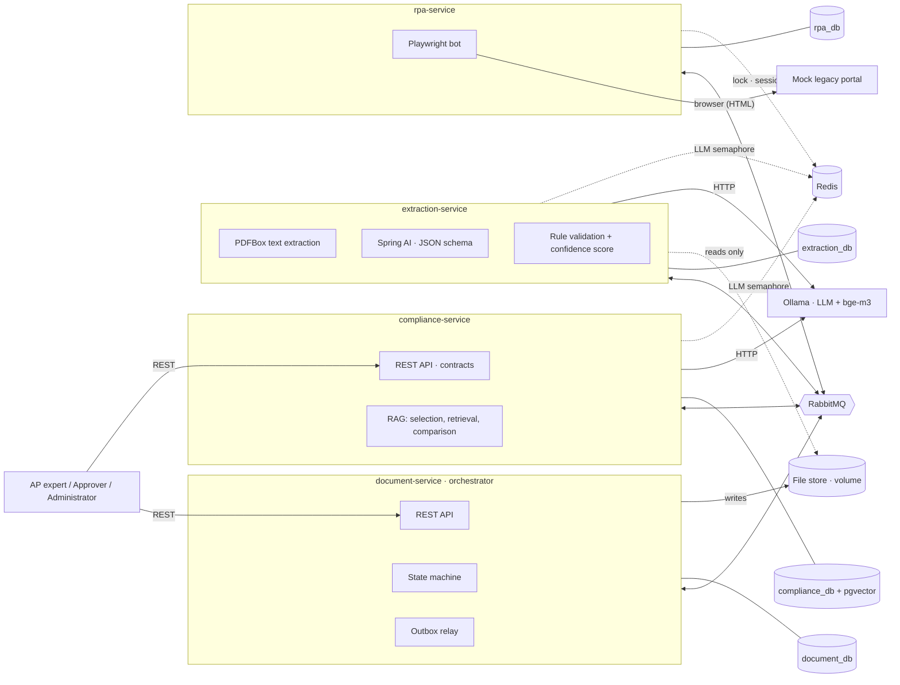
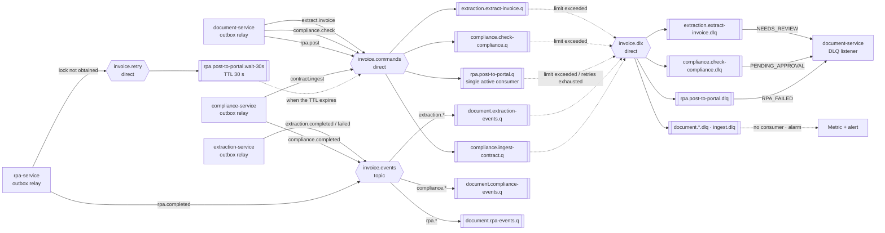
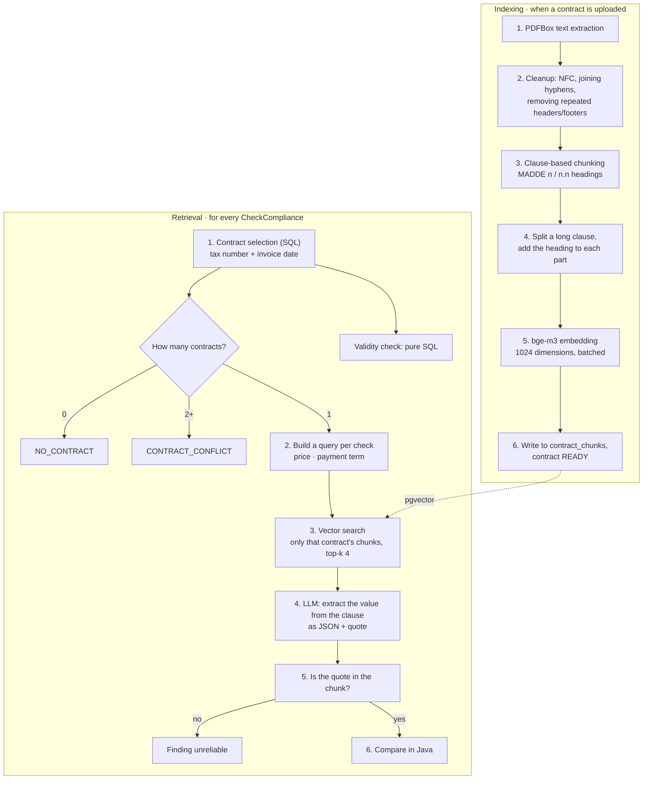
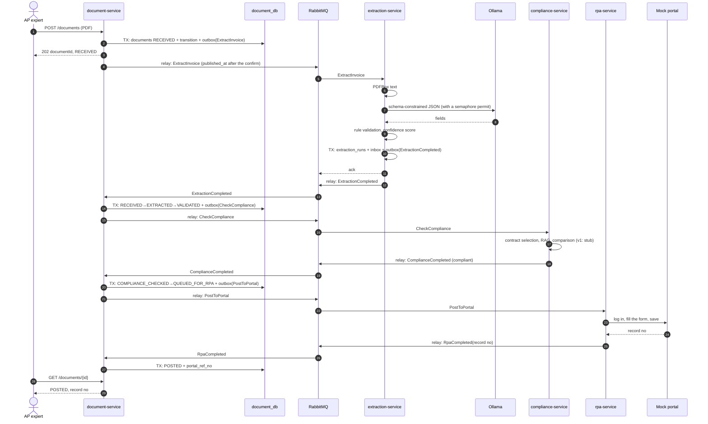
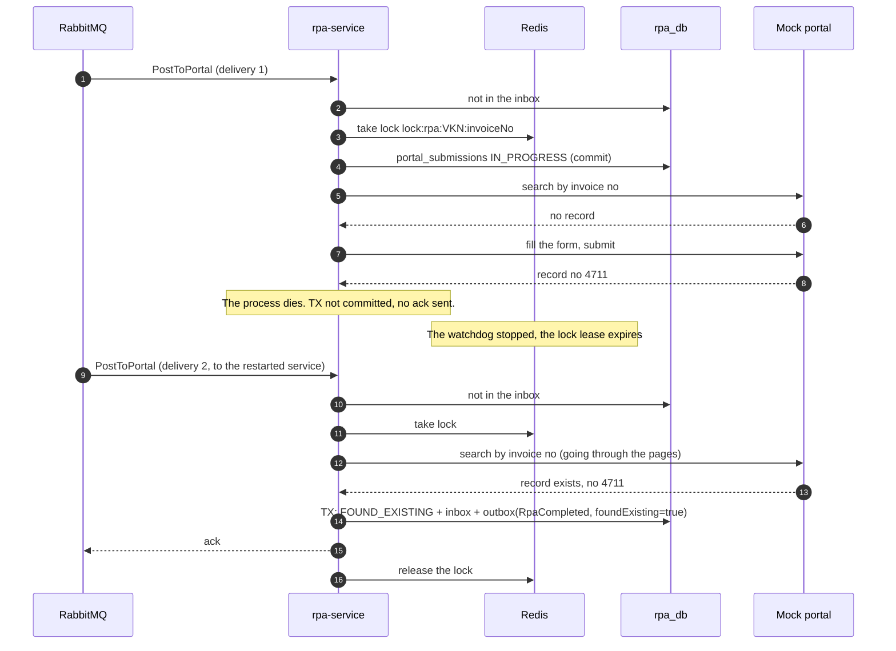
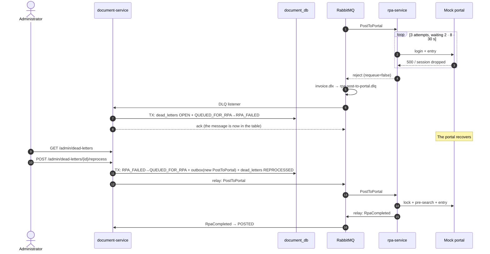

# Smart Invoice Processing and Contract Compliance System — System Design

> **English translation.** The original is [`docs/Sistem Tasarımı.md`](../Sistem%20Tasar%C4%B1m%C4%B1.md) (Turkish),
> which is authoritative; if the two differ, the Turkish version wins. Translated on 2026-10-03. This is the design
> document of 1 October 2026; later decisions and their current state are in [`DECISIONS.md`](DECISIONS.md).

## Summary and design principles

The system consists of four Spring Boot services that talk to each other only through RabbitMQ, with document-service as the orchestrator. REST exists only at the two doors through which humans enter the system (invoice and contract upload, status, approval, administration); there are no synchronous calls from service to service. The "at most once into the portal" guarantee does not rely on a single mechanism but on four overlapping protections.

Six principles carry the design:

1. **Single owner of state.** An invoice's state lives only in document-service's database. The other services receive commands, do work and publish events; they do not decide on state transitions (FR-D9).
2. **Commands vs. events.** Commands (`ExtractInvoice`, `CheckCompliance`, `PostToPortal`) go to a single recipient; events (`*Completed`, `ExtractionFailed`) report what happened. The flow is orchestration, not choreography: the next step is always started by document-service.
3. **Transactional outbox, without exception.** Every service writes an outgoing message to its own `outbox` table in the same transaction as the business data; a separate relay publishes it (NFR-02). The upload API works even while the broker is down.
4. **At-least-once delivery + idempotent consumer.** Every consumer writes the `messageId` it processed to the `inbox` table in the same transaction. A repeated message does not change the outcome (NFR-01 layer 1).
5. **The state machine is a conditional update.** A transition is done with `UPDATE … WHERE id = ? AND status = ?`; an event that arrives late or out of order has no effect.
6. **Extra protection for side effects in the outside world.** The portal is not idempotent; RPA is protected by a lock (v2) and a pre-search in the portal (v2). In v1, the single active consumer partly closes this gap.

The document separates v1 from v2; see the table in the last section for the split.

## Service boundaries and responsibilities

The boundaries were drawn by reason for change: workflow rules, LLM extraction, contract knowledge and portal automation change independently of each other. Each service owns a single "hard thing".



| Service            | Single responsibility | Data it owns | Consumes | Publishes | External dependency |
| ------------------ | --------------------- | ------------ | -------- | --------- | ------------------- |
| document-service   | The invoice life cycle: upload, duplicate check by hash, state machine, duplicate and threshold decisions, approval/rejection, reflecting the DLQs onto records | Invoice record, accepted fields, status history, DLQ parking table, threshold settings, PDF files | `ExtractionCompleted`, `ExtractionFailed`, `ComplianceCompleted`, `RpaCompleted`, three command DLQs | `ExtractInvoice`, `CheckCompliance`, `PostToPortal` | None |
| extraction-service | Producing structured invoice data from the PDF and saying how reliable it is | Extraction attempts: raw LLM output, model and prompt version | `ExtractInvoice` | `ExtractionCompleted`, `ExtractionFailed` | Ollama (LLM), file store (read-only) |
| compliance-service | Holding contract knowledge and comparing an invoice with the contract valid on the invoice date | Contracts, clause chunks and their embeddings, compliance check results | `CheckCompliance`, its own internal `IngestContract` command | `ComplianceCompleted` | Ollama (LLM + embedding) |
| rpa-service        | Entering the approved invoice into the portal once and getting the record number | Portal entry records, attempts, screenshots | `PostToPortal` | `RpaCompleted` | Mock portal (browser), Redis |
| mock-portal        | Imitating the legacy system that has no API | Its own invoice table (not considered part of the system) | — | — | — |

Two boundary decisions need explaining:

- **Why is the confidence threshold comparison in document-service?** extraction-service only measures (the score); it does not decide. The threshold is a business rule, it changes through FR-A2, and together with the duplicate check it is part of the priority rule. Having the decision in one place keeps the state machine testable.
- **Why is contract upload in compliance-service?** It is the sole owner of contract data; routing it through document-service would bind compliance's data to another service's API. The cost is that the client knows two base URLs; if the scale grows, an API gateway is put in front (out of scope).

File sharing: PDFs are stored content-addressed and immutable at `/data/documents/{sha256}.pdf`. extraction-service mounts this volume read-only and reads through the `storageUri` in the message. Since the file never changes, this sharing is not a violation of data ownership; a later move to MinIO changes only the URI scheme, and the message contract stays the same.

## Data ownership (database per service)

Inside a single PostgreSQL container there are four separate databases, each with its own user. One service's user cannot connect to another service's database; this gives the same isolation as running four Postgres containers, without doing so within the 18 GB limit. Data moves between services only through messages: for example, compliance-service does not read the invoice; the `CheckCompliance` message carries the tax number, date, lines and amounts.

### document_db

| Table                | Content | Note |
| -------------------- | ------- | ---- |
| `documents`          | id, `file_sha256`, `storage_uri`, `status`, `supplier_vkn`, `invoice_no`, `invoice_date`, `grand_total`, `currency`, `confidence_score`, `portal_ref_no`, `version`, timestamps | `file_sha256` UNIQUE (US-02); a non-unique index on `(supplier_vkn, invoice_no)` (US-03, suspected duplicate records can exist side by side) |
| `invoice_data`       | document_id, accepted fields (JSONB), rule results, source (LLM / expert correction) | The invoice's "official" data is here, not the raw output in extraction_db |
| `compliance_results` | document_id, result, findings and clause references (JSONB) | The source of the screen the approver sees (US-06) |
| `status_transitions` | document_id, from, to, triggering event, `message_id`, actor, reason, time | Append-only; in v2 the UPDATE/DELETE privilege is revoked from the application user (NFR-05) |
| `dead_letters`       | Source queue, message type, `message_id`, document_id, body, `x-death` header, status (OPEN, REPROCESSED, IGNORED) | The DLQ "parking" table; the administrator's list is read from here (FR-A1) |
| `settings`           | Confidence threshold, approval amount threshold | FR-A2; cached briefly in the service's memory |
| `outbox`, `inbox`    | Common pattern (below) | The same structure in every service |

### extraction_db

| Table             | Content | Note |
| ----------------- | ------- | ---- |
| `extraction_runs` | document_id, attempt no, model, prompt version, raw LLM output, parse error, duration | FR-E6; to explain later what the LLM got wrong and why |
| `outbox`, `inbox` | Common pattern | |

### compliance_db (with the pgvector extension)

| Table               | Content | Note |
| ------------------- | ------- | ---- |
| `contracts`         | id, `supplier_vkn`, `valid_from`, `valid_to`, `storage_uri`, `file_sha256`, `status` (INGESTING, READY, FAILED) | Indexed on `(supplier_vkn, valid_from, valid_to)`; contract selection is done from this table with SQL |
| `contract_chunks`   | contract_id, clause no, title, text, page, `embedding vector(1024)`, embedding model name | bge-m3 produces 1024 dimensions; if the model changes, re-indexing is needed (that is why the model name is on the row) |
| `compliance_checks` | document_id, contract_id, result, findings, retrieved chunk ids, model | A record of which clauses the decision was based on |
| `outbox`, `inbox`   | Common pattern | |

### rpa_db

| Table                | Content | Note |
| -------------------- | ------- | ---- |
| `portal_submissions` | document_id, `invoice_no`, status (IN_PROGRESS, SUBMITTED, FOUND_EXISTING), `portal_ref_no`, number of attempts | Records the bot's "I have started entering it" before writing to the form; after a crash it tells whether a pre-search is needed |
| `rpa_attempts`       | document_id, attempt no, failed step, error, screenshot path | FR-R6 |
| `outbox`, `inbox`    | Common pattern | |

### Two tables that are the same in every service

```sql
CREATE TABLE outbox (
    id            UUID PRIMARY KEY,          -- = the messageId to publish
    aggregate_id  UUID NOT NULL,             -- = documentId (correlationId)
    message_type  TEXT NOT NULL,             -- ExtractInvoice, RpaCompleted ...
    exchange      TEXT NOT NULL,
    routing_key   TEXT NOT NULL,
    payload       JSONB NOT NULL,
    created_at    TIMESTAMPTZ NOT NULL DEFAULT now(),
    published_at  TIMESTAMPTZ,
    attempts      INT NOT NULL DEFAULT 0
);
CREATE INDEX outbox_unpublished ON outbox (created_at) WHERE published_at IS NULL;

CREATE TABLE inbox (
    message_id    UUID NOT NULL,
    consumer      TEXT NOT NULL,             -- queue name; two different listeners may process the same message
    processed_at  TIMESTAMPTZ NOT NULL DEFAULT now(),
    PRIMARY KEY (message_id, consumer)
);
CREATE INDEX inbox_processed_at ON inbox (processed_at);
```

So that `inbox` records do not grow without bound, rows older than 30 days are deleted by a scheduled job; in practice RabbitMQ never redelivers that late. Files are data too: the `documents` volume belongs to document-service, contract PDFs are in compliance-service's volume, screenshots in rpa-service's.

## Synchronous communication (REST)

Synchronous communication exists only where a human is waiting for an answer: upload, query, approval and administration. No long-running work (LLM, RAG, RPA) is done inside an HTTP request; the upload returns 202 and processing continues on the queue (NFR-07, the 500 ms target). There are deliberately no REST calls from service to service: when compliance-service crashes, document-service's API must keep working.

### document-service

| Method and path | What it does | Response | Version |
| --- | --- | --- | --- |
| `POST /api/v1/documents` (multipart) | Receives the PDF, computes SHA-256, and if it is new writes the record and the `ExtractInvoice` outbox row in one transaction | 202 `{documentId, status: RECEIVED}`; if the hash is known, 200 `{documentId, status, duplicate: true}` | v1 |
| `GET /api/v1/documents/{id}` | Status, fields, portal record number | 200 | v1 |
| `GET /api/v1/documents?status=&vkn=&from=&to=&page=&size=` | Filtered, paged list | 200 | v1 |
| `GET /api/v1/documents/{id}/history` | Status history (US-12) | 200 | v2 |
| `PUT /api/v1/documents/{id}/fields` | Field correction on a `NEEDS_REVIEW` record; `If-Match: version` mandatory | 200, 412 on a concurrent correction | v2 |
| `POST /api/v1/documents/{id}/approve` · `/reject` | Approval or rejection with a reason; an approver cannot approve their own upload | 200, 409 in an invalid state | v2 |
| `POST /api/v1/documents/{id}/duplicate-decision` | Closes a duplicate suspicion | 200, 409 | v2 |
| `GET /api/v1/admin/dead-letters` · `POST …/{id}/reprocess` | DLQ parking table and reprocessing (FR-A1) | 200, 409 | v2 |
| `PUT /api/v1/admin/settings` | Thresholds (FR-A2) | 200 | v2 |

### compliance-service

| Method and path | What it does | Response | Version |
| --- | --- | --- | --- |
| `POST /api/v1/contracts` (multipart + tax number, start, end) | Stores the file, writes an `INGESTING` record and an internal `IngestContract` command to the outbox | 202 `{contractId, status}` | v2 |
| `GET /api/v1/contracts?vkn=` · `/{id}` | Contracts and their indexing status | 200 | v2 |

### Inside the upload request

1. While the file is streamed to a temporary location, SHA-256 is computed with a `DigestInputStream`; memory use stays independent of the file size.
2. `INSERT INTO documents … ON CONFLICT (file_sha256) DO NOTHING RETURNING id` runs. If no row is returned, the existing record is read and 200 `duplicate: true` is returned. Two concurrent uploads of the same file are resolved by the unique constraint; no Redis lock is needed here.
3. For a new record, the `status_transitions` and `outbox` (`ExtractInvoice`) rows are written in the same transaction, and the file is moved to `/data/documents/{sha256}.pdf`.
4. If the transaction commits, 202 is returned. If it crashes without committing, only an orphan file is left behind; if the same file is uploaded again it is written to the same path, and a nightly cleanup job deletes files without a record.

The service's other two outgoing HTTP links are client-side: from the extraction and compliance services to Ollama (with timeouts, through Spring AI) and from rpa-service to the portal (not an API, HTML through Playwright).

## Asynchronous communication: RabbitMQ topology

There are three main exchanges: `direct` for commands, `topic` for events, and a DLX for dead letters. Every work queue is a quorum queue with a delivery limit of 3 and its own DLQ; so a broken message is set aside after the first delivery and three redeliveries (four attempts in total) and does not hold up the invoices behind it (NFR-03).



### Exchange and queue table

| Queue                           | Bound to exchange · routing key         | Consumer           | Prefetch · concurrency                    | Its DLQ and the outcome |
| ------------------------------- | --------------------------------------- | ------------------ | ----------------------------------------- | ----------------------- |
| `extraction.extract-invoice.q`  | `invoice.commands` · `extract.invoice`  | extraction-service | 1 · 1 (LLM limit, NFR-08)                 | `extraction.extract-invoice.dlq` → document-service, record `NEEDS_REVIEW` |
| `compliance.check-compliance.q` | `invoice.commands` · `compliance.check` | compliance-service | 1 · 1                                     | `compliance.check-compliance.dlq` → document-service, record `PENDING_APPROVAL` |
| `compliance.ingest-contract.q`  | `invoice.commands` · `contract.ingest`  | compliance-service | 1 · 1                                     | `compliance.ingest-contract.dlq` → contract `FAILED`, alarm |
| `rpa.post-to-portal.q`          | `invoice.commands` · `rpa.post`         | rpa-service        | 1 · 1, `x-single-active-consumer` (FR-R8) | `rpa.post-to-portal.dlq` → document-service, record `RPA_FAILED` |
| `document.extraction-events.q`  | `invoice.events` · `extraction.*`       | document-service   | 10 · 2                                    | `document.extraction-events.dlq` → no consumer, alarm (FR-D10) |
| `document.compliance-events.q`  | `invoice.events` · `compliance.*`       | document-service   | 10 · 2                                    | alarm in the same way |
| `document.rpa-events.q`         | `invoice.events` · `rpa.*`              | document-service   | 10 · 2                                    | alarm in the same way |
| `rpa.post-to-portal.wait-30s`   | `invoice.retry` · `rpa.post.wait`       | — (waiting room)   | —                                         | When the TTL expires, its DLX `invoice.commands` with routing key `rpa.post` → back to the main queue |

`x-single-active-consumer` moves FR-R8's "single consumer" rule from configuration into the topology: even if a second rpa-service instance is started, it waits on standby, and two bots never run at the same time.

### Queue arguments

```text
x-queue-type              = quorum
x-delivery-limit          = 3
x-dead-letter-exchange    = invoice.dlx
x-dead-letter-routing-key = <queue name>        # each queue to its own .dlq
x-dead-letter-strategy    = at-least-once       # no message is lost while moving to the DLQ either
x-overflow                = reject-publish      # required for at-least-once
```

In RabbitMQ 4.x the default delivery limit of quorum queues is 20; 3 is set explicitly. DLQs are quorum and durable too, and have no DLX of their own.

### Publisher and consumer settings

- **Outbox relay:** every 500 ms it runs `SELECT … WHERE published_at IS NULL ORDER BY created_at LIMIT 100 FOR UPDATE SKIP LOCKED`. It sends the message as `persistent`, `mandatory` and with publisher confirms; `published_at` is written only after the broker's confirmation (ack) arrives. If it crashes before the confirmation, the message is published again and the inbox handles the duplicate. Each round is one transaction; a row that is returned (unroutable), nacked or timed out does not count as published, `attempts` increases and it is retried in the next round. Services write to the outbox through `OutboxWriter`, only inside a business transaction.
- **Message properties:** `message_id` = the outbox row id, `correlation_id` = `documentId`, `type` = the message name, the `x-schema-version` header. `correlationId` is put into the MDC and appears on every log line (NFR-06); in containers the logs are JSON in ECS format, and the `service.name` field tells the services apart.
- **Ack:** the container runs with `AcknowledgeMode.MANUAL`; `InvoiceMessageListener` in `common-messaging` makes the ack and reject decision explicitly. When the handler returns successfully, `basicAck`; on an exception, `basicReject(requeue=true)`. Spring AMQP's default error path is not used: it sends `basicNack` on an exception, and in RabbitMQ 4.3 a `nack` does not increment a quorum queue's delivery counter, so a failing message would never reach the DLQ. No ack is sent before the business transaction commits; a crash between the commit and the ack means a redelivery that is caught by the inbox.
- **Poison message:** a message that cannot be decoded (unknown `type`, a missing envelope field, an unsupported `x-schema-version`, broken JSON), a type that has no handler on the queue, and `AmqpRejectAndDontRequeueException` thrown by a handler go straight to the DLQ with `basicReject(requeue=false)`, without being retried; they do not use up the delivery limit for nothing.

### Two separate retry counters

There are two different reasons for retrying, and they are counted separately:

1. **A temporary business error** (portal 500, dropped session, element not found, LLM parse error): retried inside the service, within the same delivery, with increasing waits (for example 3 attempts for RPA, 2 · 8 · 30 s). When exhausted, RPA rejects the message and sends it to the DLQ; extraction instead publishes `ExtractionFailed` as a business result and acks the message.
2. **A crash or a poison message:** the process dies or an unexpected exception is thrown; the broker increments the delivery counter. Since the limit is 3, the message goes to the DLQ after the fourth failed delivery.

Not getting the lock (FR-R7) is not an error: the message is published to the waiting room with the same `messageId` and the original is acked. So this case does not use up the delivery limit.

## Redis: exactly where and why

In this system Redis is not the source of truth for any data; it is used only for short-lived coordination between several processes. Even if Redis were wiped completely, no invoice would be lost or move to a wrong state; at worst the work slows down. There are three uses, two of them in v2.

| Key | Used by | What for | TTL | If Redis is down | Version |
| --- | ------- | -------- | --- | ---------------- | ------- |
| `sem:llm` (Redisson semaphore, 2 permits) | extraction-service, compliance-service | Limiting the number of concurrent requests to Ollama to 1–2 across both services together (NFR-08). A per-service limit is not enough, because the two services share the same GPU | A lease per permit, slightly above the LLM timeout | Falls back to a local in-service semaphore (fail-open, with a local limit) | v1 |
| `lock:rpa:{supplierVkn}:{invoiceNo}` (Redisson `RLock`) | rpa-service | Preventing two workers from entering the same invoice into the portal at the same time (FR-R7, NFR-01 layer 2) | 60 s lease, the watchdog renews it every 20 s while the work runs | The lock counts as not obtained, the message goes to the waiting room (fail-closed) | v2 |
| `rpa:portal:session` | rpa-service | Sharing the Playwright session state (cookie) between workers and restarts; not logging in for every invoice | Shorter than the portal's session lifetime | The bot logs in again | v2 |

### Why is the lock key not documentId?

The portal recognizes an invoice by its invoice number. What the lock protects is the business key in the portal, so the key is `supplierVkn + invoiceNo`. Locking with `documentId` would let two different records that slipped past the duplicate check enter the same invoice in parallel.

### Why is the lock alone not enough?

A lease-based lock on a single Redis instance can expire and pass to another worker if the worker goes into a long GC pause or loses the network. That is why the lock is treated as an efficiency measure, not as a correctness guarantee: the final guarantee is the search by invoice no in the portal after the lock is taken (FR-R3). The lock stops two bots from writing to the form at the same time; the pre-search asks the portal itself "has this already been entered?".

### Where Redis is deliberately not used

- **Inbox / record of processed messages:** if it were kept in Redis, it could not join the business transaction. "The DB committed, Redis could not be written", or the reverse, would lead either to the message being processed twice or to it not being processed at all. That is why the inbox is in Postgres.
- **Upload duplicate check:** the unique constraint on `file_sha256` already reduces concurrent uploads to a single record.
- **Status query cache:** reading a single row by primary key takes under a millisecond at this scale; a cache would only add the risk of stale data.
- **Threshold settings:** read by a single service; an in-memory cache of a few seconds is enough.

## RAG pipeline

Here RAG answers the question "which clause is relevant?"; it does not make the "is it compliant?" decision. Which contract is valid is decided in SQL, and the numbers are compared in Java code. The LLM only extracts the numeric value (unit price, payment-term days) from the clause text in a structured form and quotes the sentence it relies on. This separation keeps an LLM that is assumed to be fallible (see the actor table) from being the weakest link in the decision chain.



### Indexing (FR-C1)

The contract upload request only writes the file and the `INGESTING` record; the actual work is done on the `compliance.ingest-contract.q` queue. So if the service crashes during indexing, the work is not lost.

1. **Text extraction:** PDFBox, keeping page numbers. If no text comes out, the contract becomes `FAILED` (OCR is out of scope).
2. **Normalization:** Unicode NFC (for Turkish İ/ı problems), joining end-of-line hyphens, removing headers/footers and page numbers repeated on every page.
3. **Chunking, at clause boundaries:** clause headings are found with the patterns `^(MADDE|Madde)\s+\d+` ("Clause n") and `^\d+(\.\d+)*[.)]\s`, and each clause becomes one chunk. Clause boundaries were chosen instead of fixed-size splitting so that the source can be shown to the approver as "Clause 7.2" (US-06).
4. **Long clauses:** a clause over \~500 tokens is split at paragraph boundaries, and the clause heading is added to the start of each part ("Madde 7 – Ödeme Koşulları: …", i.e. "Clause 7 – Payment Terms: …"). A part without a heading loses its context in the embedding space. If no clause pattern is found at all, it falls back to recursive splitting of \~400 tokens with a 50-token overlap.
5. **Embedding:** with bge-m3 (multilingual, NFR-14) through Ollama, in batched requests. Vectors are normalized and cosine similarity is used. The model name is written on every row; if the model changes, the need to re-index is detected from this column.
6. **Writing:** all chunks are written in one transaction, then the contract becomes `READY`. A half-indexed contract is never selected.

If a contract whose date range overlaps another one for the same tax number is uploaded, it is accepted but a warning is returned in the response; at check time the overlap results in `CONTRACT_CONFLICT` (US-07).

### Retrieval and comparison (FR-C2, FR-C3)

1. **Contract selection is deterministic:** `WHERE supplier_vkn = ? AND ? BETWEEN valid_from AND valid_to AND status = 'READY'`. Since vector search could bring back a similar clause belonging to the wrong contract, selection is never done with embeddings.
2. **Queries are per check:** for price, each line separately ("{line description} birim fiyat" — "unit price"), for the payment term a single query ("ödeme vadesi gün" — "payment term days"). The invoice text is not used as a query; it is noisy.
3. **Vector search, a full scan after the filter:** `WHERE contract_id = ? ORDER BY embedding <=> :q LIMIT 4`. Since a contract contains a few dozen chunks, the filtered set is small and a full scan is both exact and fast. An HNSW index is unnecessary at this scale; besides, post-filtering with HNSW can miss matching rows.
4. **Value extraction:** the LLM is given the retrieved clauses and a single question; the answer is schema-constrained JSON: `{bulunduMu, deger, birim, maddeNo, alinti}` (found, value, unit, clause no, quote).
5. **Grounding check:** the `alinti` (quote) text is searched for verbatim (whitespace-normalized) inside the retrieved chunks. If it is not found, the finding is marked "unreliable" and the invoice goes to human approval.
6. **The comparison is done in code:** rules such as invoice unit price > contract price and invoice payment term ≠ contract payment term are in Java and tested with unit tests. The contract validity check (the result of step 1) never goes to the LLM.

The result is published as `ComplianceCompleted`: the overall result (`COMPLIANT`, `NON_COMPLIANT`, `NO_CONTRACT`, `CONTRACT_CONFLICT`) and, for each finding, the clause no, the quote and the two values. document-service makes the `PENDING_APPROVAL` decision (FR-C4).

If retrieval quality turns out not to be enough later, the first step is hybrid search: combining Postgres's `turkish` full-text search with the vector results through Reciprocal Rank Fusion. This makes a clear difference for terms that need an exact match, such as item names.

## Sequence diagrams

### Happy path (US-01)

Every service follows the same rhythm: receive the message, check the inbox, do the work, write the result and the inbox row in one transaction, ack. The outbox relay does the publishing.



`EXTRACTED` and `VALIDATED` are applied one after the other in the same transaction; both land in `status_transitions` as separate rows, so how the priority rule worked is visible in an audit.

### RPA crashes during entry (US-08, v2)

The bot dies after submitting the form, before it can write the result to the database. The record exists in the portal, but the system does not know it. Recovery is provided by the pre-search in the portal.



The form is not filled again; document-service handles `RpaCompleted` as usual and the record becomes `POSTED`. Since v1 has no pre-search, this scenario can end in a duplicate record there; this is the known limitation in the scope report.

### Portal keeps failing, administrator reprocesses (US-09, US-10)



Reprocessing does not move the message from the DLQ back to the queue; document-service takes the state back through a valid transition and publishes a new command. So an `RpaCompleted` that arrives while the record is `RPA_FAILED` is never left "orphaned".

## Failure scenarios and idempotency

The system does not promise "exactly-once delivery"; RabbitMQ does not provide it. Instead, every message is delivered at least once, and every consumer changes nothing when it sees the same message a second time. The result, from a business point of view, is "exactly-once effect".

### The four idempotency layers

| Layer                           | Where                                                       | What it prevents                                                                                    | Version                         |
| ------------------------------- | ----------------------------------------------------------- | --------------------------------------------------------------------------------------------------- | ------------------------------- |
| 1. Inbox                        | In every consumer, same transaction as the business data    | The same `messageId` being processed twice (the relay republishing, a crash before the ack)          | v1                              |
| 2. Conditional state transition | document-service, `UPDATE … WHERE status = ?` + `version`   | An event that arrives with a different `messageId` but is no longer valid (late, out of order, the result of an old command) | v1 |
| 3. Distributed lock             | rpa-service, Redis, tax number + invoice no                 | Two workers entering the same invoice at the same time                                              | v2 (in v1 a single active consumer) |
| 4. Pre-search in the portal     | rpa-service, after the lock is taken                        | Entering again a record that was entered in an earlier attempt but not reflected in the system      | v2                              |

The first two layers prevent repetition "inside the system", the last two repetition "in the outside world". Since the portal is not idempotent, only RPA needs all four layers.

### Consumer skeleton

```java
// var listener = listeners.forQueue("document.extraction-events.q")
//         .on(ExtractionCompleted.class, this::on).build();
// InvoiceListenerContainers.create(cf, listener, 10, 2);
//
// The listener opens the transaction and does inbox.tryInsert(messageId, queue); if the message
// was already processed, the handler is not called and the message is acked. The handler runs in the same transaction.
void on(MessageEnvelope envelope, ExtractionCompleted evt) {
    Trigger trigger = Trigger.message("extraction-service", envelope, evt, "document.extraction-events.q");
    // Conditional UPDATE; if the record is no longer RECEIVED it returns STALE and the event is written to dead_letters as LATE_EVENT.
    if (transitions.apply(evt.documentId(), RECEIVED, EXTRACTED, trigger) == STALE) {
        return;
    }
    Decision d = decide(evt, settings);                // NEEDS_REVIEW > DUPLICATE_SUSPECTED > VALIDATED
    transitions.apply(evt.documentId(), EXTRACTED, d.target(), trigger);
    d.nextCommand().ifPresent(cmd -> outbox.add(evt.documentId(), cmd));   // e.g. CheckCompliance
    // normal return -> commit + basicAck; exception -> rollback + basicReject(requeue=true), the delivery counter increases;
    // AmqpRejectAndDontRequeueException -> rollback + basicReject(requeue=false), straight to the DLQ
}
```

Since the inbox row is inside the business transaction, if the transaction is rolled back the inbox row is lost too, and on redelivery the work is done again; that is the correct behaviour. For long-running work (LLM, RPA), a cheap `inbox.exists` check is done first, the work runs outside a transaction, and the result is written in a short transaction with `tryInsert`. If two copies are processed at the same time, the second `tryInsert` waits for the first one's commit, gets a conflict and discards its result. This pattern is coded in the listener: the handler is registered with `onLongRunning` and writes its result through `completion.complete(() -> …)`.

### Failure matrix

| Scenario | What happens | Why no message is lost and no work is done twice | Version |
| -------- | ------------ | ------------------------------------------------ | ------- |
| document-service crashes after the DB commit, before publishing | The outbox row is left with an empty `published_at` | When the service starts, the relay finds the row and publishes it (NFR-02 acceptance criterion) | v1 |
| The relay publishes, crashes before writing `published_at` | The message is published a second time | The same `messageId` is caught by the recipient's inbox | v1 |
| RabbitMQ crashes | Upload still returns 202, the outbox builds up; consumers try to reconnect | Quorum queues and durable messages are on disk; the relay continues when the broker is back | v1 |
| Crash during an upload before the commit | No record; an orphan file may remain on disk | Since the user did not get a 202, they upload again; the file is written to the same path, the cleanup job removes leftovers | v1 |
| extraction-service dies during the LLM call | The message was not acked and is redelivered | The delivery counter increases; after the fourth failed delivery, DLQ → `NEEDS_REVIEW` | v1 |
| The LLM returns broken JSON or times out (US-05) | Bounded retries inside the service, with the error message added to the prompt | When exhausted, `ExtractionFailed` is published and the message is acked; this is a business result, not a DLQ case | v1 |
| A message that cannot be parsed (poison) | Conversion exception | Straight to the DLQ without retries; it does not block the head of the queue | v1 |
| compliance-service down for hours | `CheckCompliance` messages wait in the queue, records stay in `VALIDATED` | Messages are durable; they are processed in order when the service comes up. The stuck record detector raises an alarm | v1 |
| The same `ExtractionCompleted` arrives twice | Second copy | Inbox (layer 1) | v1 |
| A late or out-of-order event (the record is no longer in the expected state) | The conditional `UPDATE` affects 0 rows | Layer 2; the event is written to the `dead_letters` table as a "late event" and an alarm is raised | v1 |
| RPA crashes after submitting the form (US-08) | The record is in the portal, not in the system | v2: lock + pre-search find the existing record. v1: risk of a duplicate record (known limitation) | v2 |
| The portal returns a temporary error (US-09) | In-service retry with increasing waits, re-login if the session drops | When exhausted, DLQ → `RPA_FAILED`; reprocessing is safe thanks to the pre-search | v2 |
| Two rpa-service instances are started | The second waits on standby | `x-single-active-consumer`; in v2 also the lock | v1 |
| Redis crashes | The LLM semaphore falls back to the local limit; RPA cannot take the lock | RPA fails closed: the message goes to the waiting room and the portal is not touched | v2 |
| Postgres crashes | Consumers throw exceptions | Risk: healthy messages use up the delivery limit and fall into the DLQ. Countermeasure: a short retry with increasing waits on DB errors inside the listener, and stopping the listener containers while the health check is DOWN | v1 |
| `RpaCompleted` arrives while the record is `RPA_FAILED` | Invalid transition, rejected | A rare race (a crash after commit coinciding with the delivery limit). Recorded as a "late event"; when the administrator reprocesses, the pre-search finds the record and it becomes `POSTED` | v2 |
| document-service fails on its own event queue (a bug) | The event falls into the DLQ, the record cannot be updated (FR-D10) | DLQ depth alarm; once the bug is fixed the messages are republished, and the inbox and the conditional transition make the repetition harmless | v1 |

### Stuck record detector

Even if no message is lost, a record can stay in an intermediate state longer than expected (the relevant service is down, the queue has built up). Every minute, document-service counts the records that have stayed in `RECEIVED`, `VALIDATED` or `QUEUED_FOR_RPA` longer than a threshold (for example 10 min) and publishes the count as a metric. In v1 it only raises an alarm; it does not republish the command automatically, because a pending copy may already be in the queue. This makes the acceptance criterion "no invoice is left stuck in an intermediate state" observable.

## The v1 / v2 split and open decisions

The v1 topology is the same as v2's: all queues, DLQs, the outbox and inbox are set up from day one. v2 adds no new messages or queues (except the waiting room); it adds logic inside the existing skeleton. This is the principle "the message contract and the flow do not change" from FR-C5, extended to the whole system.

| Component                                    | v1                                       | v2 |
| -------------------------------------------- | ---------------------------------------- | -- |
| Outbox + inbox, in every service             | Present                                  | Same |
| Quorum queues, delivery limit 3, DLX/DLQ     | Present                                  | Same |
| DLQ → state update (FR-D10)                  | Present, parked in the `dead_letters` table | + reprocessing through the administrator API |
| RPA concurrency protection                   | `x-single-active-consumer`, prefetch 1   | + Redis lock, pre-search in the portal, waiting room |
| Retry                                        | Only the delivery limit                  | + in-service retries with increasing waits |
| compliance-service                           | Stub, always compliant                   | RAG + comparison in code |
| Redis                                        | LLM semaphore                            | + RPA lock, portal session |
| Audit                                        | `status_transitions` is written          | Immutability enforced through privileges, history API |
| Observability                                | JSON logs + `correlationId`              | + Micrometer metrics, DLQ and stuck record alarms |

### Open decisions

- [x] **Ollama completely unreachable** (connection refused) does not count as an attempt (B-19, DECISIONS.md A1). Instead of a waiting room, the extraction listener is stopped, Ollama is probed, and when it comes back the listener starts again; no new queue was needed. Only broken output and timeouts use up the attempt budget.
- [x] **File sharing:** a read-only shared volume was chosen (B-10, DECISIONS.md A2 and ADR-11). An internal endpoint was not chosen because it would make extraction-service depend on document-service being up.
- [ ] **Should the stuck record detector** automatically republish the command with the same `messageId` in v2? It is safe thanks to the inbox; still, how often it is needed should first be seen from the alarm data.
- [ ] **Late event policy:** an `RpaCompleted` arriving while `RPA_FAILED` is for now only recorded. Since it carries the record number, a direct transition to `POSTED` would require changing the rule in the scope report; it was deliberately left out.
- [ ] **Confidence score formula:** how many points each rule violation costs and the threshold's initial value should be fixed after measuring with the 10 synthetic invoices.
